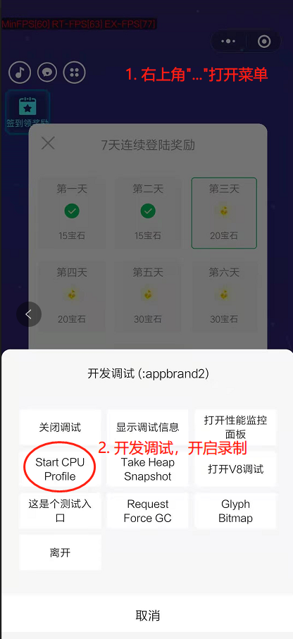
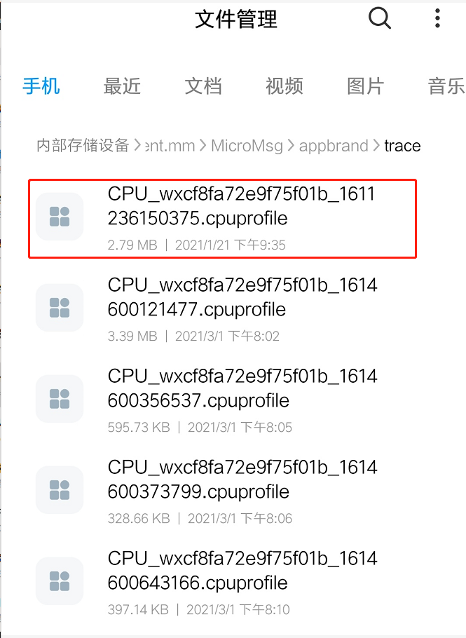
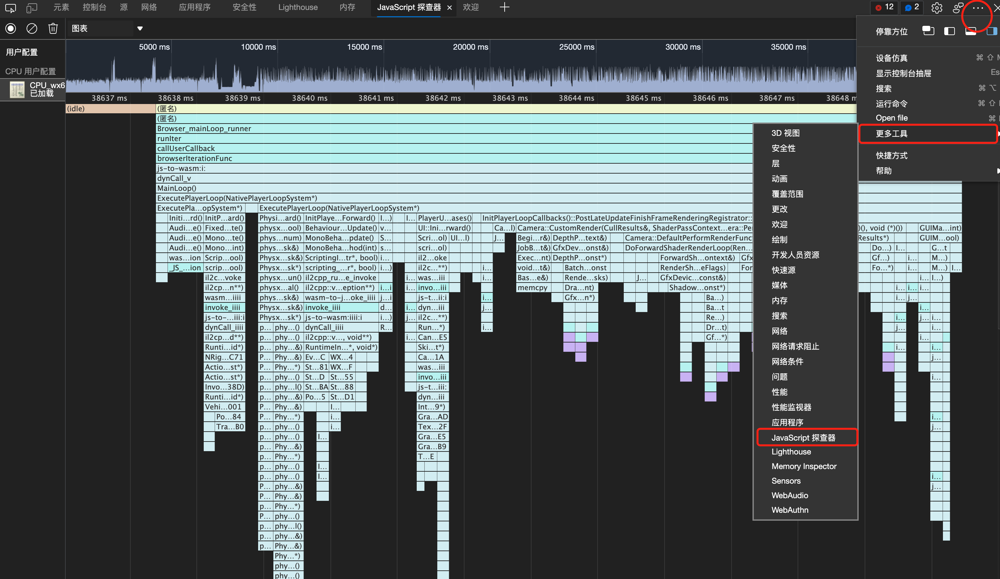
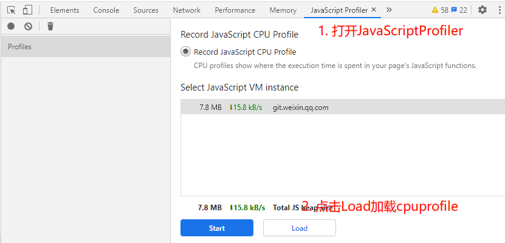
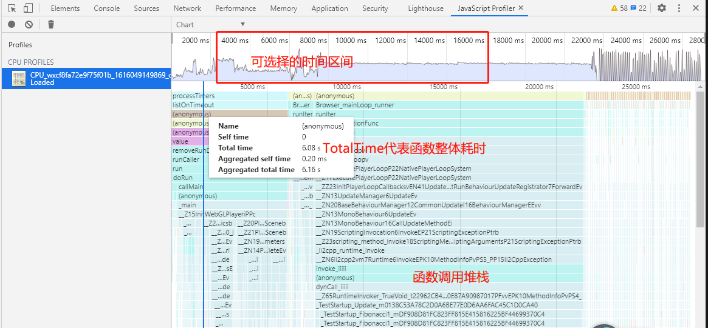

# 使用Android CPU Profiler性能调优
0. 转换导出插件勾选"Profiling-funcs", 请勿使用Development(该模式将极大降低性能)。 发布上线版本请务必关闭该选项！
1. 在Android微信小游戏打开调试进行录制

   

2. 停止性能数据录制

    与步骤1相似，在相同的菜单中选择Stop CPU Profile

3. 传输录制文件到PC
   
    录制结束后，Android会生成一份xxx.cpuprofile，该文件格式可以使用chrome进行解析。
因此我们需要将录制后的文件传输到PC使用chrome进行分析。
文件路径通常为：Android/data/com.tencent.mm/MicroMsg/appbrand/trace



4. 利用PC(Windows/Mac)的Edge/Chrome加载数据

   以Edge为例：浏览器菜单打开"更多工具-开发人员工具-右上角...-更多工具-JavaScript探测器"，然后点击加载前面导出的cpuprofile文件即可。
    
    
    
    视图有多种方式，可选择"图表"(Chart)分析每一帧游戏函数耗时情况

5. 使用JavaScriptProfile进行数据分析
 

     

注意：
1. 编译版本仅当导出勾选Profiling-funcs(推荐)或Development时才能在函数堆栈中看到可读函数名。
2. 特殊情况下，如果游戏勾选Profiling-funcs会导致代码包过大，那么不要使用此选项。此时得到的Profile中函数为数字ID，有两种做法进行解读：
    - 2.1 通过webgl导出目录下的symbols文件对照映射
    - 2.2 通过[替换脚本](../tools/update_v8_wasm_profile.py)对cpuprofile进行自动映射到真实函数。使用方式：python update_v8_wasm_profile.py $cpuprofile $symbol
3. 如希望能从游戏启动立即抓取profile，请在game.js末尾代码稍作修改：
   ```
   const gl = GameGlobal.canvas.getContext('webgl') 
       gl.clear(gl.COLOR_BUFFER_BIT);
       setTimeout(() => {
       gameManager.startGame();
       GameGlobal.manager = gameManager;
    }, 10000);
    ```
    修改后，游戏启动将会有10s黑屏，可在此期间打开调试。

   
