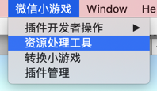
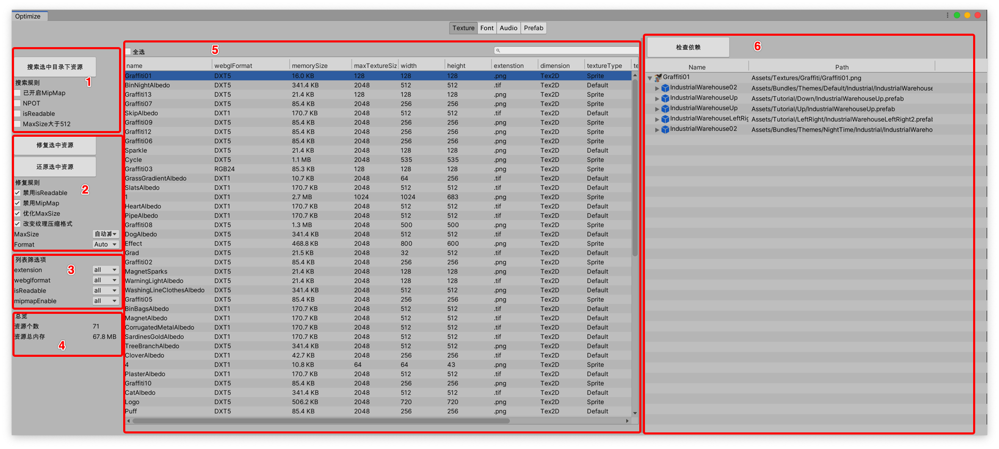
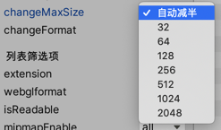
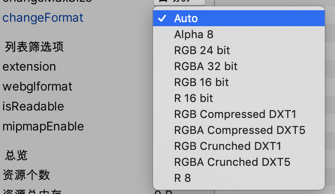

# 资源优化
可通过转换工具配套提供的资源优化工具，将游戏内纹理资源**针对webgl导出**做优化。

## 工具入口
菜单栏-微信小游戏-资源优化工具

## 工具介绍
### Texture

1.  区域1: 选中目录，以设定规则扫描目录下文件。
搜索规则
- 已开启MipMap: 搜索已开启了MipMap的纹理
- NPOT: 搜索非POT图片
- isReadable: 搜索已开启readable纹理
- MaxSize大于512: 搜素MaxSize大于512纹理

2. 区域2: 以设定规则修复列表中选中的资源
**注意: 每次修复时将当前所要修复资源的importer覆盖写入到Library/AssetImporterbak; 还原时，从Library/AssetImporterbak读取选中资源的importer设置并还原后，会删除Library/AssetImporterbak，并不是undo/redo逻辑**
- 禁用readable：关闭readable
- 禁用mipmap：关闭mipmap
- 优化maxsize：勾选后，可选择优化maxsize的方式

其中，自动减半根据当前纹理尺寸，将maxsize设置为纹理宽高最大值的一半。
- change texture format: 勾选后可修改纹理压缩格式

3. 区域3: 筛选列表展示结果
4. 区域4: 列表总览
5. 区域5: 资源列表
支持一键全选、按资源名搜索
6. 区域6: 引用查找
选中一个资源，查找资源被引用关系

## 优化建议
- 小游戏平台下不需要太大的纹理，合理设置纹理maxsize可以减小纹理资源大小，最大不要超过1024。
- MipMap: UI不需要开启mipmap，开启会增大1/3内存。
- read/write enabled: 一般不需要访问纹理像素, 并且unity也是默认关闭。开启后会占用GPU显存和CPU内存。
- NPOT纹理无法使用压缩纹理，注意修改纹理尺寸。