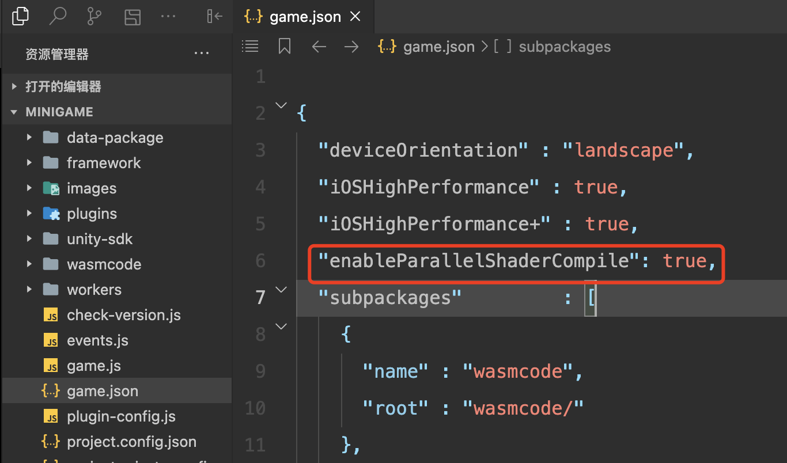

# Shader 异步 Warmup

当游戏中 Shader 变体数量较多时，可以通过 ShaderVariantCollection（以下简称 SVC）进行 Shader 预热，以避免游戏运行过程中因 Shader 编译导致的卡顿。

然而，当 SVC 中的 Shader 变体数量过多时，SVC 的同步 Warmup 可能会引发较长时间的卡顿。为此，Unity 推出了 Shader 异步 Warmup 功能，微信小游戏平台现已支持该能力。

## 平台支持情况
- iOS 普通模式暂不支持
- PC 及 iOS 高性能模式支持（系统自带，无需额外配置）
- Android 及 iOS 高性能+ 模式需使用平台能力，开发者需进行相关配置

## 异步 Shader Warmup 使用条件
1. 微信客户端需为 8.0.54 或以上版本
2. 基础库需为 3.7.4 或以上版本（可在小游戏调试面板第一条日志查看）
3. 微信客户端 8.0.62 或以上版本默认开启 Shader 异步 Warmup 功能，可跳过 3.1 步骤
    - 3.1：如未满足上述条件，请点击[申请开通 Shader 异步 Warmup 功能](https://doc.weixin.qq.com/forms/AJEAIQdfAAoACQA2gY2AD41GisQUxXTEf)，等待审核通过
4. 在小游戏的 `game.json` 文件中配置 `"enableParallelShaderCompile": true`
    - 

## 参考资料
- [Unity ShaderVariantCollection](https://docs.unity3d.com/2021.3/Documentation/ScriptReference/ShaderVariantCollection.html)
- [Unity Shader 异步 Warmup（微信小游戏）](https://docs.unity.cn/cn/tuanjiemanual/Manual/WeixinAsyncShaderWarmup.html)