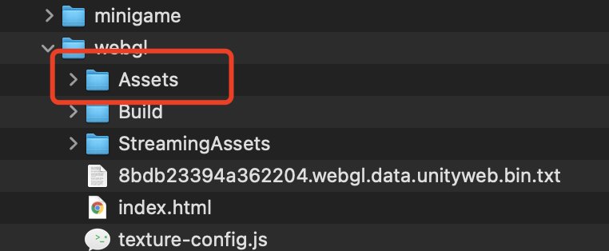

# 为何需要音频优化
1. Unity2021版本之前的音频不支持压缩音频，在引擎CPU侧解压会消耗大量内存
2. iOS高性能模式下，Unity WebGL默认使用WebAudio会消耗游戏进程大量内存(特别是时长较大的音频)

我们建议将Unity Audio替换成SDK中的音频API控制播放。如果工作量太大，也建议替换长音频(如BGM)。


## API使用
### 接口使用
代码如下，可参考[微信开发者文档](https://developers.weixin.qq.com/minigame/dev/api/media/audio/InnerAudioContext.html),其中src为音频地址，可填本地路径如 xx.wav，运行时会自动和配置的音频地址前缀(默认为DATA_CDN/Assets)做拼接得到最终线上地址。
* 使用方法一:

为了减少用户等待时间和避免音频延迟，
对于重要的音频可以等待`onCanplay`事件之后再调用`Play`播放。onCanplay事件是表示，当前音频已经可以播了，可以直接掉用`Play`，不会有延迟。而对于没那么重要的音频，允许部分延迟的，可以不等待onCanplay事件，而直接调用`Play`方法，这样音频就会边加载边播放，效果取决于用户网络，可能会稍微有点延迟。如果希望等音频全部加载了再播放，以及便于后续复用，避免后续延迟的话，可以在初始化是加上needDownload = true，
```
       // 第一次使用     
            var music = WX.CreateInnerAudioContext(new InnerAudioContextParam()
            {
                src = "Audio/0.wav",
                needDownload = true
            });
            music.OnCanplay(() =>
            {
                music.Play();
            });
            
        // 后续需要需要同时创建多个音频实例时，可以直接Play
                var music2 = WX.CreateInnerAudioContext(new InnerAudioContextParam()
                {
                    src = "Audio/0.wav"
                });
                music2.Play();    
```
* 使用方法二：
如果想直接将用到的音频先完全下载避免延迟，用到的时候直接使用，则可以如下调用：
```
            //需要预下载列表
            string[] a = { "Audio/0.wav", "Audio/1.wav" }; 
            WX.PreDownloadAudios(a, (int res) =>
            {
                //下载完成后回调
                Debug.Log("Downloaded" + res);
                if (res == 0)
                {
                    //可以直接调用，无网络延迟
                    var music0 = WX.CreateInnerAudioContext(new InnerAudioContextParam()
                    {
                        src = "Audio/0.wav"
                    });
                    music0.Play();

                    var music1 = WX.CreateInnerAudioContext(new InnerAudioContextParam()
                    {
                        src = "Audio/1.wav"
                    });
                    music1.Play();
                }
            });
```
`注意` WX.CreateInnerAudioContext 返回的音频对象是可以复用的，就是可以多次调用Play方法播放，但是如果需要多个音频同时播放就要创建多个音频对象了。

## 导出设置
勾选使用微信音频API，并填上"游戏资源CDN"，比如填写的地址为https://wx.qq.com/data/ ，而API的src地址为 Audio/Chill_1.wav，则最终请求路径会自动拼接前缀DATA_CDN/Assets(其中Assets路径可通过MiniGameConfig.asset更改), 即https://wx.qq.com/data/Assets/Audio/Chill_1.wav。

 
## 将音频文件上传CDN
 游戏内的音频会被导出到导出目录的Assets文件夹下，需要将其上传至您的CDN，保证用户能访问到
 


## 注意事项
- 使用微信音频API后音频无需再监听onAudioInterruptionBegin，onAudioInterruptionEnd事件，插件会自动处理。
- 音频未使用needDownload=true或PreDownloadAudios的情况下，音频文件是不还被缓存的，多次创建并播放同样音频会造成多次下载。需要游戏逻辑自己负责缓存音频对象（就是WX.CreateInnerAudioContext的对象需要自己缓存）。

