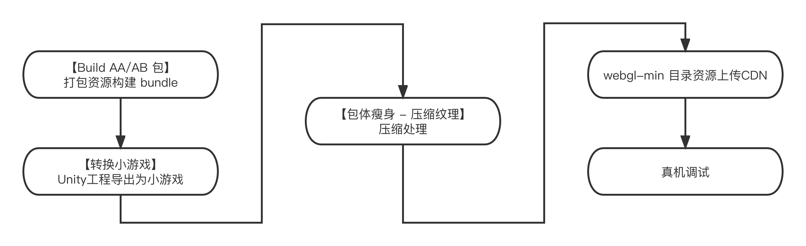

# 微信小游戏压缩纹理工具2.0(Beta)

​		早期 Unity 不支持对 ASTC 纹理格式进行导出，因此在移动端中无法充分利用 GPU 完成硬件的解码渲染。为弥补这一缺陷，微信 Unity SDK 提供压缩纹理按需加载的能力工具。使用该工具将对项目获得如下增益：

- **降低 bundle 体积，资源按需加载，加快游戏运行进度**

​		压缩纹理工具将纹理资源从 Bundle 中分离单独托管，因此 Bundle 体积将变小，这有助于加快游戏运行进度。对于被分离的纹理资源将在游戏实际的使用过程中按渲染需要动态加载。

- **有效降低内存，提升渲染效率**

​		使用压缩后的纹理本身将节约更多的内存空间，这对于内存吃紧的游戏至关重要。微信压缩纹理工具将对同一个纹理资源生成多种不同格式的压缩纹理（如ASTC、DXT……），在游戏运行中如需按需加载，根据实际运行设备 GPU 下载可被识别的压缩纹理。对于资源体积而言将更小，由 GPU 实现硬件解码，效率更高。


## Unity 版本支持问题

​		压缩纹理工具对于 Unity 2019、2020、2021 的部分版本有支持，目前已知一些版本无法使用（如 2021.3.x 、 2020.3.36 等不可用）。为了确保压缩纹理工具的顺利进行，建议开发者根据 **年份大版本** 的基础上选用我们已经验证可行的 Unity 版本：**2019.4.28f1c1 、2020.3.10f1c1、2021.2.18f1c1**，使用新的 Unity 版本后需要重新构建 Bundle 。

|            | Unity引擎自带压缩纹理                                        | 微信小游戏压缩纹理工具       |
| ---------- | ------------------------------------------------------------ | ---------------------------- |
| 版本支持   | Unity 2019支持部分；Unity 2020支持部分格式；Unity 2021支持   | 2019、2020、2021均有版本支持 |
| 格式支持   | Unity 2019支持DXT等；Unity 2020支持DXT、ETC，但不支持ASTC；Unity 2021支持多数 | DXT、ASTC、ETC均支持         |
| 按设备加载 | 不支持                                                       | 支持                         |

**Unity引擎自带压缩纹理：**

​		更统一的工作流；ASTC能支持最近3-4年大部分机型；但PC端不支持ASTC依然需要解压。

**微信小游戏压缩纹理工具：**

​		支持不同平台的自适应(ETC2,ASTC,DXT)；同时纹理从ab中剥离出来，使得ab占用内存更小。

**建议：**

​		若游戏为轻中度游戏，两者均可以使用。对于重度游戏（如MMO、SLG等），对内存以及性能要求较为严苛，应使用 微信UnitySDK压缩纹理工具 进行处理。


## 使用说明

> 请务必确保使用压缩纹理工具时，导出的游戏工程来自 **同版本** 的 **微信 Unity SDK**

主要的执行过程如下图所示：



### 1.安装 Node.js

​		下载并安装 [Node.JS](https://nodejs.org/en/) 并检查环境变量是否生效。

### 2.构建 Bundle 文件

​		项目中若使用 bundle 文件，需先构建 AB包。请勿开启 crc 对 bundle 进行校验。

#### 构建前的纹理格式配置说明：

​		纹理资源的 `WebGL Settings` 的 `Format` 配置项支持列表：

| Format                      | 支持情况     |                                      |
| --------------------------- | ------------ | ------------------------------------ |
| R 8 / R 16 bit              | 支持         |                                      |
| RGBA Crunched DXT5\|BC3     | 不支持       |                                      |
| RGB Crunched DXT1\|BC1      | 不支持       |                                      |
| RGBA Compressed DXT5\|BC3   | 支持         |                                      |
| RGB Compressed DXT1\|BC1    | 支持         |                                      |
| Alpha 8                     | 支持         |                                      |
| RGBA Compressed ETC2 8 bits | 不支持       |                                      |
| RGB Compressed ETC2 4 bits  | 支持         |                                      |
| RGB Compressed ETC 4 bits   | **请勿使用** | 资源占位符专用，全游戏工程请勿使用！ |
| **ASTC 请参考配置说明**     | -            | -                                    |
| RGB(A) Compressed BC7       | 支持         |                                      |
| RGBA 32 bit                 | 支持         |                                      |

#### ASTC格式配置说明：

​		ASTC 是多数移动设备中游戏运行的主要支持的纹理格式，因此也是微信小游戏环境下主要使用到的压缩的纹理资源。

​		在 2021版本 Unity 纹理资源的  `WebGL Settings` 的 `Format` 配置项中，工具支持识别 **RGB(A) Compressed ASTC 8x8、6x6、5x5、4x4 block** 这三种压缩格式，其余格式请勿设置，并且不支持 ASTC HDR 系列的格式。

​		若以上述4种格式配置后，最终生成的多份格式资源中，ASTC 资源将保持对应的 Block Size。值得注意的是，默认推荐使用 Block Size 8x8 格式，4x4 最清晰内存占用也会升高，开发者应根据实际调试后运行效果按需配置。

### 3.导出游戏

​		点击`微信小游戏 - 转换小游戏 - 导出WEBGL并转化为小游戏` 导出游戏工程。请注意！任何时候当 微信Unity SDK 更新后，均需要重新执行该步骤（导出游戏工程）再使用同版本的压缩纹理工具完成后续操作，**不可混版本使用**。

### 4.执行压缩纹理

​		点击 `微信小游戏 - 包体瘦身--压缩纹理` ，可点击 `打开bundle配置面板` 查看识别情况，并按需忽略部分不希望执行压缩纹理的bundle资源，点击 `处理资源` 开始处理。

​		`调试模式` 将只生成 ASTC 格式（开发者工具中使用PNG资源，移动设备使用 ASTC格式资源），调试结束后可再次选用`全量模式`（默认采用增量逻辑不会额外增加处理时间）

​		该步骤根据项目实际情况不同，处理时间也会有差异，执行完成后请留意控制台提示信息，不可存在多个警告消息。


### 5.上传CDN

​		执行完上述步骤后，将 `webgl-min` 目录中的资源上传至 CDN 服务器中，如 Assets 目录、StreamingAssets目录、xxx.webgl.data.unityweb.bin.txt 等文件。


## 原理解释

​		微信纹理压缩工具底层原理是将bundle内纹理资源分离，将资源指针替换至原bundle内，分离出的资源将被处理成多种不同GPU所支持的纹理格式托管至CDN中，游戏实际运行时将劫持渲染时根据资源指针以及当前设备GPU所支持的纹理格式进行远程加载，成功加载立即上传GPU后将从系统内存释放。这样的工作原理即做到了不同硬件所支持的纹理格式按需加载，又相比于bundle全部加载至内存时占用过多的系统内存。经过微信小游戏团队测试，该工具能够降低游戏的运行时内存情况，不同的游戏之间使用的场景、纹理差异降低值是不相同的。


## Q&A

### 1.生成的纹理太大

​		PC端上预览的时候展示的是PNG图片会比较大，手机上用的是带txt后缀的，如astc.txt, 这些文件压缩率很高，注意正式环境CDN一定要开启Brotli或者Gzip，这样加载的时候纹理就会很小。速度快很多。建议优先使用Brotli。

### 2.资源上传至CDN的注意事项

​		上传至CDN时，请注意要按二进制传输，强制storebinary，如果按文本传输也会出现加载回来的图片成黑色。

### 3.非4倍数的资源处理底层逻辑

​		移动设备中大多数使用 ASTC 作为主要的纹理资源格式，ASTC 是不受纹理资源高宽影响的，因此非 4 倍数底层逻辑处理并不会对移动设备上的表现有差异。而对于 DXT 格式是 PC 小游戏中主要的纹理资源格式，该格式是要求高宽必须为 4 的倍数，微信纹理压缩工具在资源处理的过程中识别了资源能否正确的被压缩处理，并在渲染期间做了兜底的渲染策略，在 PC 的表现上，若资源支持以 DXT 格式，则将采用 DXT 渲染，否则遵循兜底策略，其格式优先级为： ASTC、ETC2、DXT、PNG，最差的情况将使用 PNG 格式渲染。

### 4.Node.js异常处理

​		压缩纹理工具执行需要依赖 Node.js 解释器，若执行前已安装 Node.js 但执行时提示未找到则需手动填入本机 Node.js 路径。请将 Node.js 的绝对路径填写至 `Assets/WX-WASM-SDK/Editor/TextureEditor/WXAssetsTextTools.cs` 文件的 `NODE_PATH` 变量中。若开发者使用API调用执行，可对该变量进行直接赋值。


## 微信压缩纹理API介绍

​		为方便开发者构建个性化的工程导出能力，微信压缩纹理工具提供了相应的 API 调用接口，开发者可以在游戏内自助构建游戏导出脚本，完成发布上传前的自动化操作。

> 提示：为简化调用，忽略ab、工程路径等数据均来自面板配置此处不提供相应参数传入，面板配置后将被存盘记录无需每次执行前进行配置。

### WXAssetsTextTools.CompressText( ... )

​		void WXAssetsTextTools.CompressText(Action<bool, string> complete = null, string bundleDir = null, string outBundleDir = null, bool debug = false, bool force = false)

#### 说明

​		执行微信压缩纹理流程，该函数为异步函数，调用后并不会立即处理成功，需提供 complete 函数来获取执行结束后的回调事件。

#### 参数

| 参数         | 类型   | 说明                                                         |
| ------------ | ------ | ------------------------------------------------------------ |
| complete     | Action | 执行结束的回调函数，形参1(bool) 返回执行是否成功，形参2(string)返回执行错误时的错误提示信息。 |
| bundleDir    | string | 可缺省，若存在独立的AB包目录，则此处填写目录的绝对路径。     |
| outBundleDir | string | 可缺省，若填写bundleDir则不可省略，独立AB包处理后的输出目录。 |
| debug        | bool   | 可缺省，默认全量生成(false)，true时仅生成ASTC格式纹理。      |
| force        | bool   | 可缺省，默认遵循增量逻辑(false)，true时将强制生成（已生成资源仍然生成并覆盖）。 |

例子：

```c#
WXAssetsTextTools.CompressText((result, msg) =>
	{
		if (result)
		{
			Debug.Log("微信压缩纹理转换完成！");
		}else{
			Debug.LogError(msg);
		}
	}, 
	null, 
	null, 
	false,
	false);
```


### WXAssetsTextTools.GetAssetBundles( ... )

​		void WXAssetsTextTools.GetAssetBundles(Action<string[]> callback = null, string bundleDir = null)

#### 说明

​		获取微信压缩纹理工具所能扫描到的符合条件的AB包路径数组。相同参数情况下，所扫描到的资源列表则为实际可被执行处理的资源。

#### 参数

| 参数      | 类型   | 说明                                                         |
| --------- | ------ | ------------------------------------------------------------ |
| callback  | Action | 扫描结束的回调函数，形参(string[]) 返回扫描到的ab包资源绝对路径。 |
| bundleDir | string | 可缺省，若存在独立的AB包目录，则此处填写目录的绝对路径。     |
