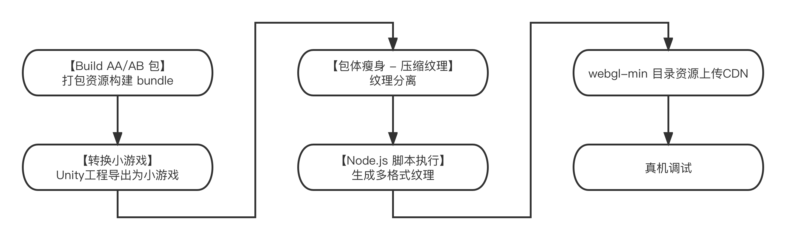
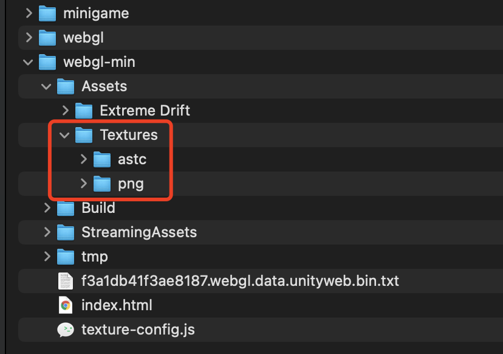

# 微信小游戏压缩纹理工具(Beta)

​		早期 Unity 不支持对 ASTC 纹理格式进行导出，因此在移动端中无法充分利用 GPU 完成硬件的解码渲染。为弥补这一缺陷，微信 Unity SDK 提供压缩纹理按需加载的能力工具。使用该工具将对项目获得如下增益：

- **降低 bundle 体积，资源按需加载，加快游戏运行进度**

​		压缩纹理工具将纹理资源从 Bundle 中分离单独托管，因此 Bundle 体积将变小，这有助于加快游戏运行进度。对于被分离的纹理资源将在游戏实际的使用过程中按渲染需要动态加载，且内存占用将更低。

- **有效提升渲染效率**

​		压缩纹理工具将对同一个纹理资源生成多种不同格式的压缩纹理（如ASTC、DXT……），在游戏运行中如需按需加载，将根据实际运行设备 GPU 下载可被识别的压缩纹理。对于资源体积而言将更小，由 GPU 实现硬件解码，效率更高。


## Unity 版本支持问题

​		压缩纹理工具对于 Unity 2019、2020、2021 的部分版本有支持，目前已知一些版本无法使用（如 2021.3.x 、 2020.3.36 等不可用）。为了确保压缩纹理工具的顺利进行，建议开发者根据 **年份大版本** 的基础上选用我们已经验证可行的 Unity 版本：**2019.4.28f1c1 、2020.3.10f1c1、2021.2.18f1c1**，使用新的 Unity 版本后需要重新构建 Bundle 。


## 使用说明

> 请务必确保使用压缩纹理工具时，导出的游戏工程来自 **同版本** 的 **微信 Unity SDK**

主要的执行过程如下图所示：



### 1.安装 Node.js

​		下载并安装 [Node.JS](https://nodejs.org/en/) 

### 2.构建 Bundle 文件

​		项目中若使用 bundle 文件，需先构建 AB包。请勿开启 crc 对 bundle 进行校验。

#### 构建前的纹理格式配置说明：

​		纹理资源的 `WebGL Settings` 的 `Format` 配置项支持列表：

| Format                      | 支持情况       |                          |
| --------------------------- | -------------- | ------------------------ |
| R 8 / R 16 bit              | 支持           |                          |
| RGBA Crunched DXT5          | **请勿使用！** | 资源占位符专用，请勿使用 |
| RGB Crunched DXT1           | **请勿使用！** | 资源占位符专用，请勿使用 |
| RGBA Compressed ETC2 8 bits | 不支持         |                          |
| Alpha 8                     | 支持           |                          |
| RGB Compressed ETC 4 bits   | 支持           |                          |
| RGB Compressed ETC2 4 bits  | 支持           |                          |
| ASTC 请参考配置说明         | -              | -                        |
| RGB(A) Compressed BC7       | 支持           |                          |
| RGBA Compressed DXT5\|BC3   | 支持           |                          |
| RGBA Crunched DXT5\|BC3     | 不支持         |                          |
| RGB Compressed DXT1\|BC1    | 支持           |                          |
| RGBA 32 bit                 | 支持           |                          |

#### ASTC格式配置说明：

​		ASTC 是多数移动设备中游戏运行的主要支持的纹理格式，因此也是微信小游戏环境下主要使用到的压缩的纹理资源，旧版本 微信Unity SDK对资源处理中全部采用 Block Size 8x8 格式实现压缩，但在实际的应用中发现部分纹理的清晰度或可能不及预期，但又无法针对性的配置，新版本的 微信 Unity SDK 提供了这一单独配置的能力，请阅读如下指引：

​		新版本 微信UnitySDK 已经支持不同 ASTC Block Size 配置但只支持 **RGB(A) Compressed ASTC 4x4、6x6、8x8 block** 这三种压缩格式，其余格式请勿设置，并且不支持 ASTC HDR 系列的格式。前往游戏工程内对纹理资源的 `WebGL Settings` 的 `Format` 配置后，需要重新构建AB包，则资源若以上述3种格式配置后，最终生成的多份格式资源中，ASTC 资源将保持对应的 Block Size。

​		值得注意的是，默认推荐使用 Block Size 8x8 格式，4x4 最清晰内存占用也会升高，开发者应根据实际调试后运行效果按需配置。

### 3.导出游戏

​		点击`微信小游戏 - 转换小游戏 - 导出WEBGL并转化为小游戏` 导出游戏工程。请注意！任何时候当 微信Unity SDK 更新后，均需要重新执行该步骤（导出游戏工程）再使用同版本的压缩纹理工具完成后续操作，**不可混版本使用**。

### 4.执行压缩纹理(分离)

​		点击 `微信小游戏 - 包体瘦身--压缩纹理` ，配置好 bundle 后缀后，可点击 `打开bundle配置面板` 查看识别情况，并按需忽略部分bundle资源，点击 `处理资源` 开始处理。如果自定义了bundle生成路径，要将bundle复制到导出目录的webgl目录下。

​		该步骤根据项目实际情况不同，处理时间也会有差异，执行完成后请留意控制台提示信息，不可存在多个警告消息。



### 5.执行压缩纹理(生成)

​		步骤4 处理完成后，控制台将给出使用 Node.js 脚本执行的消息提醒，开发者应根据提醒进入该目录，执行：

```shell
#开发调试阶段使用 只生成 ASTC 格式用于真机调试
node compress_astc_only.js
#上线时使用 生成所有格式纹理资源
node compress_all.js
```

### 6.上传CDN

​		执行完上述步骤后，将 `webgl-min` 目录中的资源上传至 CDN 服务器中，如 Assets 目录、StreamingAssets目录、xxx.webgl.data.unityweb.bin.txt 等文件，log 目录无需上传。


## Q&A

### 1.生成的纹理太大

​		PC端上预览的时候展示的是PNG图片会比较大，手机上用的是带txt后缀的，如astc.txt, 这些文件压缩率很高，注意正式环境CDN一定要开启Brotli或者Gzip，这样加载的时候纹理就会很小。速度快很多。建议优先使用Brotli。

### 2.资源上传至CDN的注意事项

​		上传至CDN时，请注意要按二进制传输，强制storebinary，如果按文本传输也会出现加载回来的图片成黑色。

### 3.Unity升级至2021后已支持ASTC，是否无需再使用微信压缩纹理工具

|            | Unity引擎自带压缩纹理                                        | 微信小游戏压缩纹理工具       |
| ---------- | ------------------------------------------------------------ | ---------------------------- |
| 版本支持   | Unity 2019支持部分；Unity 2020支持部分格式；Unity 2021支持   | 2019、2020、2021均有版本支持 |
| 格式支持   | Unity 2019支持DXT等；Unity 2020支持DXT、ETC，但不支持ASTC；Unity 2021支持多数 | DXT、ASTC、ETC均支持         |
| 按设备加载 | 不支持                                                       | 支持                         |

**Unity引擎自带压缩纹理：**

​		更统一的工作流；ASTC能支持最近3-4年大部分机型；但PC端不支持ASTC依然需要解压。

**微信小游戏压缩纹理工具：**

​		支持不同平台的自适应(ETC2,ASTC,DXT)；同时纹理从ab中剥离出来，使得ab占用内存更小。

**建议：**

​		若游戏为轻中度游戏，两者均可以使用。对于重度游戏（如MMO、SLG等），对内存以及性能要求较为严苛，应使用 微信UnitySDK压缩纹理工具 进行处理。
