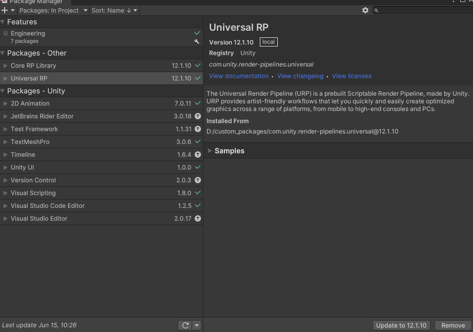

# 定制微信小游戏的 URP 管线
- 本文档主要说明如何在 Unity 官方 URP 管线基础上，定制适合微信小游戏的 URP 管线。
- URP 是 Unity 通用渲染管线，支持移动端、PC、WebGL 平台的游戏开发，它包含的功能很全面也很强大。
- 但对于大部分微信小游戏，有些功能可能是用不上，诸如延迟渲染、XR、多光源管理等。直接用官方 URP 管线，那些用不到的功能在运行时可能也会有性能开销，因此，将那些游戏用不到的功能在编译期就去掉，对运行时性能会有提升。
- 定制 URP 管线除了具备 C# 和 Shader 相关的编程知识，还要对渲染管线有一定了解。
- 首先需要 [本地化 URP 包](#本地化-urp-包)

>### 本地化 URP 包 
- 首先将官方的 URP 包本地化，本地化后我们可以自由地定制化 URP，Unity 也支持从本地加载 URP 相关的 Package 包
- 这里假设 Unity 游戏项目工程已经安装好 URP，并且已经切换到 WebGL 平台，使用官方 URP 版本进行游戏开发
- 打开 Unity Editor 后，点开 Window 菜单，并选中 Package Manager 打开 Package Manager 窗口 
- 选择 `Packages：In Project`，在 Packages - Unity 一栏显示的是 当前项目安装的 官方 Packages 
    - 安装 URP后，列表会有 `Universal RP`项，选中，面板右测会显示 URP版本信息，右小角有 Remove 按钮  
- 除了 `Universal RP`包，URP 还会安装其他依赖包，主要有 `Core RP Library` 和 `Shader Graph` 
    - `Core RP Library` 是 URP 依赖的基础代码包 
    - `Universal RP` 是 URP 本身的代码包 
    - `Shader Graph` 是 Shader 可视化编辑器的包 
- 选择 `Packages：Unity Registry`，才会看到 `Core RP Library` 和 `Shader Graph` 等包的情况
- 定制 URP 主要需要修改 `Universal RP` 和 `Core RP Library` 这两个包
- 这里需要将 `Universal RP` 和 `Core RP Library` 这两个包从项目工程的缓存目录里拷贝出来 
    - 找到 项目工程的 Library/PackageCache/ 文件夹
    - 找到 `com.unity.render-pipelines.universal@12.1.10` 和 `com.unity.render-pipelines.core@12.1.10` 两个子文件夹
        - 这里以 URP 12.1.10 版本 (配套Unity 2021.3.19)，其他 URP版本的路径是差不多的，就是 @ 带的版本号不一样
    - 将这两个子文件夹拷贝到工程目录外的一个本地文件夹 (这里是放 `D:/custom_packages/`，路径随意，只要不要放到工程目录下即可)
- 在 `Package Manager` 窗口找到 `Universal RP` 选中，然后点击面板右下角的 Remove 按钮，移除掉官方的 URP版本
    - 除了 `Universal RP`包，`Core RP Library` 和 `Shader Graph`包也会同时被移除
- 稍等一会，官方 URP 包就会被移除，此时 Unity Game 和 Scene 视图可能显示粉红色的渲染异常，这是正常现象，不用担心
- 导入本地的 `Core RP Library`包
    - 在 Package Manager 窗口，点击左上角 `+` 号按钮，在弹出列表选择 `Add package from disk`
    - 在弹出的 `Select package on disk` 窗口，选择 `D:/custom_packages/com.unity.render-pipelines.core@12.1.10/package.json`文件打开
- 导入本地的 `Universal RP`包 
    再次点击 左上角 `+` 号按钮，选择 `D:/custom_packages/com.unity.render-pipelines.universal@12.1.10/package.json`文件打开
- 注意 需要先导入本地的 `Core RP Library`，然后再导入`Universal RP`. 顺序不能反! (否则会自动引入官方的`Core RP Library`包)
- 当导入完成后，Unity Game 和 Scene 视图得渲染应该会恢复正常的
- 此时在 `Package Manager` 窗口 选择 `Packages：In Project`, 在 `Packages - Other` 一栏会看到`Core RP Library` 和 `Universal RP`

- 此时本地化 URP 包已经完成了，下一步可以在本地的包定制 URP 
- 如果此时 Unity Editor 有些 warning 甚至 error 的日志，可能和替换 URP 包有关系，一般重启一下 Editor 就好了
- 接下来需要[准备条件编译宏](#准备条件编译宏)

>### 准备条件编译宏
- 为什么要用条件编译宏来定制代码 ？
    - 其实不用宏也可以定制本地化的 URP 包，但这样定制会影响到所有平台，而加了 WebGL 平台相关的宏，那么只会影响到 WebGL 平台
    - 有了编译宏可以保留 原来的 URP 的代码，也方便知道自己修改了哪些内容 
- 需要分别对 C# 脚本 和 Shader HLSL 代码 增加 微信小游戏专用宏 `WX_PERFORMANCE_MODE`
- 在 C# 脚本增加宏定义`WX_PERFORMANCE_MODE` 
    - 首先打开 Unity，在 Edit 菜单选择 Project Settings 打开该窗口
    - 然后在Project Settings 窗口选择 Player项，在 Player页选择 `WebGL settings` 标签页
        - 在该标签页下找到 Other Settings 的 `Scripting Define Symbols`
        - 点击`+`号，添加宏`WX_PERFORMANCE_MODE`，然后点击`Apply` 让其生效
        - 那么在 C# 脚本环境就会有宏`WX_PERFORMANCE_MODE` 的定义
- 在 Shader HLSL 代码增加宏定义`WX_PERFORMANCE_MODE`
    - 这里采用了一种取巧的方式来定义（Unity 2021.3 没有定义 Shader HLSL 全局宏的接口，如果后面版本有相关的接口，那会方便很多）
        - 在 `com.unity.render-pipelins.core@12.1.10/ShaderLibrary/Common.hlsl` 和 `com.unity.render-pipeline.universal@12.1.10/ShaderLibrary/Input.hlsl` 这两个文件的开头新增以下代码:
```c
#ifndef WX_PERFORMANCE_MODE
    #if (defined(SHADER_API_GLES) || defined(SHADER_API_GLES30) || defined(SHADER_API_GLES3)) 
        #define WX_PERFORMANCE_MODE 1
    #else 
        #define WX_PERFORMANCE_MODE 0
    #endif 
    #ifndef SHADER_API_MOBILE
        #define SHADER_API_MOBILE WX_PERFORMANCE_MODE
    #else 
        #if !SHADER_API_MOBILE && WX_PERFORMANCE_MODE
            #undef SHADER_API_MOBILE
            #define SHADER_API_MOBILE WX_PERFORMANCE_MODE
        #endif 
    #endif 
#endif
```
- 这样，就可以在 C# 代码 和 Shader HLSL 代码 通过宏`WX_PERFORMANCE_MODE`来定制代码
```c
#if WX_PERFORMANCE_MODE // 表示 微信 WebGL 平台
...
#endif

#if !WX_PERFORMANCE_MODE // 表示 非微信 WebGL 平台
...
#endif 
```
- 注意 1：Shader HLSL 的 `WX_PERFORMANCE_MODE` 不是 WebGL 平台特有的，而是通过 SHADER_API_GLES* 宏来开启的，除了 WebGL 平台会启用 SHADER_API_GLES* 宏，还有 安卓 GLES 平台也会启用这个宏  
- 注意 2：Unity Editor 默认用渲染图形 API 是 DirectX，而不是 GLES，因此在 Editor 下，HLSL 的宏
`WX_PERFORMANCE_MODE` 是不生效的，而 C# 的是生效的 
- 注意 3：上述的代码除了启用了 `WX_PERFORMANCE_MODE`宏，还会启用`SHADER_API_MOBILE`宏
    - `SHADER_API_MOBILE` 宏是 Unity 对移动平台的一个优化项，在 WebGL 平台是没有开启这一项优化，这里顺带把它开启了 
- 接下来，可以[定制本地化 URP 管线](#定制本地化-urp-管线) 

> ### 定制本地化 URP 管线   
- 定制 URP 管线一般而言，是具体项目具体分析的，对于微信平台的小游戏，有一些共同点是可以参考的
- 这里列举一些微信小游戏可考虑优化的功能：
    - Deferred 延迟渲染 和 GBuffer 相关Pass
    - 后处理，例如 FilmGrain（胶片颗粒）、PaniniProjection（圆柱状投影）、ChromaticAberration（颜色偏移后处理）等
    - XR 相关功能 (有相关 XR 宏，也可以再用 WX_PERFORMANCE_MODE 宏关闭)
    - Additional Lights 额外的光源 (基本一个主方向光就够了)
    - Clustered Rendering 光照分簇渲染 (多光源分簇渲染，基本上不上)
    - Reflection Probe 反射探头 (可以简化)
    - Light Probe 光照探头 (可以简化)
    - 材质 UnityPerMaterial 属性 (用不到的属性可以剔除掉)
    - Lightmap 光照贴图 (可以简化)
    - Shader 优化 (多余的 Uniform 变量、半精度、简化计算等)
    - 简化阴影 Shadow Cascades (可以简化)
    - Light Cookie (根据项目需要，看是否去掉)
    - ScreenSpaceShadows、ScreenSpaceOcclusion (屏幕空间阴影、遮蔽，根据项目需要，看是否去掉)
    - Motion Vector 相关 (根据项目需要，看是否去掉)
    - Decal 贴花 (根据项目需要，看是否去掉)
    - Fog 雾效 (根据项目需要，看是否去掉)
    - ColorGradingLutPass (根据项目需要，看是否去掉) 
    - UseOptimizedStoreActions 设置 
    - NormalReconstruction (根据项目需要，看是否去掉)
    - Debug 代码 DebugHandler、DebugDisplaySettingsUI、DrawGizmos、DrawWireOverlay (Debug代码，去调)
- 除了上面列举的功能，还可以根据项目类型或项目需要简化或去掉 URP 一些功能
- 下面是一个 [供参考的 URP 定制版本](#供参考的 URP 定制版本)

>>#### 供参考的 URP 定制版本
- 开发者请填写 [微信小游戏定制 URP 管线申请表](https://doc.weixin.qq.com/forms/AJEAIQdfAAoACQA2gY2AD41M603Bw3QIf?page=1) ，等待通过后即可获取微信定制版的 URP 源码
- 这是基于 Unity 2021.3.19 的 URP 12.1.10 版本定制的渲染管线，主要是用来参考如何定制 URP 管线，
- 这个 URP 版本是基于大部分微信小游戏的渲染需要来定制的，主要修改有以下这些：
    - 不影响 GPU Instancing 和 SRP Batcher 
    - 只支持一盏实时方向光，裁剪 Additional Light 额外的光照
        - 裁剪 _MainLightOcclusionProbes
        - 裁剪 _MainLightLayerMask， 默认使用 DEFAULT_LIGHT_LAYERS
    - 只支持最基础的 Lightmap，裁剪支持 Directional Lightmap 和 Dynamic Lightmap
    - 简化级联阴影 CSM 
        - 修改 MainLightShadowCasterPass.cs 
            - 去掉 SetEmptyMainLightCascadeShadowmap 额外开销
        - 半透明物体投射阴影，会被当作不透明物体
        - CSM 最多支持 2 级 (默认是 4 级的)
        - 裁剪软阴影
        - 裁剪 _ShadowBias 设置阴影偏移
        - 裁剪 ShadowFade
        - 裁剪 MixRealtimeAndBakedShadows
        - 裁剪 BEYOND_SHADOW_FAR
        - 裁剪 _MainLightShadowParams
    - 简化了 UnityPerMaterial 材质 （包括 UnlitInput、SimpleLitInput、LitInput、BakedLitInput 的） 
    - TransformObjectToWorldNormal 和 TransformWorldToObjectNormal 使用 UNITY_ASSUME_UNIFORM_SCALING 版本 
    - 只支持 unity_SpecCube0，裁剪 unity_SpecCube1，unity_SpecCube0_HDR 和 unity_SpecCube1_HDR，
        - 裁剪 ReflectionProbe Bleed 和 BoxProjection
    - 裁剪 _GlossyEnvironmentColor、_GlossyEnvironmentCubeMap 和 _GlossyEnvironmentCubeMap_HDR
    - 裁剪 unity_ProbesOcclusion ( 去掉了 Shader HLSL 对应的 uniform 变量 )
    - 裁剪 Alpha Test 镂空 （自己写的 Shader 可以支持镂空，这里是指 URP 自带的 Shader 裁剪了 镂空功能）
    - 裁剪 Fog 雾效
    - 裁剪 Deferred 延迟渲染 和 GBuffer 相关Pass 
    - 裁剪 Decal 贴花
    - 裁剪 _DETAIL 细节纹理 
    - 裁剪 Light Cookie 
    - 裁剪 clearCoatMask 和 clearCoatSmoothness 清漆效果
    - 裁剪 ColorGradingLutPass 
    - 裁剪 ClusteredRendering
    - 裁剪 XR 
    - 裁剪 RenderGraph（代码用 WX_PERFORMANCE_MODE 屏蔽了）
    - 裁剪 MotionVector 运动向量或运动模糊
    - 裁剪 NormalReconstruction 法线重建
    - 禁用了部分不常用的后处理（FilmGrain、DepthOfField、CameraMotionBlur、PaniniProjection 等），只保留 Bloom 等少数后处理 （后处理慎用）
    - 裁剪 ScreenSpaceShadows、ScreenSpaceOcclusion
    - 裁剪 _Surface 设置表面的类型 (是否不透明) 
    - 裁剪 unity_RenderingLayer
    - 裁剪 unity_LODFade
    - 裁剪 _AmbientOcclusionParam
    - 裁剪 _GlobalMipBias
    - 裁剪 _ScaledScreenParams
    - 裁剪 unity_WorldTransformParams
    - 裁剪 unity_OrthoParams（正交投影相机需要注意）
    - 裁剪 Camera renderScale （相机缩放会引入额外的 Pass）
    - 裁剪 UseOptimizedStoreActions 设置 
    - SpeedTree7Passes 和 SpeedTree8Passes 
        - 裁剪 dithering LOD transition
    - Shader HLSL 部分变量全精度改为半精度 （例如 normalWS 类型从 float3 改为 half3 ）
    - Shader HLSL 其他的一些修改
        - 用 LinearToGamma22 替代 LinearToSRGB 
        - 简化了 ReflectivitySpecular 函数
        - 简化了 DirectBRDFSpecular 函数 
        - 简化了 VFXCalcPixelOutputForward 函数
        - 简化 SubtractDirectMainLightFromLightmap 函数 
            - 去掉 _SubtractiveShadowColor 影响
    - 裁剪 DEBUG_DISPLAY、 DebugHandler、DebugDisplaySettingsUI、DrawGizmos、DrawWireOverlay
- 所有 C# 和 Shader HLSL 代码改动 都有 `WX_PERFORMANCE_MODE` 来做条件编译，改动详情可参考源代码

>>#### 微信 URP 定制版本的性能数据对比
- 1. 使用 URP SimpleLit Shader 的测试场景，静置如下图：

- Perfog 统计的数据 (设备 iPhone X) ，定制版本的 GPU利用率从 50%下降到 38.2%，降幅达到 23%，且 Shader半精度的利用率也有所提高

| 版本   | FPS | GPU 利用率% | 半精度利用率% | 全精度利用率% | Total CPU 利用率%
|--------:|---:|----------:|----------------:|--------------:|:-----
|官方URP | 59.8 |  50   |      11.92   |   35.24  |   23   
|定制URP | 59.9 |  38.2 |       8.87   |   45.5  |    23.1
- 2. 使用 URP Lit Shader 的测试场景，静置如下图：

- Perfog 统计的数据 (设备 iPhone X) ，定制版本的 GPU利用率从 70.8%下降到 51.1%，降幅达到 27.8%，且 Shader半精度的利用率也有所提高

| 版本   | FPS | GPU 利用率% | 半精度利用率% | 全精度利用率% | Total CPU 利用率%
|--------:|---:|----------:|----------------:|--------------:|:-----
|官方URP | 59.8 |  70.8   |      5.88   |   43.72  |   22.9   
|定制URP | 59.9 |  51.1 |      8.59   |   35.39  |    23.2


>### 注意事项
- 开发者使用的 Unity 版本 和 URP 版本可能不一样，不能拿微信定制的 URP  直接用的，但是
- 即使开发者用的 URP 版本和微信定制的 URP版本一致，有需要根据项目实际情况，来决定是否直接使用微信定制的版本
- 微信定制的 URP 版本目前没有对 Shader 变体做剔除的，因为 .shader 文件非 HLSL部分 不能用`WX_PERFORMANCE_MODE`宏来控制，因此 Shader 变体这部分开发者可以在定制的过程中剔除掉不需要的功能
    - 例如 fog雾效不会用到，可以手动在 .shader 将相关的 pragma指令删除
- 使用了定制的 URP 版本后 ，可以切回官方的 URP 包吗 ？
    - 可以，先把本地的 URP包移除掉，然后通过 `Package Manager` 窗口的 `Add package by name`，输入`com.unity.render-pipelines.universal` 即可
- 微信定制的 URP 12.1.10 版本对应 Unity 2021.3.19，其他 Unity 版本可以直接拿来用吗
    - 如果是 Unity 2021.3.19 ~ 23，URP 版本是很接近的，如果这里给出的参考版本满足开发者需要，可以拿来用
    - 其他 Unity 版本不一样 或者 不满足渲染需要，建议基于当前 Unity版本 的 URP 进行定制，可以借鉴里面定制的方法或思路
- 上述定制的 URP 版本 是否适用于 App 移动端 平台 ？
    - 不能直接用，但定制的做法或思路可以借鉴
- 定制版本的 URP 版本和 官方 URP 的渲染结果是否一致 ？
    - 如果使用的功能是定制 URP 支持的，那么渲染结果基本一致的，如果渲染差异比较大，那么应该是使用了定制 URP 裁剪掉的功能

### 参考
- [Unity URP 官方文档](https://docs.unity3d.com/Packages/com.unity.render-pipelines.universal@12.1/manual/index.html)