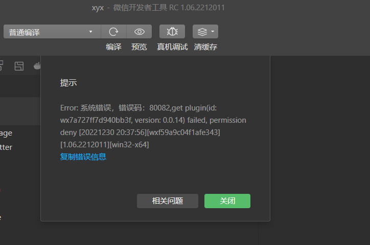

# 技术常见问题QA
## 工具使用
#### 1.微信开发者工具打开时提示“app.json未找到”

- 请注册小程序appid，并申请为小游戏服务类目
- 请参考[小游戏开发者文档-注册一个小游戏帐号](https://developers.weixin.qq.com/minigame/dev/guide)
#### 2.微信开发者工具打开时提示“找不到game.json或读取错误”

- 打开导出目录/minigame文件夹而不是导出的根目录
#### 3.如何在真机上预览游戏

- 请使用微信开发者工具-预览-二维码/自动预览
- 切勿使用微信开发者工具的"真机调试"功能
#### 4.如何在真机上进行调试和错误日志排查

- 方式1：game.js增加代码"wx.setEnableDebug({enableDebug: true})"
- 方式2：真机环境中，右上角"..."-打开调试-重启小游戏-vconsole
- 上述方法之后，若启动封面无法打开vconsole, 请点三次下方的"unity logo"
- 错误日志中的业务代码堆栈分析可参考文档 [开发错误调试与排查](DebugAndException.md)
#### 5.Unity PlayerSettings导出选项中使用"brotli"或"gzip", 使用微信开发者工具无法启动游戏

- 请勿修改PlayerSettings的压缩选项，保持为不压缩
- 转换工具对代码包自动进行br压缩
- 资源包请使用CDN gzip/br, 传输大小与zip压缩后体积相当
#### 6.使用代码分包的情况下，启动游戏出现“首次拉取代码分包”提示

- 原因是收集函数不够完备，查看分包工具是否有新收集函数，重新生成一轮即可
- 该提示仅在开发版本提示，代表在“引擎+业务首场景”初始化时遇到了缺失函数
#### 7.微信开发者工具提示"资源下载失败"

- 请将首资源包放CDN或HTTP服务器，并正确设置导出面板的“游戏资源CDN“
#### 8.微信开发者工具能正常打开游戏，但Android卡在首屏，资源下载失败

- 请参考文档[网络通信适配](UsingNetworking.md#注意事项)，尤其关注安全域名、跨域与SSL证书等问题
#### 9.开发者工具提示“插件申请成功，待审核确认”

- 请前往mp后台-能力地图-生产提效包-快适配，开通使用。参考指引[转换工具导出微信小游戏](Transform.md)

#### 10.内网开发时，微信开发者工具服务异常
- 微信开发者工具域名被屏蔽，参照指引放开域名限制[微信开发者工具域名列表](DevtoolsDomain.md)

#### 11.开发者工具提示`pluginid: wx7a727ff7d940bb3f, permission deny`字样错误
Q: 



A: 新版导出插件使用小游戏插件来渲染关系链数据，因此需要添加插件。可通过微信开发者工具控制台-添加插件的报错信息添加插件，即可正常使用。同时需要注意**实际未使用关系链数据时请删掉game.json中plugins.Layout配置**。如果开发者工具控制台没有添加插件的入口请手动在MP端[添加插件](https://mp.weixin.qq.com/wxopen/plugindevdoc?appid=wx7a727ff7d940bb3f)或者升级至最新版本的开发者工具。

#### 12.小游戏包中的`webgl.wasm.symbols.unityweb`不会被上传，是做什么用的
- 堆栈信息，主要用于[错误调试与异常排查](https://github.com/wechat-miniprogram/minigame-unity-webgl-transform/blob/main/Design/DebugAndException.md)

#### 13.如何自定义接入构建流程
- 除在微信小游戏转换工具面板配置导出外，微信SDK工具支持开发者自行实现构建，基于 `WXConvertCore.cs` 脚本提供的 `DoExport()` 方法实现导出，参考代码如下：
```CSharp
if (WXConvertCore.DoExport() == WXConvertCore.WXExportError.SUCCEED) {
  Debug.Log("成功");
  //... 后续操作
} else {
  Debug.LogError("失败");
}
```
  
## Unity WebGL
#### 1.能否使用System.Net命名空间下的接口

- 不行，WebGL导出时网络需要进行改造适配，请参考文档[网络通信适配](UsingNetworking.md)
#### 2.小游戏启动出现"Unable to load DLL ...."  

-  WebGL模式不允许加载非源码编译的插件，需游戏自行排查
-  典型地，如System.Net、lua外部模块、某些依赖平台的第三方插件
#### 3.能否使用System.File相关接口做文件存储

 - 如果是资源(比如AssetBundle)需要进行缓存, 适配插件已自动完成，注意bundle命名规则和缓存策略即可，请参考文档[资源部署与缓存](DataCDN.md)
 - 如果是玩家存档，可使用C# SDK中的小游戏存储接口。此外，更建议使用服务器或云开发进行定期存储，因为微信用户更容易删除小程序，文件存储将随之被删除。
#### 4.如何接入第三方的js sdk, 能写js脚本和C#进行交互吗？

- 可以，请参考我们提供的C# SDK写法，原理也是利用到了JS与C#互通的特性。具体方式请参考Unity官方文档[Interaction with browser scripting](https://docs.unity3d.com/cn/2021.3/Manual/webgl-interactingwithbrowserscripting.html)
#### 5.小游戏的中文字体不显示，但Editor没问题

- WebGL环境下的中文显示需要自定义字体，打包在首资源包或Bundle；***请尽量使用2~3MB以内的精简字体以免影响游戏启动速度***
#### 6.游戏逻辑是否能使用lua

- 可以，但具体性能需自己实际评测，请参照[Demo](https://github.com/wechat-miniprogram/minigame-unity-webgl-transform/tree/main/Demo)示例。
- lua可使用AssetBundle方式整体打包，require时使用bundle.LoadAsset同步接口获取脚本
#### 7.Touch事件丢失或错误，导致多点触控不正确

- 请将WXTouchInputOverride.cs附加到EventSystem对象上，已测试EasyTouch、UGUI、FairGUI可正常工作

#### 8.显示黑屏，运行提示大量shader编译错误

- 默认导出未webgl1, 请确认游戏是否依赖webgl2(opengles3.0)
- 导出选项勾选webgl2实验能力
#### 9.Unity FMOD音频插件是否支持？

- 支持，目前微信小游戏已支持fmod转换的小游戏
#### 10.Mac 系统下 Unity 构建 WebGL 项目报`Failed running "../il2cppcore/il2cppcore.dll"`错误解决办法

- 报错原因：Unity 2020及以前（如2019）版本构建 WebGL 仍然需要 Python2 ，而Mac OS 12.3版本起已经不再内置 Python2。

- 一种解决办法：

  （1）前往 python 官网下载对应的 [python2.7.dmg](https://www.python.org/downloads/macos/) 安装包直接进行安装；

  （2）在 Unity 工程目录任意位置创建 `.cs` 脚本文件，内容如下：

  ```c#
  #if UNITY_EDITOR
  using UnityEditor;
  using UnityEditor.Build;
  using UnityEditor.Build.Reporting;
  using UnityEngine;
  
  public class PreBuildProcessing : IPreprocessBuildWithReport
  {
      public int callbackOrder => 1;
      public void OnPreprocessBuild(BuildReport report)
      {
          System.Environment.SetEnvironmentVariable("EMSDK_PYTHON", "/Library/Frameworks/Python.framework/Versions/2.7/bin/python");
      }
  }
  #endif
  ```

  其中 Python 路径请自行检查，若由步骤（1）方式安装的一般无需改动，至此问题解决。
  
#### 11.引擎代码裁剪级别(Managed Striping Level)应该如何设置？

- 建议勾选并设置为High, 如果发现部分代码被错误裁剪，请参考[托管代码剥离](https://docs.unity.cn/cn/2019.4/Manual/ManagedCodeStripping.html)

#### 12.使用xlua等方案在WebGL平台报“ArgumentException: Destination array was not long enough”？

- 请参考https://github.com/Tencent/xlua/issues/741

## 平台适配
#### 1.文本输入框点击无法输入，没有弹出输入法

- 请参考小游戏输入法API进行适配，示例[API Demo](https://github.com/wechat-miniprogram/minigame-unity-webgl-transform/tree/main/Demo/API)
#### 2.高性能模式下iOS无法加载，但Android和微信开发者工具没问题

- 请参考文档[iOS高性能模式](iOSOptimization.md)QA部分
#### 3.Android运行达到满帧较为流畅，iOS性能差

- 请参考文档[iOS高性能模式](iOSOptimization.md)概述部分
#### 4.小游戏中能插入超链接跳转网页吗？

- 不行，不提供内嵌webview或跳转的能力
#### 5.小游戏是否支持Unity VideoPlayer

- 支持，详情查看[音频视频适配](AudioAndVideo.md)
#### 6.小游戏应该使用哪个接口进行限制帧率？

- Application.targetFrameRate
- 使用导出插件的“性能面板”(ProfileStats)可以看到帧耗时、限帧与当前FPS
- 使用Perfdog查看帧率并不总是准确，因为30/15等帧率是微信使用raf分帧处理，Perfdog统计的是raf触发帧率而不是分帧后的帧率。
#### 7.Unity Audio音频是否需要使用小游戏音频适配

- 转换方案已通过WebAudio支持Unity音频，通常无需替换
#### 8.PlayerPref或用户数据存储失效

- 使用小程序云开发或自建服务器进行云端存储（推荐，因本地存储的话，由于微信环境下玩家非常容易删除本地小游戏而导致存档丢失）
- 使用WX C# SDK提供的PlayerPref进行存储，可以替代已有Unity的PlayerPref。但需要注意该部分数据使用小游戏Storage，有10MB存储上限。 由于接口是同步调用(阻塞游戏线程)，不建议频率过高的调用。“存储“请参考https://developers.weixin.qq.com/minigame/dev/guide/base-ability/storage.html
- 使用WX C# SDK的文件API进行自行本地存储，他会与游戏资源缓存共用“文件系统”区域，有200MB存储上限，建议使用异步接口以不影响主线程帧率。“文件系统”请参考https://developers.weixin.qq.com/minigame/dev/guide/base-ability/file-system.html
- 总体而言，尽量使用云端存储。对于少量数据可以采用后两种方式，缺点是用户删除本地小游戏则记录丢失，同时要注意避免频繁的同步接口调用。

#### 9.微信接口提示“fail require user interaction (only in touchend event)”
 - 个别微信接口（比如订阅消息WX.RequestSubscribeMessage）需要在Touch回调才能被使用，而Unity大部分的UI解决方案都是延迟到下一帧才执行UI事件回调。因此需要开发者手动调用OnTouch监听，在回调内使用这类API。

#### 10. 团结引擎导出的小游戏卡在Loading界面并提示“MONO_WASM: Failed to load config file ./blazor.boot.json”

- 查看`Player Setting`中的`Scripting Backend`选项，将其设置为`IL2CPP`后重试。

#### 11. 使用 WebGL2 URP管线导出小游戏时提示 shader 编译报错 “Hidden/Universal/CoreBlit: invalid pass index 1 in DrawProcedural”
- 有部分官方 URP 自带的 shader 存在这个问题，在微信开发者工具上可能渲染会异常，一般真机上渲染是正常的
- 解决这个报错，可以尝试这两种方法：
  - 第一种方法：升级 URP 版本（有些 URP 版本和 Unity 版本是绑定的，此时可能需要升级 Unity 版本）
  - 第二种方法：可以把工程 Library/PackageCache 目录下的 unity.rendercom.-pipelines.universal@xxx 包拷贝到本地路径，通过 file 的方式引入 unity.rendercom.-pipelines.universal@xxx 包，然后找到 Shaders/Utils/CoreBlit.shader 并修改它，只保留第一个 Pass （注意：此方法需要确保项目中只使用第一个 Pass）

#### 12. PC端输入框无法输入，移动端正常
- https://developers.weixin.qq.com/minigame/dev/api/device/keyboard/wx.showKeyboard.html
需要传一下maxLength参数