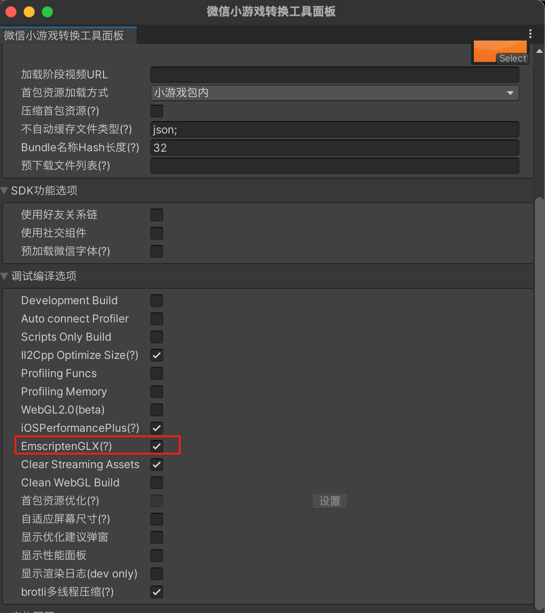
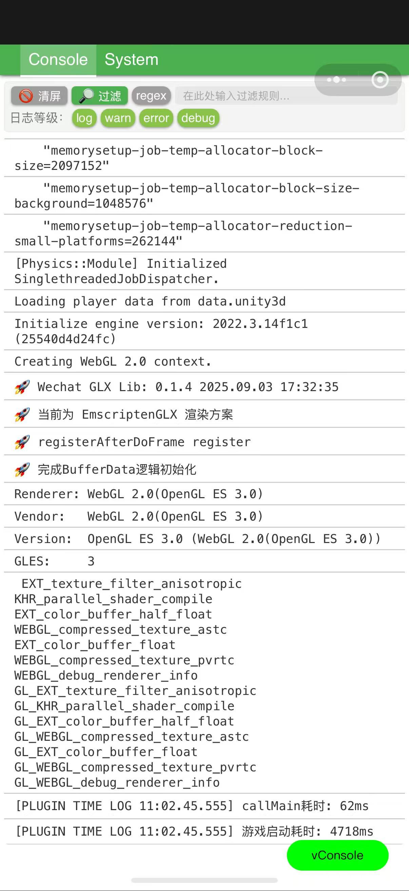

# EmscriptenGLX 渲染模式

## 简介

游戏内所有 GL 指令调用需要经过三层转换：`WASM(业务逻辑)` -> `WebGL JS胶水层(GL -> WebGL)` -> `平台渲染`，WASM 模块与 JavaScript 之间的高频通信无疑带来了繁重的性能开销。

通过 EmscriptenGLX 渲染模式，可以实现在 WASM 内部完成 `GL -> WebGL` 指令的处理，将原本 `WebGL JS胶水层` 的代码下沉至业务逻辑(WASM)中，消除**WASM 与 JS 之间高频调用链路**。详细文档请查阅[EmscriptenGLX 渲染模式](https://developers.weixin.qq.com/minigame/dev/guide/performance/perf-emscriptenglx.html)

## 特别说明

1. EmscriptenGLX 目前仅支持在 **iOS 高性能+模式** 以及 **Android 平台** 下运行，其他运行时将会自动降级为原有的运行方案。
2. 基础库版本须 `>= 3.8.10`，低版本的基础库会使用原有的运行模式运行游戏。
3. 当前仅支持 `Unity2022` 和 `团结引擎` 接入
4. 本方案处于 `Beta` 测试阶段，建议**充分验证后**再进行发布。

## 接入指南

### 1. SDK 接入

请参照 [微信 SDK 安装](./SDKInstaller.md)，使用 `Package方式`进行安装

`打开游戏工程` -> `Editor 菜单栏` -> `Package Manager` -> `右上方 "+"` -> `Add package from git URL` -> `输入下方的URL地址`，即可完成 SDK 导入

```javascript
https://github.com/wechat-miniprogram/minigame-tuanjie-transform-sdk#feat-emscriptenglx
```

### 2. 开启 EmscriptenGLX

通过「微信小游戏工具面板」-「调试编译选项」-「EmscriptenGLX」进行勾选，并开启转换



## 常见问题

### Q1. 如何确认转换后的游戏使用到了 EmscriptenGLX 的渲染模式？

请按照下方的步骤进行验证

1. 删除本地小游戏（包括开发版、体验版和正式版）。
2. 重新进入游戏并打开调试，查看 vConsole 中的相关日志

-   vConsole 第一行，确认基础库版本 `>=3.8.10`
-   在 WebGL Context 创建上下文前后，查看是否包含下图高亮的日志信息
    

### Q2. 为什么开启了 EmscriptenGLX 后，性能更差了？比如单帧耗时更大了。

A2. 如果遇到了此类情况，一般是踩到了新方案的坑，[联系我们](./IssueAndContact.md)一起进行排查。

### Q3. 为什么开启 EmscriptenGLX 模式后，渲染异常了？

A3. 新方案对 GL 的相关指令进行了重构，若遇到了渲染相关的表现异常问题，请先排查游戏在 iOS 高性能+ 和 原 Android 设备下的渲染表现是否正常，若正常，请[联系我们](./IssueAndContact.md)一起进行排查。

