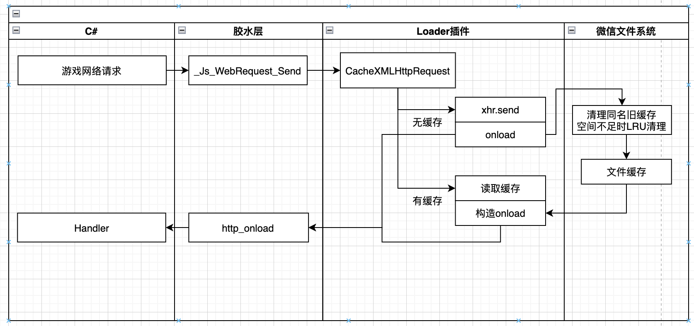

# 资源缓存



## 一、什么情况触发资源缓存
当使用以下API发起网络请求时会检查是否需要缓存
- UnityWebRequest
- WWW
- UnityWebRequestAssetBundle
- Addressables

**游戏业务侧无需关心资源是否有缓存，正常调用API即可，当有缓存时，Loader插件会构造正常响应返回给游戏**

## 二、哪些资源会自动缓存？
- wasm主包/分包，即`wasm.code.unityweb`文件
- 首包资源，即`webgl.data.unityweb`文件
- 预加载的文件
- 请求URL包含StreamingAssets，并且没有添加到excludeFileExtensions列表中的文件
- 开启纹理缓存后，纹理资源


### 转换插件相关配置
```
bundlePathIdentifier: 需要缓存的路径
excludeFileExtensions: 不需要缓存的文件类型
needCacheTextures: 是否缓存纹理
texturesPath: 纹理存放路径
texturesHashLength: 纹理中hash长度
```

## 三、缓存规则
> 适用于预加载的文件和URL中包含`bundlePathIdentifier`的文件

在写入缓存前需要经过三步
1. 根据URL生成缓存路径
URL剔除掉DATA_CDN部分后作为缓存路径
例如：
- DATA_CDN=https://weixin.qq.com
- 请求路径=https://weixin.qq.com/StreamingAssets/textures_8d265a9dfd6cb7669cdb8b726f0afb1e
- 则缓存路径=StreamingAssets/textures_8d265a9dfd6cb7669cdb8b726f0afb1e
2. 清理掉同名旧文件
通过文件名中的hash区分同名文件的不同版本
继续上面的例子，假如本地已经有`StreamingAssets/textures_cdb8b726f0afb1e8d265a9dfd6cb7669`
在写入缓存前，插件认为已经本地已经有同名文件`StreamingAssets/textures`，但hash与本次写入的文件不一致，则需要删除`StreamingAssets/textures_cdb8b726f0afb1e8d265a9dfd6cb7669`

转换插件相关配置
```
bundleHashLength: bundle中hash的长度
```
3. 检查存储空间是否足够，是否需要清理
当已有缓存+待写入缓存超过允许的上限时，按照LRU清理出所需大小

转换插件相关配置
```
defaultReleaseSize: 清理时，默认额外清理的大小，单位Bytes，1MB = 1024KB = 1024*1024Bytes
```

## 四、注意项
1. 文件名需要带上hash [BuildAssetBundleOptions.AppendHashToAssetBundleName](https://docs.unity3d.com/ScriptReference/BuildAssetBundleOptions.AppendHashToAssetBundleName.html)，以便清理掉该文件的旧缓存。默认32位长度，可通过导出选项中`Bundle名中Hash长度`来自定义。比如游戏自己计算了crc，可将`Bundle名中Hash长度`设置为crc长度。
2. 配置到不自动缓存文件类型中的文件，不会自动缓存，默认值是json，比如addressable打包后生成StreamingAssets/aa/WebGL/catalog.json，这个文件不会自动缓存。
3. 开发者工具上可以打开文件系统查看缓存文件

缓存文件在usr目录下

<image src='../image/cache_path.png'>
