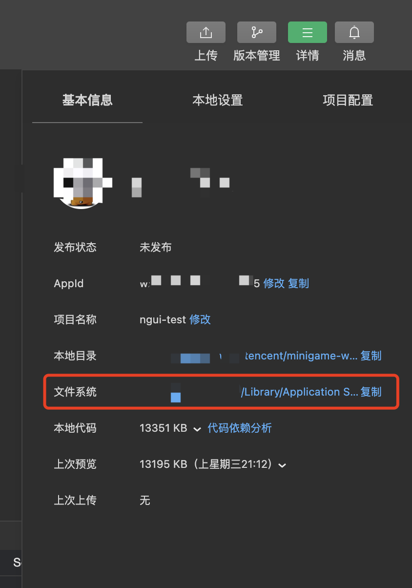

# 资源缓存
- [资源缓存](#资源缓存)
- [介绍](#介绍)
  - [一、什么情况触发资源缓存](#一什么情况触发资源缓存)
  - [二、哪些资源会自动缓存？](#二哪些资源会自动缓存)
  - [三、缓存规则](#三缓存规则)
    - [相关配置](#相关配置)
      - [是否缓存规则](#是否缓存规则)
        - [是否缓存业务资源](#是否缓存业务资源)
        - [是否缓存纹理](#是否缓存纹理)
      - [资源淘汰规则](#资源淘汰规则)
        - [识别业务资源版本](#识别业务资源版本)
        - [识别纹理资源版本](#识别纹理资源版本)
      - [缓存清理规则](#缓存清理规则)
    - [示例](#示例)
  - [四、查看缓存日志](#四查看缓存日志)
    - [判断是否走缓存](#判断是否走缓存)
    - [其他缓存日志](#其他缓存日志)
  - [对外接口](#对外接口)
    - [`public string WX.PluginCachePath`](#public-string-wxplugincachepath)
    - [`public string WX.GetCachePath(string url)`](#public-string-wxgetcachepathstring-url)
    - [`public void CleanAllFileCache(Action<bool> action)`](#public-void-cleanallfilecacheactionbool-action)
    - [`public void CleanFileCache(int fileSize, Action<ReleaseResult> action)`](#public-void-cleanfilecacheint-filesize-actionreleaseresult-action)
    - [`public void RemoveFile(string path, Action<bool> action)`](#public-void-removefilestring-path-actionbool-action)
    - [](#)
  - [五、注意项](#五注意项)
  - [QA](#qa)
    - [1. PC上配置为不自动缓存的文件，仍然没有走网络下载](#1-pc上配置为不自动缓存的文件仍然没有走网络下载)
    - [2. 同一个文件，日志提示执行缓存逻辑，下次运行时仍然从网络下载](#2-同一个文件日志提示执行缓存逻辑下次运行时仍然从网络下载)
    - [3. 已经有`无缓存，执行缓存逻辑`的日志，缓存仍不生效，下次访问资源仍从网络下载](#3-已经有无缓存执行缓存逻辑的日志缓存仍不生效下次访问资源仍从网络下载)
    - [4. 如何切换备用CDN地址](#4-如何切换备用cdn地址)
    - [5. 一些配置文件不希望被自动清理，由业务控制何时清理](#5-一些配置文件不希望被自动清理由业务控制何时清理)

# 介绍
小游戏主要存在三种类型的资源：
1. wasm代码，即`wasm.code.unityweb`文件
2. 首资源包，即`webgl.data.unityweb`文件
3. 业务bundle资源

其中，**wasm代码和首资源包框架会强制缓存，开发者无需关心**。本篇重点介绍业务资源的缓存规则。

与APP游戏不同，在小游戏中推荐将资源包拆分成为一个个小文件加载。结合启动Loader有以下优势：
1. 通过细粒度的资源拆分，提高下载成功率。
2. 文件粒度缓存，降低版本更新时的流量消耗。
3. 框架自动做缓存控制，开发者无需感知本地是否存在缓存。

大致流程如图：


## 一、什么情况触发资源缓存
当使用以下API发起网络请求时会检查是否需要缓存，以及是否命中缓存。
- UnityWebRequest
- WWW
- UnityWebRequestAssetBundle
- Addressables

**游戏业务侧无需关心资源是否有缓存，按照本地没有缓存来使用，正常调用API即可，当有缓存时，Loader插件会构造正常响应返回给游戏**

## 二、哪些资源会自动缓存？
- 配置到[预下载列表](./UsingPreload.md)的文件
- 用unity网络接口发起请求，且URL包含自动缓存路径标识符的文件
- 使用微信压缩纹理工具，且开启纹理缓存后，纹理资源

## 三、缓存规则

### 相关配置
`Assets/WX-WASM-SDK/Editor/MiniGameConfig.asset` 中以下配置与缓存相关

```
// 业务资源相关
bundlePathIdentifier: 需要缓存的路径，用 `;`分隔 eg: StreamingAssets;bundles;
excludeFileExtensions: 当路径中包含字符时不需要缓存，用 `;`分隔 eg: .json;.hash
bundleHashLength: bundle中hash占多少长度
// 纹理相关
needCacheTextures: 是否缓存纹理
texturesPath: 纹理存放路径
texturesHashLength: 纹理中hash长度
// 缓存淘汰相关
defaultReleaseSize: 清理缓存时默认额外清理的大小，单位Bytes，默认值30MB
maxStorage: 最大缓存容量，单位MB，默认值200MB
```

其中部分配置可通过转换插件面板快速修改：
- `bundleExcludeExtensions` 对应 `不自动缓存文件类型` 配置
- `bundleHashLength` 对应 `Bundle名中Hash长度` 配置

#### 是否缓存规则
存在业务的bundle资源和使用微信压缩纹理工具后的纹理资源，不同资源的缓存细节略有不同。
##### 是否缓存业务资源

默认URL中包含`StreamingAssets`的请求会被识别为资源文件被自动缓存，可修改 `bundlePathIdentifier` 为你期望的值

并非所有文件都适合持久化缓存，因此缓存规则也支持忽略某些文件，默认包含 `.json` 的文件不会被自动缓存，可修改 `bundleExcludeExtensions`。等同于修改**导出插件面板**的`不自动缓存文件类型`配置

对应 js 代码，`minigame/unity-namespace.js`
```ts
// 判断是否需要自动缓存的文件，返回true自动缓存；false不自动缓存
unityNamespace.isCacheableFile = function (path) {
  // 判定为下载bundle的路径标识符，此路径下的下载，会自动缓存
  const cacheableFileIdentifier = ["StreamingAssets"];
  // 命中路径标识符的情况下，并不是所有文件都有必要缓存，过滤下不需要缓存的文件
  const excludeFileIdentifier = [".json"];
  if (
    cacheableFileIdentifier.some(identifier => path.includes(identifier)
        && excludeFileIdentifier.every(excludeIdentifier => !path.includes(excludeIdentifier)))
  ) {
    return true;
  }
  return false;
};
```

##### 是否缓存纹理
默认会缓存纹理，修改`needCacheTextures`可控制是否缓存纹理资源。

通过`texturesPath`可让Loader识别一条请求是否为纹理，默认为`Assets/Textures`


#### 资源淘汰规则
如开篇的流程图所示，当需要自动缓存的文件在写入本地之前，若本地已经有此文件的旧缓存，则先清理旧缓存，再执行写入，那么需要一个手段来区分资源版本。

##### 识别业务资源版本
框架不会做额外计算来验证资源版本，通过文件名中带资源hash，可以在资源更新时，识别不同版本的资源。

以`Addressables`为例，打包参数加上[BuildAssetBundleOptions.AppendHashToAssetBundleName](https://docs.unity3d.com/ScriptReference/BuildAssetBundleOptions.AppendHashToAssetBundleName.html)，会携带32位长度的hash拼接到文件名末尾。

默认hash长度为`32`，可通过`bundleHashLength`修改。等同于修改**导出插件面板**的`Bundle名中Hash长度`

以下几种命名都能识别到版本号`8d265a9dfd6cb7669cdb8b726f0afb1e`
eg1: font_8d265a9dfd6cb7669cdb8b726f0afb1e
eg2: font-8d265a9dfd6cb7669cdb8b726f0afb1e
eg3: font_8d265a9dfd6cb7669cdb8b726f0afb1e.ttf

##### 识别纹理资源版本
因纹理打包规则不一致，hash长度也不一样，默认hash长度为`8`，可通过`texturesHashLength`配置。

#### 缓存清理规则
随着游戏进度的推进，累计资源体积可能会超过允许的最大值。

> ***注意！！！此最大值通过`maxStorage`修改，未前往`mp后台-能力地图-生产提效包-空间提升`开通空间提升的游戏，请勿设置超过200MB的值***

达到缓存上限后，一些游戏前期的资源已经不需要再被使用。
此时Loader会按照LRU规则，清理出所需大小，并且为了避免频繁触发清理，会默认多清理`30MB`的空间，可通过`defaultReleaseSize`修改。

同时，在清理时也支持忽略一些文件，永不被自动清理，只可通过fs接口主动删除。

通过导出的小游戏`minigame/untiy-namespace.js`中`isErasableFile`javascript函数自行控制

```js
// 清理缓存时是否可被自动清理；返回true可自动清理；返回false不可自动清理
unityNamespace.isErasableFile = function (info) {
  // 用于特定AssetBundle的缓存保持
  if (unityNamespace.WXAssetBundles.has(info.path)) {
    return false;
  }
  // 达到缓存上限时，不会被自动清理的文件
  // 例如，font文件不希望自动清理
  const inErasableIdentifier = ['font_8d265a9dfd6cb7669cdb8b726f0afb1e.ttf'];
  if (inErasableIdentifier.some(identifier => info.path.includes(identifier))) {
    return false;
  }
  return true;
};
```

### 示例
假设有以下配置
```
1. DATA_CDN: https://weixin.qq.com/webgl
2. bundlePathIdentifier: ['StreamingAssets']
3. bundleHashLength: 32
```

在写入缓存前需要经过三步
1. 根据URL生成缓存路径
URL剔除掉DATA_CDN部分后作为缓存路径
例如：
- DATA_CDN=https://weixin.qq.com/webgl
- 资源下载URL=https://weixin.qq.com/webgl/StreamingAssets/textures_8d265a9dfd6cb7669cdb8b726f0afb1e

那么：
- 则缓存路径=${wx.env.USER_DATA_PATH}StreamingAssets/textures_8d265a9dfd6cb7669cdb8b726f0afb1e
- 资源唯一标识=StreamingAssets/textures
- 资源版本=8d265a9dfd6cb7669cdb8b726f0afb1e

***注意：资源实际部署的CDN前缀必须与转换面板填写的CDN地址一致，否则无法按照前文的缓存规则获得资源的唯一标识。导致缓存失败***

2. 清理掉同名旧文件
通过文件名中的hash区分同名文件的不同版本
继续上面的例子，假如本地已经有`StreamingAssets/textures_cdb8b726f0afb1e8d265a9dfd6cb7669`
在写入缓存前，插件认为已经本地已经有同名文件`StreamingAssets/textures`，但hash与本次写入的文件不一致，则需要删除`StreamingAssets/textures_cdb8b726f0afb1e8d265a9dfd6cb7669`

支持的bundle命名：需以`-`或`_`分割，当以其他符号分割时，无法正确处理版本信息，故无法正确删除旧版本资源
- textures_8d265a9dfd6cb7669cdb8b726f0afb1e
- textures-8d265a9dfd6cb7669cdb8b726f0afb1e

转换插件相关配置
```
bundleHashLength: bundle中hash的长度
```
3. 检查存储空间是否足够，是否需要清理
当已有缓存+待写入缓存超过允许的上限时，按照LRU清理出所需大小

转换插件相关配置
```
defaultReleaseSize: 清理时，默认额外清理的大小，单位Bytes，1MB = 1024KB = 1024*1024Bytes
maxStorage: 最大缓存容量，修改此值需要联系研发助手开通权限，否则无效
```

## 四、查看缓存日志
[查看插件调试日志](UsingLoader.md#_3-6-插件调试日志)

### 判断是否走缓存
1. 自动缓存
出现以下两种日志，都可认为需要自动缓存
- `[PLUGIN LOG 10:32.52.915]  CacheXMLHttpRequest_onload: shadowreceiverdepth_9551162e.bundle, 耗时:222ms,无缓存，执行缓存逻辑`
- `[PLUGIN LOG 10:32.53.073]  缓存 shadowreceiverdepth_9551162e.bundle成功;size: 1.78KB,耗时: 79ms`
2. 命中本地缓存: `[PLUGIN LOG 20:18.38.275]  CacheXMLHttpRequest_onload: scene999_tw_5b9ef7d7.bundle使用缓存, 耗时:37ms`

### 其他缓存日志
1. `删除 xxx 旧缓存`：清理同名文件旧缓存
2. `需要释放xxMB存储空间`：达到缓存上限，需要释放的空间大小
3. `缓存文件数=xxx, 总文件大小=xxx`：当前缓存目录总文件数和总文件大小（单位 bytes）
4. `删除文件: xx, md5:xx, size:xx, 耗时: xx`：清理旧缓存或达到缓存上限时删除文件

## 对外接口
### `public string WX.PluginCachePath`
获取自动缓存的文件存储路径，返回值：`${wx.env.USER_DATA_PATH}/__GAME_FILE_CACHE`
- javascript接口
> `GameGlobal.manager.PLUGIN_CACHE_PATH`


### `public string WX.GetCachePath(string url)`
传入URL或文件相对路径，若本地有文件缓存，返回缓存路径，否则返回空字符串
- javascript接口
> `GameGlobal.manager.getCachePath`

### `public void CleanAllFileCache(Action<bool> action)`
清理所有自动缓存的文件
- javascript接口
> `Promise<boolean> GameGlobal.manager.cleanAllCache()`

### `public void CleanFileCache(int fileSize, Action<ReleaseResult> action)`
从自动缓存目录中释放指定大小的文件缓存
- javascript接口
> `Promise<ReleaseResult> GameGlobal.manager.cleanCache(fileSize)`

```cs
/// <summary>
/// 清理文件缓存的结果
/// </summary>
public enum ReleaseResult
{
    /// <summary>
    /// 无需清理，空间足够
    /// </summary>
    noNeedRelease = 1,

    /// <summary>
    /// 超过最大存储容量，不清理
    /// </summary>
    exceedMax,

    /// <summary>
    /// 清理成功
    /// </summary>
    releaseSuccess,
}
```

### `public void RemoveFile(string path, Action<bool> action)`
从自动缓存目录中删除指定文件
- javascript接口
> `Promise<void> GameGlobal.manager.removeFile(path)`


###

## 五、注意项
1. 文件名需要带上hash [BuildAssetBundleOptions.AppendHashToAssetBundleName](https://docs.unity3d.com/ScriptReference/BuildAssetBundleOptions.AppendHashToAssetBundleName.html)，以便清理掉该文件的旧缓存。默认32位长度，可通过导出选项中`Bundle名中Hash长度`来自定义。比如游戏自己计算了crc，可将`Bundle名中Hash长度`设置为crc长度。
2. 配置到不自动缓存文件类型中的文件，不会自动缓存，默认值是json，比如addressable打包后生成StreamingAssets/aa/WebGL/catalog.json，这个文件不会自动缓存。
3. 缓存目录
- 开发者工具上可以打开文件系统查看缓存文件
缓存文件在usr目录下



- 真机安卓缓存目录：data/com.tencent.mm/MicroMsg/wxanewfiles/随机ID(根据最近使用时间判断是哪个目录)
- windows缓存目录：微信-设置-文件管理-打开文件夹；打开文件管理后进入`Applet\${appid}\${appState}\usr\`

1. 当文件没有正常缓存时，着重检查 缓存规则 中 `资源下载URL` 、`DATA_CDN`、和 `bundlePathIdentifier`，当`资源下载URL`中不包含`DATA_CDN`时，不会走缓存逻辑。

2. 真机安卓缓存目录：data/com.tencent.mm/MicroMsg/wxanewfiles/随机ID(根据最近使用时间判断是哪个目录)
3. 未开通`mp后台-能力地图-生产提效包-空间提升`的游戏，修改`maxStorage`超过200MB会导致出现写缓存失败。

## QA
### 1. PC上配置为不自动缓存的文件，仍然没有走网络下载
PC上使用了Chromium的网络模块，存在HTTP缓存，可通过请求添加时间戳、[服务器返回不缓存的头](https://developer.mozilla.org/zh-CN/docs/Web/HTTP/Caching#%E4%B8%8D%E4%BD%BF%E7%94%A8%E7%BC%93%E5%AD%98)

### 2. 同一个文件，日志提示执行缓存逻辑，下次运行时仍然从网络下载
可能有两种情况：
1. 请求同名资源的不同版本
可能[预下载列表](./UsingPreload.md)中配置的资源版本和UnityWebRequest请求的版本不一致，由于缓存清理逻辑：
- 先下载版本A，若本地有版本B，版本B被清理后写入版本A的缓存
- 再下载版本B，此时版本A缓存被清理，写入版本B缓存
- 下次启动游戏再次下载版本A，此时本地有版本B，清理后写入版本A

如何检查：从缓存日志中搜索不带hash的资源名，出现两个版本的下载日志。

2. 缓存写满之后的自动清理逻辑
当出现以下日志，可认为资源被自动清理，可查阅本篇「缓存清理规则」
- `需要释放xxMB存储空间`
- `删除文件: xx, md5:xx, size:xx, 耗时: xx`

### 3. 已经有`无缓存，执行缓存逻辑`的日志，缓存仍不生效，下次访问资源仍从网络下载
资源下载URL中不包含DATA_CDN部分，可能是运行期间修改了CDN，但并没有同步修改资源下载URL。

如何检查：
- 启动插件版本>=1.2.41，会在开发阶段输出错误日志`缓存路径不合法 请检查DATA_CDN配置和请求URL是否匹配`，提示出错的资源信息
- 启动插件版本<=1.2.41，开发者工具通过Network面板查看资源下载URL，确认是否和DATA_CDN不一致；真机可通过抓包工具查看下载URL；

### 4. 如何切换备用CDN地址
参考[Unity Loader - 资源下载](./UsingLoader.md#_3-1-资源下载)

### 5. 一些配置文件不希望被自动清理，由业务控制何时清理
参考本篇「缓存清理规则」将这些文件添加到inErasableIdentifier中。

注意：业务侧注意在适当时机清理文件，否则文件将会一直在缓存目录中。
