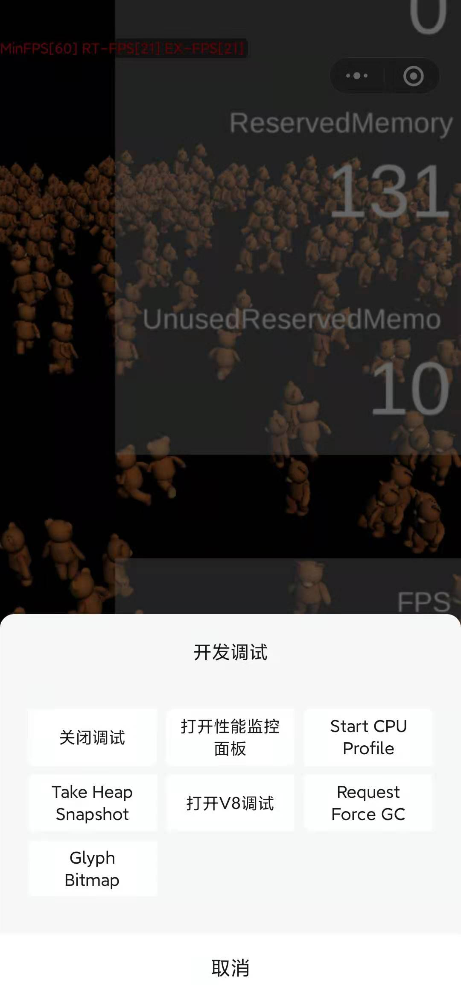
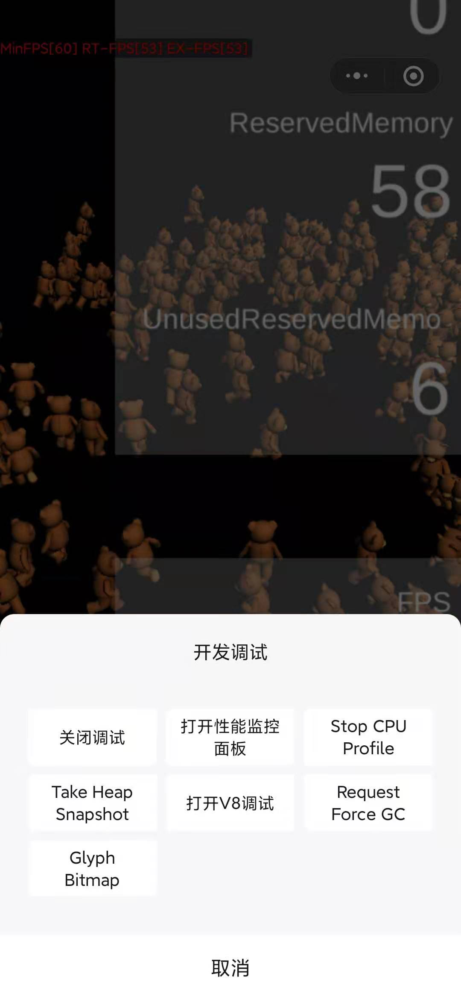
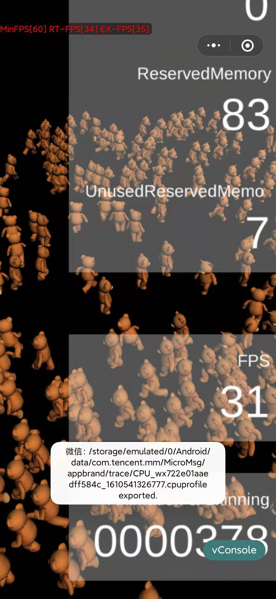
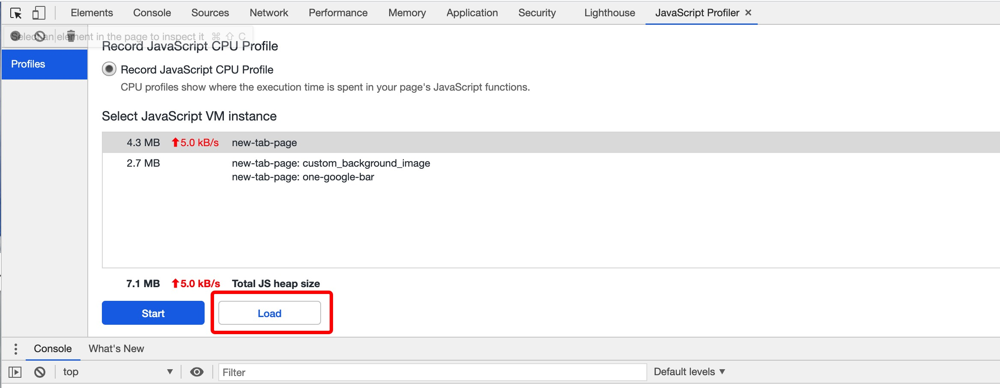
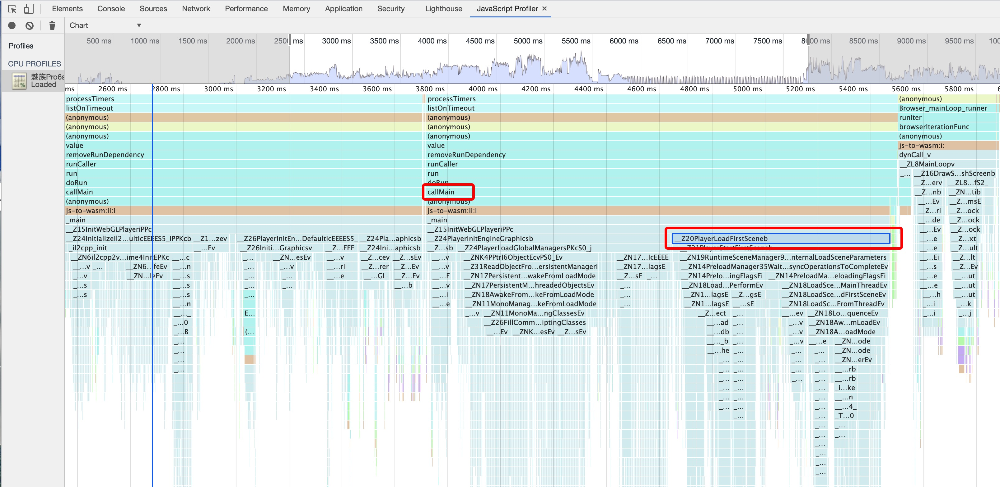

# 首场景启动优化

在[提升Unity WebGL游戏启动速度](./StartupOptimization.md)章节我们提到过：
>在timelog中呈现的首场景耗时即为引擎初始化与开发者首帧逻辑，关于该阶段耗时，开发者需要注意的是：
>1. MonoBehaviour脚本的首帧Start/Awake应足够少逻辑，优先将画面呈现
>2. 初始场景不宜过大，通常呈现Splash场景即可
>3. 初始场景中需要后续主场景或配置加载时可采取分帧策略，切勿在Start/Awake阻塞

下面介绍如何通过在小游戏下通过Profile的方式对小游戏首场景耗时进行针对性优化。

## 小游戏Profile
微信小游戏在安卓平台提供了CPU Profile能力，使用姿势为：
1.采集Profile： 点击右上角菜单 -> 开发调试 -> Start CPU Profile -> Stop CPU Profile；
  
2.导出Profile文件
当点击Stop CPU Profile之后，会弹出浮窗告知profile文件的存储路径，通过USB链接电脑或者第三方文件管理器即可将Profile文件传输至电脑。

3.Chrome导入Profile文件
打开Chrome浏览器，右键审查元素或者按F12即可打开控制台界面。选中JavaScript Profile tab(如果默认没有，可能在右上角的三个点展开菜单->More tools里面)，点击load导入步骤2的profile文件，Profile文件的使用可以参考Google的开发文档: https://developers.google.com/web/tools/chrome-devtools/rendering-tools/js-execution


## Unity CallMain
参考文档[小游戏启动流程](./Startup.md)中提到的，当游戏代码包下载编译完成和首包资源下载完成后会运行游戏逻辑，最开始执行的逻辑是CallMain主函数。
在WebGL模式下，CallMain的主要是initWebGLPlayer调用，主要分成两部分调用：

- Unity引擎初始化：主要分成：InitializeIl2CppFromMain、RuntimeInitialize、PlayerInitEngineNoGraphics和PlayerInitEngineGraphics等函数调用；
- 首场景初始化：PlayerLoadFirstScene函数调用；

下表为针对Unity Benchmark项目在不同设备上的callmain耗时分析，Benchmark项目链接：https://github.com/Unity-Technologies/Benchmark
> 下面实验均采用Unity 2018.4.24f1版本，Development模式会对性能有一定影响，下表数据均为Development模式下数据。

|  initWebGLPlayer主要函数   | 安卓魅族6s  | OPPO A37m |  安卓小米10 | 开发者工具 |
|  ----  | ----  |  ----  | ----  | ----  |
| InitializeIl2CppFromMain  |  525ms |954ms |113ms |39.90ms |
| RuntimeInitialize  | 139ms | 649ms | 50.2ms | 2.33ms |
| PlayerInitEngineNoGraphics  |  463.8ms | 1.24s | 154ms | 10.46ms |
| PlayerInitEngineGraphics  | 1.4s | 2.94s | 403ms | 126ms | 
| PlayerLoadFirstScene  | **815ms**| **2.12s** | **213ms** |**70.75ms** |

目前为止，开发者可以操作的主要是PlayerLoadFirstScene函数的调用，参照Unity的Benchmark项目，要尽可能将PlayerLoadFirstScene的耗时控制在整个CallMain耗时的<font color="#dd0000">20%</font>左右，如果CallMain耗时过大，可以借助上面提到的Profile工具进行优化，下面简单分析流程。

## CallMain Profile分析
1.改造小游戏代码
因为安卓采集Profile文件需要手动控制，而CallMain会在码包下载编译完成和首包资源下载完成后就执行，为了录制启动阶段完整的Profile，需要保证Profile的录制开始之后才真正执行游戏开始逻辑，找到项目的game.js文件，做如下改造：

- 搜索`loadingPageConfig`字段，添加`visible: false`字段，如下：

```js
hideAfterCallmain: true,
        loadingPageConfig: {
            visible: false, 
            // 以下是默认值
            totalLaunchTime: 7000,
            animationDuration: 100,
```

- 搜索`gameManager.startGame()`字段，将其放入wx.onTouchStart事件中，如下：

```js
// gameManager.startGame();

wx.onTouchStart((result) => {
  console.log('真正执行开始游戏逻辑');
  gameManager.startGame();
})

GameGlobal.manager = gameManager;
```
通过上面的改造，在进入小游戏后，可以按照这个流程采集Profile：Start CPU Profile -> 点击屏幕触发真正的开始游戏逻辑 -> 看到游戏界面后Stop Profile。


2.导入步骤1的启动过程Profile文件


导入文件后，我们只需要关注CallMain调用的PlayerLoadFirstScene函数，如果PlayerLoadFirstScene耗时占比过高，大多是因为在首场景执行了不必要的操作，比如大量反序列化操作、配置解析操作，按需剔除后再次Profile即可验证效果。