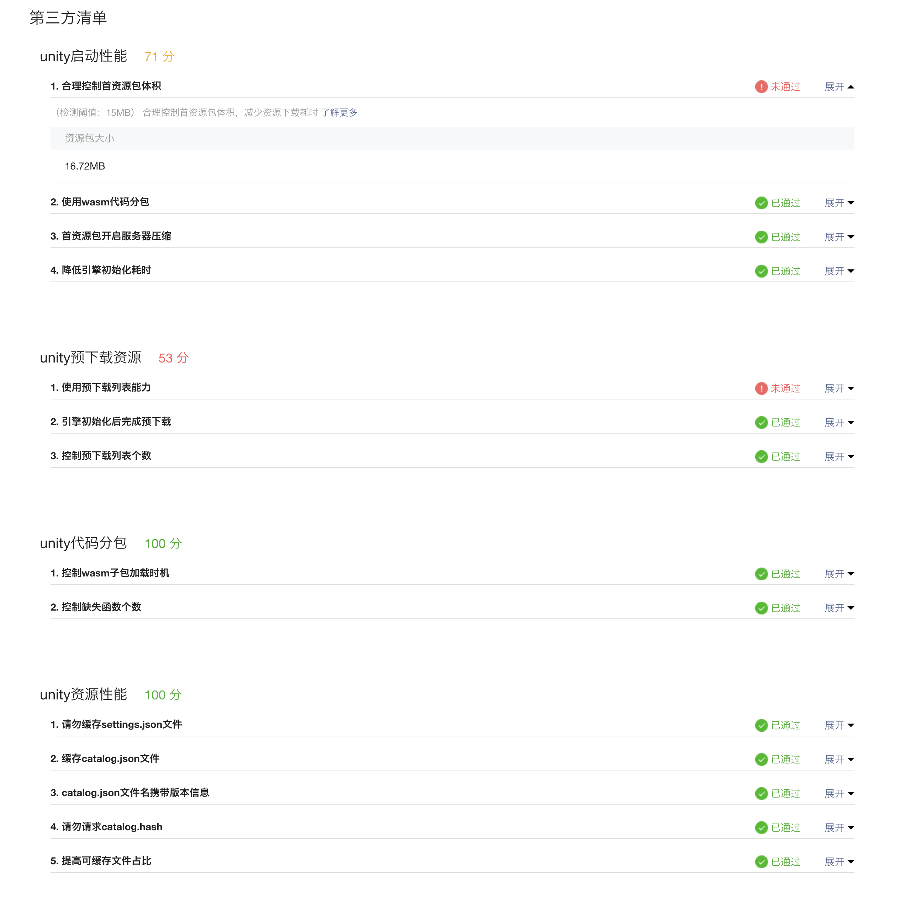

# 性能诊断工具

## 作用
为了帮助开发者在开发阶段更好的针对问题进行优化，微信官方和Unity快适配方案均推出了相应的工具。
- [微信小游戏-性能诊断工具](https://developers.weixin.qq.com/minigame/dev/guide/performance/perf-audit/perf-audit-tool.html)
- [Unity快适配-最佳实践检测工具](Design/PerformanceMonitor.md)

由于 `Unity快适配-最佳实践检测工具` 和 `微信小游戏-性能诊断工具` 都是为了给开发者提供优化建议，以便快速优化游戏。同时，随着 `微信小游戏-性能诊断工具` 支持第三方拓展，我们可以将 `Unity快适配-最佳实践检测工具` 的能力集成到 `微信小游戏-性能诊断工具`。

## 开始使用
### 运行环境要求
- 转换工具版本 > `202305230000`
- iOS客户端 >= 8.0.47
- Android客户端 >= 8.0.48

> 注意：仅支持 iOS 和 Android 真机，PC、MAC 和微信开发者工具暂不支持。

### 如何开启
1. [转换工具导出小游戏工程](Design/Transform.md) 真机扫码预览。
2. 参照文档 [微信小游戏-性能诊断工具](https://developers.weixin.qq.com/minigame/dev/guide/performance/perf-audit/perf-audit-tool.html) 中 `「推荐」方式一：开发调试` 章节，开启性能诊断工具、结束诊断上传报告、前往 `MP后台-研发工具箱-性能诊断-性能评测` 查看报告。

### 报告内容
在 `评测详情-性能清单` 模块 `第三方清单` 中。

