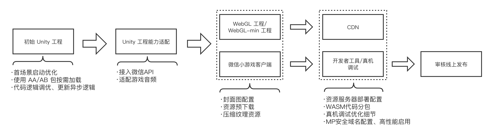

# Unity 游戏接入微信小游戏指南

> 相关下载 [微信 Unity 插件下载](https://game.weixin.qq.com/cgi-bin/gamewxagwasmsplitwap/getunityplugininfo?download=1)

​		本文档将介绍微信平台提供的各项转化能力的说明与指引，并告知开发者如何根据自己的游戏正确使用这些能力以达到最佳的游戏转化效果，开发者参考文档根据自己游戏所符合条件开始实践！

​		下图中介绍了接入过程中的流程，以及每一个阶段需要做的优化与配置，下文将介绍每一个阶段的工作：

### 首场景启动优化——首帧逻辑优化

> 详细手册：[提升Unity WebGL游戏启动速度]() 与 [首场景启动优化]()

​		根据统计数据反应，小游戏玩家对于游戏的启动时长是较为敏感的，过长的启动时间会导致用户的显著流失，因此如何快速呈现游戏场景是 Unity 原生 APP 游戏接入微信小游戏平台的一个重点优化的工作。能够影响小游戏启动速度的因素包括：首资源包的下载、WASM代码下载与编译、引擎初始化和开发者的首帧逻辑。

​		首场景启动优化的并不是一个简单的步骤就可以完全优化，在初始 Unity 工程时开发者应主要对游戏代码如首帧逻辑进行修改，具体可参阅首场景启动优化手册。后续的优化在后面的步骤小节中将具体介绍。

### 使用 AA/AB 包按需加载

> 详细手册：[AA(Addressable) 进行资源按需加载]() 与 [AB(AssetBundle)进行资源按需加载]()

​		区别于原生 APP 游戏很少考虑场景内的资源规划问题，开发时通常将资源在游戏启动时全加载到内存中，而小游戏中游戏需要做到“即点即玩”，影响游戏的呈现速度因素中一般诸如首资源包的下载往往占比较大，因此需要根据场景中的主次内容进行资源上的优化分包处理。

​		值得注意的是，微信小游戏环境中**不支持对本地的 Bundle 进行加载**，因此必须采用上传 CDN 方式进行异步的下载。

#### AA包与AB包方案选择

​		有关 AA包 与 AB包 的选择，对于轻度游戏来说两者没有特别建议，倒是功能强大的 AA包 使用门槛更低一些，而对于重度游戏，平台目前所反馈到的结论是使用 **AB包** 的性能要比 AA包 更好，AA包较大项目时生成的未压缩的 catalog 较大，加载效率低，改用 AB包后，效果提升明显。

### 接入微信API

> 详细手册：[WX SDK 平台能力适配]() 、[屏幕适配]() 、 [输入法适配]() 、 [排行榜与微信关系数据]()

​		Unity 游戏接入微信小游戏平台将获得微信提供的 API 以及开放能力，开发者根据需要进行按需接入。微信 API 支持的能力包括登陆、设备（存储、震动）、开放数据、广告等等。

### 适配游戏音频

> 详细手册：[音频适配优化]()

​		Unity2021 版本之前的音频不支持压缩音频，基于 CPU 解压将额外占用内存。在iOS高性能模式下 Unity WebGL 默认使用的 WebAudio 也会消耗大量内存。

​		微信SDK 提供了 音频API 控制播放，因此建议游戏开发者进行相应的替换。

### 网络通信适配

> 详细手册：[网络通信适配]()

​		区别于原生环境，WebGL模式（JavaScript环境）是不支持使用原生套接字（Socket）实现网络通信。对于游戏中使用到网络请求的操作，需要进行相应的适配。将 HTTP 请求使用 UnityWebRequest 类实现，全双工通信改用 WebSocket 协议实现，可参考手册案例完成适配。

### 封面图配置

> 详细手册：[启动封面]()

​		由于 Unity WebGL 的启动加载需要一定的时间，微信小游戏支持通过配置封面图/视频等内容作为加载期间的过渡来留住玩家，微信小游戏支持如下自定义配置项：

- 封面图/视频内容
- 加载文案及样式
- 进度条样式
- 封面自动隐藏时机

### 资源预下载

> 详细手册：[使用预下载功能]()

​		在 UnityLoader 加载过程中是存在CPU处理密集而 **网络空闲** 的情况，因此可以充分利用该时机进行一些必要的资源下载可有助于提升游戏场景等资源的载入速度。

### 压缩纹理资源

> 详细手册： [压缩纹理优化]() 

​		压缩纹理工具是微信SDK提供的一种能够根据不同的游戏运行平台而按需加载压缩后纹理资源的能力。它的优点是：

- **增快游戏运行进度**：纹理资源从 bundle 内分离后按渲染需要进行后续加载，有效减少 bundle 体积，增快游戏的运行进度；
- **减少内存占用，GPU硬解纹理渲染更快**： 分离的资源被压缩成多种格式的纹理资源在 CDN 中存储，客户端根据硬件 GPU 支持的格式按需下载渲染，体积更小，渲染速度更快。

​		纹理压缩对于 **提升运行速度** 与 **减少内存** 的优化方面均有不错的表现效果，对于重度游戏而言，均建议进行该优化。

### 资源服务器部署配置

> 详细手册：[资源部署与缓存]() 、[资源缓存]()

​		游戏导出小游戏包(/minigame)将使用微信开发者工具打开，而资源目录(/webgl 或 /webgl-min)需要上传至开发者的 CDN 服务器中，并前往 MP 后台配置安全域名白名单，请阅读相关手册完成相应的部署。

### WASM代码分包

> 详细手册：[使用代码分包工具]()

​		Unity 导出小游戏项目后代码将存储在 wasm 文件中，而游戏启动时需要完整的 wasm 文件才可以运行，于是微信小游戏提供了WASM代码分包能力，将原本的 wasm 文件根据游戏逻辑的主次内容分为 2 个 wasm 文件，一个用于启动加载另一个将被延迟加载，这样就允许先加载较小的首包快速进入主场景。该能力可以有效**降低内存的使用**，以及**减少脚本编译的时间**。

### 使用水印保护代码包安全

> 详细手册：[WASM水印插件]()

​		为保护原创游戏开发者的利益，通过对代码包进行水印的添加平台可快速准确的打击恶意抄袭的行为。

## 游戏分类

​		不同的游戏所需要的性能不尽相同，转化过程中的复杂度自然也是不同的。游戏开发者可以根据自己游戏的类型选择不同的转化方式满足实际的运行需求，本节列举的不同程度的游戏类型开发者根据指引完成对应的转化工作。

- 小型游戏

​		特点：游戏总包体积较小，“关卡”休闲类小游戏等。

​		转化：代价较低，较少变动即可满足运行要求。

- 原生 APP 平台采用本地 AB/AA 包的游戏

​		特点：游戏原本发布原生 APP 平台，开发时为优化运行时内存，将游戏资源以 AA/AB 包方式存放于磁盘本地，在游戏运行时适宜的位置进行加载/卸载。

​		转化：代价适中，将资源包托管至 CDN ，采用按需下载的方式运行。

- 大型无 AB 游戏

​		特点：游戏较大，但未使用 AA/AB 包方式进行分包管理，或较少使用，场景中必须与非必需资源在启动时一并加载。

​		转化：需要进行专项的适配工作来满足小游戏环境下的运行条件，对内存规划更为严格，内存优化工作需要进行专项的调整。

