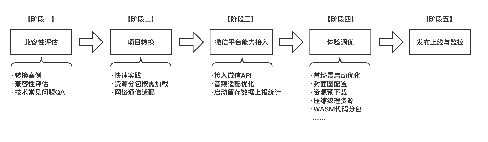

# Unity 游戏接入微信小游戏指南

​		下图中介绍了新游戏接入微信小游戏平台的主要转换流程，下文将介绍每一个阶段的工作：

- [【阶段一】兼容性评估](#阶段一兼容性评估)：初步确认技术方案是否符合游戏项目
- [【阶段二】项目转换](#阶段二项目转换)：可体验的WebGL、小游戏项目
- [【阶段三】微信平台能力接入](#阶段三微信平台能力接入)：接入更多平台能力
- [【阶段四】体验调优](#阶段四体验调优)：达到可上线标准的小游戏体验
- [【阶段五】发布上线与现网监控](#阶段五发布上线与现网监控)：上线后的问题排查与分析

## 【阶段一】兼容性评估

> 相关手册：[兼容性评估](Evaluation.md) 、[推荐引擎版本](UnityVersion.md)、[更多小游戏成功转换案例](ShowCase.md) 、[技术常见问题QA](DevelopmentQAList.md)

​		新计划接入游戏的开发者应阅读本节相关手册内容，参考已转化的案例游戏并结合自身游戏情况评估转化的可行性。

## 【阶段二】项目转换

​		本节内容将指引开发者如何让自己的游戏工程在微信小游戏平台成功运行。

### 快速开始——转换工具导出微信小游戏

> 相关下载： [微信 Unity 插件下载](https://game.weixin.qq.com/cgi-bin/gamewxagwasmsplitwap/getunityplugininfo?download=1)
>
> 相关手册：[快速开始：转换工具导出微信小游戏](Transform.md)

​		阅读 **快速开始：转换工具导出微信小游戏** 快速熟悉工具的使用并完成一次简单的转化工作！

### 资源按需加载

> 相关手册：[资源按需加载概述](ResourcesLoading.md) 、[AA(Addressable) 进行资源按需加载](UsingAddressable.md) 、 [AB(AssetBundle)进行资源按需加载](UsingAssetBundle.md) 、[Instant Game 实践指南](InstantGameGuide.md)

​		区别于原生 APP 游戏很少考虑场景内的资源规划问题，开发时通常将资源在游戏启动时全加载到内存中，而小游戏需要做到“即点即玩”，影响游戏的呈现速度因素中如首资源包的下载往往占比较大，因此需要根据场景中的主次内容进行资源上的优化分包处理。有关分包策略可参阅 **资源按需加载概述** 选择符合当前游戏的方案，具体实施可阅读具体指引文档。

### 后端/网络通信适配

> 相关手册：[后端服务指引](BackendServiceStartup.md) 、[网络通信适配](UsingNetworking.md)

​		区别于原生环境，WebGL模式（JavaScript环境）是不支持使用原生套接字（Socket）实现网络通信。对于游戏中使用到网络请求的操作，需要进行相应的适配。将 HTTP 请求使用 UnityWebRequest 类实现，全双工通信改用 WebSocket 协议实现，可参考手册案例完成适配。

### 资源服务器部署配置

> 相关手册：[资源部署与缓存](DataCDN.md) 、[资源缓存](FileCache.md) 、[iOS高性能模式](iOSOptimization.md)

​		游戏导出小游戏包(/minigame)将使用微信开发者工具打开，而资源目录(/webgl 或 /webgl-min)需要上传至开发者的 CDN 服务器中，并前往 MP 后台配置安全域名白名单，对于进一步提升 iOS 下的游戏运行效率可前往 MP 申请 **iOS 高性能模式**，请阅读相关手册完成相应的部署。

### 开发阶段的错误排查

> 相关手册：[开发错误调试与排查](DebugAndException.md)

小游戏存在开发者工具、真机(Android/iOS/PC Windows)，当游戏出现异常时可通过日志进行错误堆栈分析。

## 【阶段三】微信平台能力接入

### 接入微信API

> 相关手册：[WX SDK 平台能力适配](WX_SDK.md) 、[屏幕适配](fixScreen.md) 、 [输入法适配](InputAdaptation.md) 、 [排行榜与微信关系数据](OpenData.md)

​		Unity 游戏接入微信小游戏平台将获得微信提供的 API 以及开放能力，开发者根据需要进行按需接入。微信 API 支持的能力包括登陆、设备（存储、震动）、开放数据、广告等等。

### 启动留存数据上报统计

> 相关手册：[启动留存数据上报统计](ReportStartupStat.md)

​		在小游戏中玩家对启动时长与体验十分敏感（尤其从“广告”等买量场景进入的玩家），因此需要在必要的位置进行相关的数据上报，[Unity Loader 插件](UsingLoader.md)为游戏提供了一些基础上报数据，但游戏内部关键帧位置仍需要开发者自行上报，可参阅相关手册完成上报配置。

## 【阶段四】体验调优

​		截止本阶段，开发者的 Unity 游戏将在微信小游戏平台成功启动运行，但为了能够达到更佳的游戏体验开发者应继续进行对游戏工程的调优工作，本节将介绍目前微信小游戏平台为开发者提供的调优能力完成上线前的最后优化工作。

### 首场景启动优化——首帧逻辑优化

> 相关手册：[提升Unity WebGL游戏启动速度](StartupOptimization.md) 、[启动流程与时时序](Startup.md) 、 [首场景启动优化](FirstSceneOptimization.md)

​		根据统计数据反应，小游戏玩家对于游戏的启动时长是较为敏感的，过长的启动时间会导致用户的显著流失，因此如何快速呈现游戏场景是 Unity 原生 APP 游戏接入微信小游戏平台的一个重点优化的工作。首场景启动优化的并不是一个简单的步骤就可以完全优化，在初始 Unity 工程时开发者应主要对游戏代码如首帧逻辑进行修改，具体可参阅首场景启动优化手册。

### 资源预下载

> 相关手册：[使用预下载功能](UsingPreload.md)

​		在 UnityLoader 加载过程中是存在CPU处理密集而 **网络空闲** 的情况，因此可以充分利用该时机进行一些必要的资源下载可有助于提升游戏场景等资源的载入速度。

### 运行性能及调优

> 相关手册：[优化Unity WebGL的运行性能](OptimizationPerformence.md)、[使用 Android CPU Profiler 性能调优](AndroidProfile.md)、[使用 Unity Profiler 性能调优](UnityProfiler.md)、[优化 Unity WebGL 内存](OptimizationMemory.md)

​		游戏转化完成后仍需要对各项的性能指标进行量化测试。

### 压缩纹理资源

> 相关手册： [压缩纹理优化](CompressedTexture.md) 

​		压缩纹理工具是微信SDK提供的一种能够根据不同的游戏运行平台而按需加载压缩后纹理资源的能力。它的优点是：

- **增快游戏运行进度**：纹理资源从 bundle 内分离后按渲染需要进行后续加载，有效减少 bundle 体积，增快游戏的运行进度；
- **减少内存占用，GPU硬解纹理渲染更快**： 分离的资源被压缩成多种格式的纹理资源在 CDN 中存储，客户端根据硬件 GPU 支持的格式按需下载渲染，体积更小，渲染速度更快。

​		纹理压缩对于 **提升运行速度** 与 **减少内存** 的优化方面均有不错的表现效果，对于重度游戏而言，均建议进行该优化。

### WASM代码分包

> 相关手册：[使用代码分包工具](WasmSplit.md)

​		Unity 导出小游戏项目后代码将存储在 wasm 文件中，而游戏启动时需要完整的 wasm 文件才可以运行，于是微信小游戏提供了WASM代码分包能力，将原本的 wasm 文件根据游戏逻辑的主次内容分为 2 个 wasm 文件，一个用于启动加载另一个将被延迟加载，这样就允许先加载较小的首包快速进入主场景。该能力可以有效**降低内存的使用**，以及**减少脚本编译的时间**。

### 封面图配置

> 相关手册：[启动封面](CustomLoading.md)

​		由于 Unity WebGL 的启动加载需要一定的时间，微信小游戏支持通过配置封面图/视频等内容作为加载期间的过渡来留住玩家，微信小游戏支持如下自定义配置项：

- 封面图/视频内容
- 加载文案及样式
- 进度条样式
- 封面自动隐藏时机

## 【阶段五】发布上线与现网监控

​		审核发布可参考 MP 文档 [小游戏接入指南](https://developers.weixin.qq.com/minigame/introduction/guide.html) 自助完成，游戏相关运行数据请前往 [微信公众平台](https://mp.weixin.qq.com/)。

​		[现网错误日志上报与排查](IssueForProduction.md)

