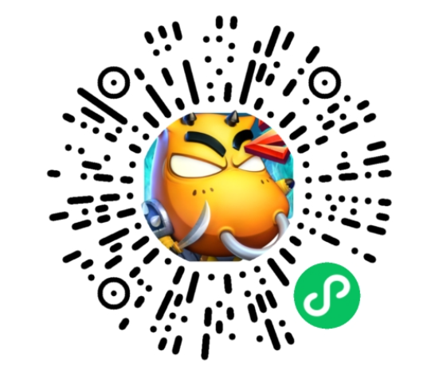

# Unity 游戏接入微信小游戏指南

​		欢迎使用 Unity WebGL 小游戏适配(转换)方案，本方案设计目的是**降低 Unity 游戏转换到微信小游戏的开发成本**。基于WebAssembly技术，无需更换Unity引擎与重写核心代码的情况下将原有游戏项目适配到微信小游戏。

### 方案特点：

- 保持原引擎工具链与技术栈
- 无需重写游戏核心逻辑，支持大部分第三方插件
- 由转换工具与微信小游戏运行环境保证适配兼容，保持较高还原度
- 微信小游戏平台能力以C# SDK方式提供给开发者，快速对接平台开放能力

​		下图中介绍了接入过程中的流程，以及每一个阶段需要做的优化与配置，下文将介绍每一个阶段的工作：

- [【阶段一】可行性评估](#阶段一可行性评估)
- [【阶段二】实践转化](#阶段二实践转化)
- [【阶段三】微信平台能力接入](#阶段三微信平台能力接入)
- [【阶段四】工程调优](#阶段四工程调优)
- [【阶段五】审核发布](#阶段五审核发布)

## 【阶段一】可行性评估

> 相关手册：[兼容性评估](Evaluation.md) 、[更多小游戏成功转换案例](ShowCase.md) 、[技术常见问题QA](DevelopmentQAList.md)

​		新计划接入游戏的开发者应阅读本节相关手册内容，参考已转化的案例游戏并结合自身游戏情况评估转化的可行性。

### 案例游戏分享

| 我叫MT2(回合战斗) | 旅行串串(休闲) | 谜题大陆(SLG) | 热血神剑(MMO) |
| :-: | :-: | :-: | :-: |
|  |  |  |  |

## 【阶段二】实践转化

​		本节内容将指引开发者如何让自己的游戏工程在微信小游戏平台成功运行。

### 快速开始——转换工具导出微信小游戏

> 相关下载： [微信 Unity 插件下载](https://game.weixin.qq.com/cgi-bin/gamewxagwasmsplitwap/getunityplugininfo?download=1) 、[Node.js长期稳定版](https://nodejs.org/zh-cn/download/)
>
> 相关手册：[快速开始：转换工具导出微信小游戏](Transform.md)

​		下载 **微信Unity插件** 并导入 Unity 游戏工程中，版本更新请查看 [更新日志]()，并安装 **Node.js长期稳定版**。

​		阅读 **快速开始：转换工具导出微信小游戏** 快速熟悉工具的使用并完成一次简单的转化工作！

**Unity版本支持说明：**

​		已验证可支持转化的 Unity 工程版本为：2018、2019、2020、2021 版本，推荐使用 2019、2021，需安装 WebGL 组件。

### 资源按需加载概述

> 相关手册：[AA(Addressable) 进行资源按需加载](UsingAddressable.md) 、 [AB(AssetBundle)进行资源按需加载](UsingAssetBundle.md) 、Instant Game 实践指南

​		区别于原生 APP 游戏很少考虑场景内的资源规划问题，开发时通常将资源在游戏启动时全加载到内存中，而小游戏需要做到“即点即玩”，影响游戏的呈现速度因素中如首资源包的下载往往占比较大，因此需要根据场景中的主次内容进行资源上的优化分包处理。

​		目前分包将基于 AA/AB 包的按需加载，以及 Unity Instant Game 三种方案。值得注意的是，微信小游戏环境中**不支持对本地的 Bundle 进行加载**，因此无论哪种方案最终都采用上传 CDN 方式在游戏运行时异步下载。

#### AA包、AB包、Instant Game 方案选择说明

​		AA/AB 包是常规的分包解决方案，关于他们的选择对于轻度游戏来说两者没有特别要求，倒是功能强大的 AA包 使用门槛更低一些，而对于重度游戏，平台目前所反馈到的结论是使用 **AB包** 的性能要比 AA包 更好，AA包较大项目时生成的未压缩的 catalog 较大，加载效率低，改用 AB包后，效果提升明显。

​		Instant Game 是由 Unity 官方提供的自动加载方案，有关 Instant Game 详细内容可查阅 **Instant Game 实践指南**，本节说明三种方案的差异：

|                | 常规资源加载方案（AA/AB包） | Instant Game 工具              |
| -------------- | --------------------------- | ------------------------------ |
| 技术原理       | 基于 AA/AB 包的异步资源管理 | Unity引擎底层资源异步加载策略  |
| 引擎版本       | 不限制                      | 目前需指定版本 2021.2.5        |
| 转化人力       | 适中                        | 较少/适中                      |
| 懒加载资源类型 | 常见纹理资源                | 纹理、模型、骨骼动画、音频资源 |
| 自选CDN        | 支持                        | 不支持（需使用腾讯云CDN服务）  |
| 必要的代码修改 | 通常需要适配                | 较少/达到最佳仍需要            |
| 首资源包处理   | 通常需要适配                | 默认不需要/达到最佳仍需要      |

**选择建议：**

- 游戏工程本身已采用完善的 AA/AB 资源管理，建议继续沿用常规资源加载方案，且有助于后续压缩纹理等优化工作的进行有效提升游戏运行性能；
- 原生 APP 版本游戏完全没有做资源的拆包，希望减少游戏的转化周期，使用 Instant Game 方案可以快速完成转化工作。

### 首场景启动优化——首帧逻辑优化

> 相关手册：[提升Unity WebGL游戏启动速度](StartupOptimization.md) 、[启动流程与时时序](Startup.md) 、 [首场景启动优化](FirstSceneOptimization.md)

​		根据统计数据反应，小游戏玩家对于游戏的启动时长是较为敏感的，过长的启动时间会导致用户的显著流失，因此如何快速呈现游戏场景是 Unity 原生 APP 游戏接入微信小游戏平台的一个重点优化的工作。首场景启动优化的并不是一个简单的步骤就可以完全优化，在初始 Unity 工程时开发者应主要对游戏代码如首帧逻辑进行修改，具体可参阅首场景启动优化手册。

### 后端/网络通信适配

> 相关手册：[后端服务指引](BackendServiceStartup.md) 、[网络通信适配](UsingNetworking.md)

​		区别于原生环境，WebGL模式（JavaScript环境）是不支持使用原生套接字（Socket）实现网络通信。对于游戏中使用到网络请求的操作，需要进行相应的适配。将 HTTP 请求使用 UnityWebRequest 类实现，全双工通信改用 WebSocket 协议实现，可参考手册案例完成适配。

## 【阶段三】微信平台能力接入

### 接入微信API

> 相关手册：[WX SDK 平台能力适配](WX_SDK.md) 、[屏幕适配](fixScreen.md) 、 [输入法适配](InputAdaptation.md) 、 [排行榜与微信关系数据](OpenData.md)

​		Unity 游戏接入微信小游戏平台将获得微信提供的 API 以及开放能力，开发者根据需要进行按需接入。微信 API 支持的能力包括登陆、设备（存储、震动）、开放数据、广告等等。

### 适配游戏音频

> 相关手册：[音频适配优化](AudioOptimization.md)

​		Unity2021 版本之前的音频不支持压缩音频，基于 CPU 解压将额外占用内存。在iOS高性能模式下 Unity WebGL 默认使用的 WebAudio 也会消耗大量内存。

​		微信SDK 提供了 音频API 控制播放，因此建议游戏开发者进行相应的替换。

### 启动留存数据上报统计

> 相关手册：[启动留存数据上报统计](ReportStartupStat.md)

​		在小游戏中玩家对启动时长与体验十分敏感（尤其从“广告”等买量场景进入的玩家），因此需要在必要的位置进行相关的数据上报，[Unity Loader 插件](UsingLoader.md)为游戏提供了一些基础上报数据，但游戏内部关键帧位置仍需要开发者自行上报，可参阅相关手册完成上报配置。

## 【阶段四】工程调优

​		截止本阶段，开发者的 Unity 游戏将在微信小游戏平台成功启动运行，但为了能够达到更佳的游戏体验开发者应继续进行对游戏工程的调优工作，本节将介绍目前微信小游戏平台为开发者提供的调优能力完成上线前的最后优化工作。

### 封面图配置

> 相关手册：[启动封面](CustomLoading.md)

​		由于 Unity WebGL 的启动加载需要一定的时间，微信小游戏支持通过配置封面图/视频等内容作为加载期间的过渡来留住玩家，微信小游戏支持如下自定义配置项：

- 封面图/视频内容
- 加载文案及样式
- 进度条样式
- 封面自动隐藏时机

### 资源预下载

> 相关手册：[使用预下载功能](UsingPreload.md)

​		在 UnityLoader 加载过程中是存在CPU处理密集而 **网络空闲** 的情况，因此可以充分利用该时机进行一些必要的资源下载可有助于提升游戏场景等资源的载入速度。

### 压缩纹理资源

> 相关手册： [压缩纹理优化](CompressedTexture.md) 

​		压缩纹理工具是微信SDK提供的一种能够根据不同的游戏运行平台而按需加载压缩后纹理资源的能力。它的优点是：

- **增快游戏运行进度**：纹理资源从 bundle 内分离后按渲染需要进行后续加载，有效减少 bundle 体积，增快游戏的运行进度；
- **减少内存占用，GPU硬解纹理渲染更快**： 分离的资源被压缩成多种格式的纹理资源在 CDN 中存储，客户端根据硬件 GPU 支持的格式按需下载渲染，体积更小，渲染速度更快。

​		纹理压缩对于 **提升运行速度** 与 **减少内存** 的优化方面均有不错的表现效果，对于重度游戏而言，均建议进行该优化。

### 资源服务器部署配置

> 相关手册：[资源部署与缓存](DataCDN.md) 、[资源缓存](FileCache.md) 、[iOS高性能模式](iOSOptimization.md)

​		游戏导出小游戏包(/minigame)将使用微信开发者工具打开，而资源目录(/webgl 或 /webgl-min)需要上传至开发者的 CDN 服务器中，并前往 MP 后台配置安全域名白名单，对于进一步提升 iOS 下的游戏运行效率可前往 MP 申请 **iOS 高性能模式**，请阅读相关手册完成相应的部署。

### WASM代码分包

> 相关手册：[使用代码分包工具](WasmSplit.md)

​		Unity 导出小游戏项目后代码将存储在 wasm 文件中，而游戏启动时需要完整的 wasm 文件才可以运行，于是微信小游戏提供了WASM代码分包能力，将原本的 wasm 文件根据游戏逻辑的主次内容分为 2 个 wasm 文件，一个用于启动加载另一个将被延迟加载，这样就允许先加载较小的首包快速进入主场景。该能力可以有效**降低内存的使用**，以及**减少脚本编译的时间**。

### 使用水印保护代码包安全

> 相关手册：[WASM水印插件](wasmWaterMark.md)

​		为保护原创游戏开发者的利益，通过对代码包进行水印的添加平台可快速准确的打击恶意抄袭的行为。

### 使用工具测试运行性能及调优

​		游戏转化完成后仍需要对各项的性能指标进行量化测试，本节给出各项工具的使用与对应的调优策略，开发者根据指引完成测试与优化。

**性能测试与优化：**

- [使用 Android CPU Profiler 性能调优](AndroidProfile.md)
- [使用 Unity Profiler 性能调优](UnityProfiler.md)
- [优化 Unity WebGL 内存](OptimizationMemory.md)
- [资源优化工具与建议](AssetOptimization.md)

**异常相关：**

- [开发错误调试与排查](DebugAndException.md)
- [现网错误日志上报与排查](IssueForProduction.md)

### 各类型游戏的优化侧重点

​		不同的游戏所需要的性能不尽相同，转化过程中的复杂度以及关注的侧重点自然也是不同的。游戏开发者可以根据自己游戏的类型进行不同的优化策略来提升实际的游戏体验，本节总结的列举开发者对不同类型的游戏应重点关注的优化内容。

- 小型游戏

​		特点：游戏总包体积较小，“关卡”休闲类小游戏等。

​		**关注**：快速适配对微信API能力的接入，性能上重点对首场景启动优化，关卡分包加载（主关卡优先，后续关卡按需加载等）。

- 原生 APP 平台采用本地 AB/AA 包的游戏

​		特点：游戏原本发布原生 APP 平台，开发时为优化运行时内存，将游戏资源以 AA/AB 包方式存放于磁盘本地，在游戏运行时适宜的位置进行加载/卸载。

​		**关注**：将 AA/AB 资源包改用 CDN 远程加载，及时卸载不再使用的资源包释放内存，使用纹理压缩工具降低纹理资源大小提升渲染效率。

- 大型无 AB 游戏

​		特点：游戏较大，但未使用 AA/AB 包方式进行分包管理，或较少使用，场景中必须与非及时资源在启动时一并加载。

​		**关注**：该类游戏需要耐心调优，重点关注游戏运行时的内存优化。需将游戏内资源逐一拆分，推荐使用 AB包 方式进行按需加载与及时资源释放，对多 Scene 时对后续场景使用 AA/AB分包方式载入，做好资源加载过程中的UI上的进度条反馈。推荐使用纹理压缩工具、WASM代码分包、资源预下载等能力优化，效果提升明显。

## 【阶段五】审核发布

​		审核发布可参考 MP 文档 [小游戏接入指南](https://developers.weixin.qq.com/minigame/introduction/guide.html) 自助完成。

## 问题反馈

- [问题反馈与联系我们](IssueAndContact.md)
