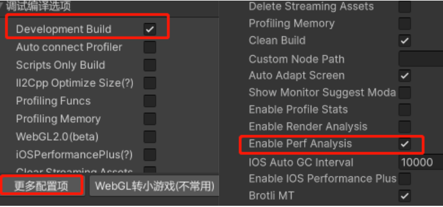

# 使用高精度时间进行性能检测

## 背景

在默认的浏览器环境下，我们通常使用`performance.now()`或`Date.now()`函数来获取当前的时间戳。然而这些API的精度在实际应用中存在诸多限制：

其中，`Date.now()`返回自 1970 年 1 月 1 日 UTC 至今的毫秒级整数时间戳，其精度固定为1ms；而`performance.now()`虽然返回从页面导航开始（navigationStart）到调用时刻的毫秒级浮点数值（例如 1780.7999999988824），理论上可以达到微秒级（千分之一毫秒）精度，但在实际浏览器中，精度往往不够高会被限制在0.1ms（Chrome）或1ms（Safari）。下图为在开发者工具中调用`performance.now()`的结果：


端游和手游APP的精度均为微秒级，与之相比，较低的时间精度对于微信游戏性能优化带来了巨大的挑战。

## 高精度时间与性能深度分析工具

从基础库3.5.4开始，针对安卓平台与iOS的普通模式，微信小游戏提供了高精度时间的底层功能。

在默认情况下，由于性能考虑，该功能默认关闭。只有在勾选`Development Build`和`Enable Perf Analysis`导出后，该功能才默认打开：



更多信息，可以参考：[性能深度分析工具使用指南](https://wechat-miniprogram.github.io/minigame-unity-webgl-transform/Design/DeepProfileTool.html)。

## 手动打开高精度时间功能

除此之外，我们也可以修改js代码，手动打开高精度时间功能。修改方法如下：

1. 打开`weapp-adapter.js`文件，搜索`const clientPerfAdapter = Object.assign`，定位到如下代码：
```javascript
const clientPerfAdapter = Object.assign({}, {
    now: function now() {
        if (GameGlobal.unityNamespace.isDevelopmentBuild
            && GameGlobal.unityNamespace.isProfilingBuild
            && !GameGlobal.unityNamespace.isDevtools
            && !GameGlobal.isIOSHighPerformanceMode) {
            // 由于wx.getPerformance()获取到的是微秒级，因此这里需要/1000.0，进行单位的统一
            return (ori_performance.now() - ori_initTime) * 0.001;
        }
        return (Date.now() - initTime);
    },
});
```
2. 可以看到，代码中进行了GameGlobal.unityNamespace.isDevelopmentBuild和GameGlobal.unityNamespace.isProfilingBuild的判断。用户可以将这两句删掉，便可以通过`performance.now()`获取微秒级别的高精度时间了。

## 注意事项
1. 当前高精度时间只支持安卓和iOS普通模式。其它模式下依然返回的是毫秒级别的精度。
2. `performance.now()`相比起`Date.now()`更耗费性能，因此建议不建议正式版本中开启高精度时间。