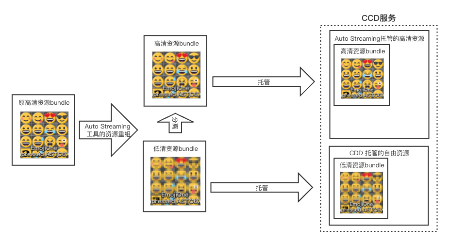

# Unity Instant Game导出至微信小游戏指南

​		除常规使用 AA/AB 分包方案外，Unity 官方也提供了 Instant Game 转换工具可以实现 Unity 游戏转化至微信小游戏平台的能力，本文将介绍 Instant Game 工具的实践操作，协助开发者将游戏转化至微信小游戏环境中运行。


## 方案选择建议

​		Instant Game 能够快速有效的将原生 APP 游戏工程在较少的代码修改的情况下完成微信小游戏平台的运行，这得益于 Unity 引擎基于底层实现对游戏资源的异步加载能力，并将这些资源托管至 CCD 服务中。对于开发者而言，若游戏为休闲关卡类等小型游戏，使用 Instant Game 能够减少游戏的转化工时。适用于 Instant Game 转化的游戏一般具备：

- 需要快速转化上线
- 原生 APP 游戏工程没有使用 AA/AB 实现资源的管理
- 中小型游戏，对设备性能如计算、内存等要求并不是特别吃紧的游戏

​		Instant Game 对于极小的休闲类游戏将具备更快更小修改代价将游戏迁移至微信小游戏环境内运行，若追求较好的游戏品质，无论哪一种方案都需要开发者专项的适配。在部署方面 Instant Game 需要使用平台提供的 CDN 服务，不支持开发者自建。


## 实践指南

​		本文以 [Unity塔防模板游戏](https://learn.unity.com/project/ta-fang-mo-ban?uv=2017.2) 作为使用Unity Instant Game工具导入至微信小游戏真机运行的实践案例，相关资源下载地址：

Windows平台：

- Unity Editor：[Editor_2021.2.5f1c301_a9](https://unity-1258948065.cos.ap-shanghai.myqcloud.com/test/AutoStreamerTest1/Release/Alpha/c301_a9/UnitySetup64.exe)
- WebGL Build Support: [UnitySetup-WebGL-Support-for-Editor-2021.2.5f1c301.exe](https://unity-1258948065.cos.ap-shanghai.myqcloud.com/test/AutoStreamerTest1/Release/Alpha/c301_a9/UnitySetup-WebGL-Support-for-Editor-2021.2.5f1c301.exe)

MacOS平台：

- Unity Editor：[Editor_2021.2.5f1c301_a9](https://unity-1258948065.cos.ap-shanghai.myqcloud.com/test/AutoStreamerTest1/Release/Alpha/c301_a9/Unity.pkg)
- WebGL Build Support: [UnitySetup-WebGL-Support-for-Editor-2021.2.5f1c301.pkg](https://unity-1258948065.cos.ap-shanghai.myqcloud.com/test/AutoStreamerTest1/Release/Alpha/c301_a9/UnitySetup-WebGL-Support-for-Editor-2021.2.5f1c301.pkg)

InstantGame Package：

[com.unity.instantgame.zip](https://unity-1258948065.cos.ap-shanghai.myqcloud.com/test/AutoStreamerTest1/Release/Alpha/c301_a9/com.unity.instantgame.zip)

### MacOS 安装

​		根据平台下载相应的 Unity 编辑器，其中对于使用 MacOS Unity Hub 选择编辑器位置若提示 “应用程序无效 这不是一个已签名的Unity应用”，则需要在 Unity Hub 界面全程按住 `command` 键完成选择操作。


### 开始实践

#### 1.新建项目导入游戏工程

​		游戏工程 [Unity塔防模板游戏](https://learn.unity.com/project/ta-fang-mo-ban?uv=2017.2) 自行导入 Unity 工程中，导入后受工程自身原因仍需修改如下两处（其他游戏无需修改）：

（1）在首场景 MainMenu 的 Main Camera 组件的检查器内，关闭 Flare Layer ，如下图所示：


（2）注释掉 `Assets/UnityTechnologies/TowerDefenseTemplate/Scripts/TowerDefense/UI/MouseScroll.cs` 文件中大约100行位置的代码，如下所示：

```c#
public void SelectChild(LevelSelectButton levelSelectButton)
{
	// minus one if  buffer
	int childCount = levelSelectButton.transform.parent.childCount - (m_HasRightBuffer ? 1 : 0);
	if (childCount > 1)
	{
		float normalized = (float)levelSelectButton.transform.GetSiblingIndex() / ( childCount - 1);
		//m_ScrollRect.normalizedPosition = new Vector2(normalized, 0);	//此处需要注释掉
	}
}
```

#### 2.修改构建设置

（1）修改 `File - Build Settings` 中的平台为 WebGL ，并修改 **Texture Compression** 为 ASTC，如下图：


（2）取消 `Build Settings - Player Settings - Player - Other Settings` 中的 **Auto Graphics API** 勾选项，并删除 WebGL 2，Lightmap Encoding 变更为 **Normal Quality**，如下图：


#### 3.导入 Instant Game 工具包

​		在 Unity Editor 菜单栏 `Windows - Package Manager ` 面板右上角 + 号选择 `Add package from disk` ，窗口中选择下载的 [com.unity.instantgame.zip](https://unity-1258948065.cos.ap-shanghai.myqcloud.com/test/AutoStreamerTest1/Release/Alpha/c301_a9/com.unity.instantgame.zip) 解压文件内 **package.json** 文件。

#### 4.启用 Auto Streaming 能力

​		在 Unity Editor 菜单栏 `Windows - AutoStreaming - Cfg&Publish` 面板中，勾选 **Use Auto Streaming**，同时配置 CCD服务，CCD服务及 APPID 等信息请查阅本文档 [**CCD服务章节**](#CCD服务)。

​		勾选 `Use Font Streaming (Experimental)` 与 `Compressed Cloud Assets` 选项，并正确填写 `Instant Game App ID` 。

- Use Font Streaming ：开启字体资源的 Streaming 能力
- Compressed Cloud Assets ：开启 CDN 智能压缩功能，可以减少客户端下载量减少客户端运行时内存占用

​		复制 CCD服务 中 `Instant Game App ID` 的 APPID 至面板内，

##### 理解 Bucket 与 Badge

- Bucket 可便于管理同一个 CCD Project 下的多个不同的存储桶，一般可用于同一款游戏工程对不同平台的资源的存储
- Badge 是建立在 Bucket 下的存储分支，一般可用于不同的游戏版本资源的存储。CCD 会为每一个 Bucket 自动生成名为 `latest` 的 Badge ，每次上传文件，该 Badge 内的资源都将被更新，始终指向最新的资源版本，因此 **请勿将资源提交至 `latest` 内**，防止影响已发布的游戏版本内容

#### 5.配置 Streaming

> 提示：面板支持 **全选快捷键** 批量操作

​		在 `Auto Streaming` 面板中顶部 5 个 Streaming Tab 将用来配置资源的异步自动加载能力，本节将逐一介绍。

- **Texture Streaming**

​		配置游戏内纹理资源进行异步自动加载，并可配置 Streaming Placeholder ，该能力支持先 **低清资源** 优先呈现场景内容在运行时首次使用到纹理后引擎后台线程加载 **高清资源** 并自动替换，开发者根据自己游戏需要进行选择。

界面能力描述：

| 功能                      | 描述                                                         |
| ------------------------- | ------------------------------------------------------------ |
| Sync Texture              | 搜索 BuildSettings 中的 Scenes 引用到的所有 Texture 资源；   |
| Force Rebuild             | 勾选后点击Generate AssetBundles，将强制重新生成 texture 的 AssetBundles； |
| Generate AssetBundles     | 为所有勾选的 texture 生成 AB，每张贴图一个 AB；              |
| Generate Placeholders     | 为所有勾选的 texture 生成一张低分辨率的替用贴图；对于少数不支持低分辨率贴图的情况（如使用 spine 旧版插件的图集，在代码中读取 size 的贴图，RawImage上使用的贴图），在勾选 Placeholder 之外需要勾选BlurPlaceholder， 从而生成一张同样大小但信息量更少的图片； |
| ConvertLegacySpritePacker | 将旧式的Sprite packer 图集转换成SpriteAtlas，从而获得streaming支持；**该功能会清理所有sprite上的packing Tag，使用前请对工程做好备份**。 |


首次打包步骤：

1. 【可选】对于有图集（旧 Sprite Packer）游戏项目点击 `ConvertLegacySpritePacker` 按钮，将图集转为支持 Auto Streaming 的新格式（SpriteAtlas），重新生成的图集将位于 `Assets/AutoStreamingData/AutoConvert` ；
2. 点击 `Sync Textures` 扫描项目资源，点击 `Ctrl + A` 可全选资源，对于需要生成 低清资源 提升加载速度的游戏勾选 `Placeholder` ，可单独点击资源查看纹理的转化是否符合预期，点击 `Generate AssetBundles` 即可构建资源 bundle；
3. 成功构建后点击 AB 表头按照大小排序，取消过小的一些资源（例如小于 5kb 资源，可按住 Shift 多选）使用该能力，再次点击 `Generate AssetBundles` 清理不需要的 AB ；
4. 最后点击 `Generate Placeholders` 替换项目内资源。

更新操作步骤：

1. 点击 `Sync Textures` 扫描项目资源，调整 `Placeholder` 的勾选项；
2. 勾选 `Force Rebuild` ；
3. 点击 `Generate AssetBundles` 重新构建 AB ；
4. 最后点击 `Generate Placeholders` 替换项目内资源。

- **Audio / Mesh / Animation Streaming**

​		Audio / Mesh / Animation 资源的异步加载，点击 `Sync Audios / Meshes / Animations` 扫描项目内资源，根据需要勾选 `OnDemandDownload` ，值得注意的是由于资源在使用时才开始进行异步加载。尤其音频资源对于一些游戏场景需要及时性的音效首次播放可能存在明显的延迟问题，因此要酌情选择使用该能力。该能力一般可用于较大的背景音乐等不追求及时性的音频资源。其他场景需要开发者手动构建 AA/AB 包完成提前加载。

- **Scene Streaming**

​		选择 `Build Settings` 中的场景，将这些场景自动构建成 AssetBundle ，并托管至 CCD服务器上，对于开发者而言通过 SceneManager 调用 `LoadScene` 或 `LoadSceneAsync` ，底层将自动完成下载与加载。

界面能力描述：

| 功能                 | 描述                                              |
| -------------------- | ------------------------------------------------- |
| Sync Scenes          | 获取 Build Settings 中的 Scene ，并在列表中显示； |
| Force Rebuild        | 勾选后，强制重新构建 Scene 的 AssetBundles；      |
| Generate AssetBundle | 生成 Scene 以及 共享资源 的 AB；                  |
| Sync SharedAssets    | 搜索勾选 Streaming 的场景中的共同引用到的资源；   |

​		场景通常将被打成独立的 AB 资源，但被不同场景内引用的资源会被重复打到不同的场景 AB 中，因此对于共享的资源挑出单独打包。被标记 `IsSharedAsset` 的资源将会在**首场景前准备好**，因此不宜过大（小于 5M），建议的资源是：

- 被多个场景引用到的资源，可查看列表 `References` 列包含场景序号较多的资源
- 本身较大的 shader 等资源

使用步骤：

1. Scene Streaming 依赖 **Texture/Audio/Mesh/Animation/Font Streaming** 配置，因此要优先处理前序操作；
2. 点击 `Sync Scenes` 扫描场景，根据需要勾选 `OnDemandDownload` 选项；
3. 点击 `Shared SharedAssets` 扫描共享资源，根据需要勾选 `IsSharedAsset` ；
4. 若已经构建过，则需勾选 `Force Rebuild` ；
5. 点击 `Generate ABs` 创建 AB 。

#### 6.针对 AB、AA 包的处理

​		由于本案例中并未涉及 AB 、AA 包资源的加载与使用，因此实践步骤中暂不介绍，对于使用 AB、AA 包资源的开发者请阅读 [**Assets Bundle指引**](#AssetsBundle指引) 与 [**Addressable指引**](#Addressable指引) 小节完成配置。

#### 7.导入微信Unity - SDK

​		前往文档主页下载安装 [Unity小游戏转换工具和SDK](https://github.com/wechat-miniprogram/minigame-unity-webgl-transform) 插件，并导入至 Unity 工程内，在 Unity 顶部菜单栏点击 `微信小游戏 - 转换小游戏` ，在配置面板中根据指引填写相关信息，其中 `游戏资源CDN` 需要填写 `Auto Streaming - Cfg&Publish` 面板中的 `Auto Straming Path` 内地址。

​		打开 `转换小游戏` 面板后，需要在 Unity 内打开工程文件 `Assets/WX-WASM-SDK/Editor/MiniGameConfig` （若无该文件需打开 `转换小游戏` 面板），在 Unity 的 Inspector 页面中点开 `Project Conf` 修改如下属性值：

- Bundle Path Identifier :  `StreamingAssets;AS;CUS/CustomAB`
- Data File Sub Prefix : `CUS`


**解释：**

- StreamingAssets 为微信小游戏默认字段；
- AS 在使用 Auto Streaming 时为 **必填** 字段；
- CUS/CustomAB 对应 `CustomCloudAssets/CustomAB` 目录，**使用到时则必须要填写**
- Data File Sub Prefix 的 CUS 为首资源包下载地址前缀，**必填**。

#### 8.将游戏导出为 WebGL 工程

​		在 `转换小游戏` 面板配置好信息后点击 `导出 WebGL 并转换成小游戏` ，该过程可能花费一段时间，打包过程需安装 Node.js ，请确保安装并正确配置环境变量。

​		导出完成后需将导出目录中的 `webgl` 目录内的由 HASH 头构成的 `.txt` 文件复制到 `CustomCloudAssets` 目录下（此处对应步骤7中 Data File Sub Prefix 的设定意义）。


#### 9.将资源上传至 CDD 服务

​		 在 `Auto Streaming - Cfg&Publish` 面板中点击 `UploadToCCD` 将所有的资源进行上传。

#### 10.真机运行

​		在 `微信开发者工具` 中导入 `minigame` 目录，前往 **[MP 后台](https://mp.weixin.qq.com/) - 开发管理 - 开发设置 - 服务器域名** 的 `request合法域名` 与 `downloadFile合法域名` 中进行白名单配置，AutoStreaming 工具用到的域名：

- https://assetstreaming-wg-content.unity.cn;
- https://asset-streaming-wg.cdn.unity.cn;
- https://asset-streaming-content.unity.cn;

​		最后在开发者工具使用预览/上传体验等功能完成真机运行。


### AssetsBundle指引

​		与微信小游戏快适配方案相同的是，若游戏内逻辑使用了自定义的远程AB包的加载，则不可避免的需要手动对AB包加载部分进行相应的修改，本节将对 AB包 的加载进行介绍。

​		Auto Streaming 对开发者自己构建的 AB包 在资源扫描时会对其进行识别，在工程中对这些资源进行低清资源的生成以及替换，在替换后，开发者需要重新对这些 bundle 进行构建，使得生成的 bundle 具备较小的体积，bundle 内原来的高清资源由 CCD 服务自行托管，需要时将异步的加载并更新在游戏的环境内，自定义AB包的运行原理如下图所示。



​		Instant Game 提供了一个目录用于对自定义资源的上传，位于工程根目录（与Assets目录同级）的 `CustomCloudAssets` 目录内，如下图所示：


​		经过工具的低清资源生成后，需要重新构建AB包，一般将资源放入`CustomCloudAssets/CustomAB` 内并在`Auto Streaming - Cfg&Publish` 面板内执行 `Upload to CCD` 即完成上传  ，未来放入该目录内的资源将被如下路径访问到：

```c#
// 例如 CustomCloudAssets/CustomAB/MyBundle01.ab
string CCD_HEADER = AutoStreaming.CustomCloudAssetsRoot;
string Uri = CCD_HEADER + "CustomAB/MyBundle01.ab";		//CCD资源地址
```

​		游戏内对于本地的 Bundle 加载的代码需要变更为远程加载，下面给出一种加载案例：

```c#
public class XXX : MonoBehaviour
{
    public Image img;		// Image
    void Start()
    {
      	//加载AB包并渲染至 Image
        StartCoroutine(LoadABAsync("MyBundle01"));
    }
  
    IEnumerator LoadABAsync(string abName)
    {
      	//首先加载 AB 包的 Manifest，用于读取经过 Hash 后的 ab 包资源
        var uwr = UnityWebRequestAssetBundle.GetAssetBundle(
            AutoStreaming.CustomCloudAssetsRoot + "AssetBundles"
            );
        yield return uwr.SendWebRequest();
        if (uwr.result != UnityWebRequest.Result.Success)
        {
            Debug.Log(uwr.error);
            yield break;
        }
        AssetBundle manifestbundle = DownloadHandlerAssetBundle.GetContent(uwr);
        AssetBundleManifest abm = manifestbundle?.LoadAsset<AssetBundleManifest>("AssetBundleManifest");
        var hashName = GetABNamesWithHash(abm);	//获取字典表
        
      	//从字典表中得到 ab包 完整的资源名（含Hash部分的）
      	var abNmaeWithHash = hashName[abName];

      	//预加载的远程资源完整地址
        string abUri = AutoStreaming.CustomCloudAssetsRoot + "CustomAB/" + abNmaeWithHash;
      
        UnityWebRequest request = UnityWebRequestAssetBundle.GetAssetBundle(abUri);
        yield return request.SendWebRequest();
        if (request.isHttpError)
        {
            Debug.LogError(GetType() + "/ERROR/" + request.error);
        }
        else
        {
          	//此处成功下载并加载 ab包 资源，后续根据需要自行使用包内资源
            AssetBundle ab = (request.downloadHandler as DownloadHandlerAssetBundle).assetBundle;          
            
          	// ab.LoadAsset
            Sprite temp = ab.LoadAsset<Sprite>("Image01");
            img.sprite = temp;
            ab.Unload(false);
        }
        request.Dispose();
    }
  	
  	//基于 AssetBundleManifest 生成 ab包 完整资源字典表
    private Dictionary<string,string> GetABNamesWithHash(AssetBundleManifest abm)
    {
        var hashNames = abm.GetAllAssetBundles();
        Dictionary<string, string> ABNamesDict = new Dictionary<string, string>();
        foreach(var hashName in hashNames)
        {
    				//这里请注意正则表达式规则是否符合项目的 ab包 的命名，本案例中后缀为 「.ab」
            bool b = Regex.Match(hashName, "_[0-9a-f]{32}.ab$").Success;
            //如果有后缀，相应的 「 hashName.Length - 33 - 3 」 也需要对应修改
            var abName = b ? hashName.Substring(0, hashName.Length - 33 - 3) : hashName;
            ABNamesDict.Add(abName, hashName);
        }
        return ABNamesDict;
    }
}
```

**总结而言，整体的步骤应为：**

1. 游戏工程先以默认（高清）方式构建 1 次bundle；
2. 在 `Auto Streaming - Cfg&Publish` 面板 `Custom AB Assets` 项点击 `Search AB` 按钮对构建的 bundle 目录扫描；
3. 在  `Auto Streaming - Texture Streaming` 面板 `Sync Textures` 后根据需要选中资源(支持全选快捷键)  `Generate Placeholaders` + `Generate AssetBundles`
4. 此时需要重新构建开发者自己的 AB包（低清，高清图已被 Auto Streaming 自行托管）；
5. 将 Asset Manifest 文件放至 `CustomCloudAssets` 目录内，其余 AB包 放至 `CustomCloudAssets/CustomAB/` 目录内；
6. 在`Auto Streaming - Cfg&Publish` 面板内执行 `Upload to CCD` 即完成上传；
7. 在需要加载 AB包 位置进行代码的修改（参考上方代码）。


### Scene 加载体验问题

​		在实践中将发现使用 Instant Game 转化的游戏首次切换场景期间等待时间较长，且没有任何的界面上给用户的加载进度回应，这对于用户的体验是不友好的。由于 Unity 引擎对底层的原本地 Load Scene（同步）方法进行了替换，所以原底层方法是不具备提供进度回调的能力，因此在实际的游戏优化的过程中，应对被加载的场景进行基于 AA/AB 的手动分包，并在可能的较大资源的加载位置增加游戏UI上的给用户的进度回应。


### CCD服务

​		CCD 服务是由 Unity Instant Game 统一提供的 CDN 服务，通常而言游戏中被 Auto Streaming 分离的资源将被托管至 CCD 服务，同时 Instant Game 也提供了一个自由的资源目录可供开发者自行上传其他资源内容。

​		前往 [CCD服务](https://developer.cloud.unity.cn/projects/) 控制台，登陆后点击 `Create New Project` 创建项目，进入项目页面后左侧菜单栏 `Content Delivery - Instant Game App ID` 中创建你的项目 APPID，该 APPID 将用于填写至面板内 APPID 一栏，如图：


### 资料链接

- https://docs.qq.com/doc/DQmlUakFQb3FFY2Fu

​		