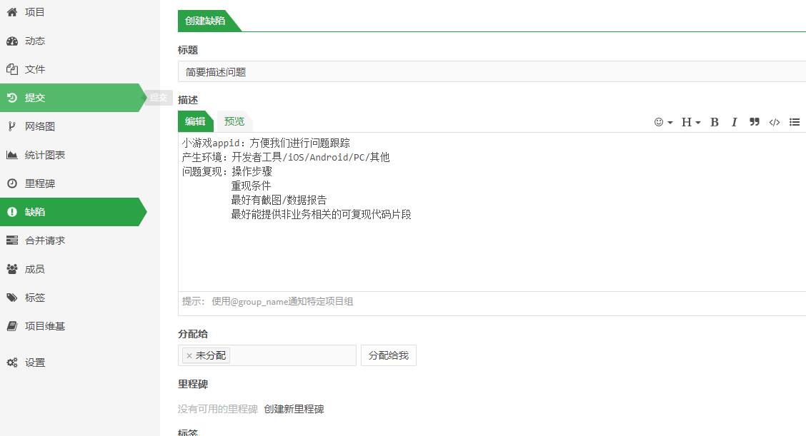

# 问题反馈与联系我们
开发者使用转换方案时，如果遇到问题可以随时反馈给我们。目前可通过[Git Issue](https://github.com/wechat-miniprogram/minigame-unity-webgl-transform/issues)和“研发助手号”微信两种方式。

## Git Issue
开发者遇到BUG或者希望新增特性优先使用[Git Issue](https://github.com/wechat-miniprogram/minigame-unity-webgl-transform/issues)，因为这里可以更好进行问题沉淀、讨论与跟踪。
 
   

问题复现尽可能详细，包括以下内容：
* 操作步骤
* 重现条件
* 最好有截图/数据报告
* 最好能提供非业务相关的可复现代码片段

## 小游戏客服助手
开发者也可以通过客服助手直接与小游戏团队进行技术交流

  
