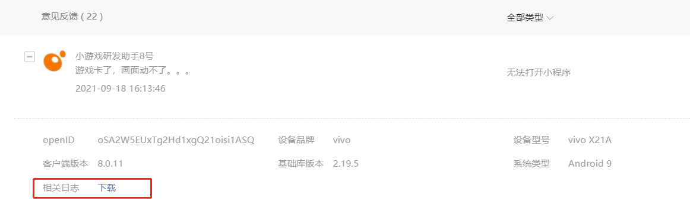
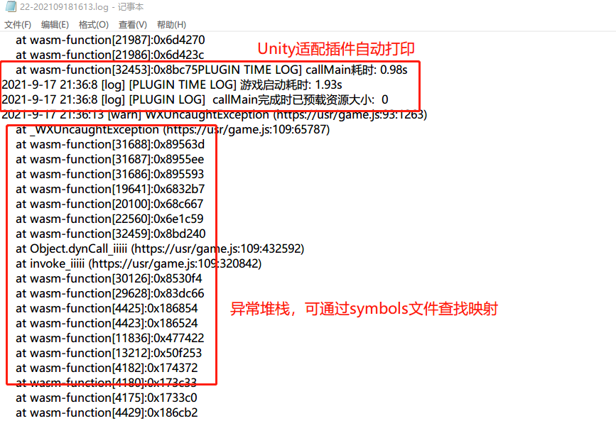
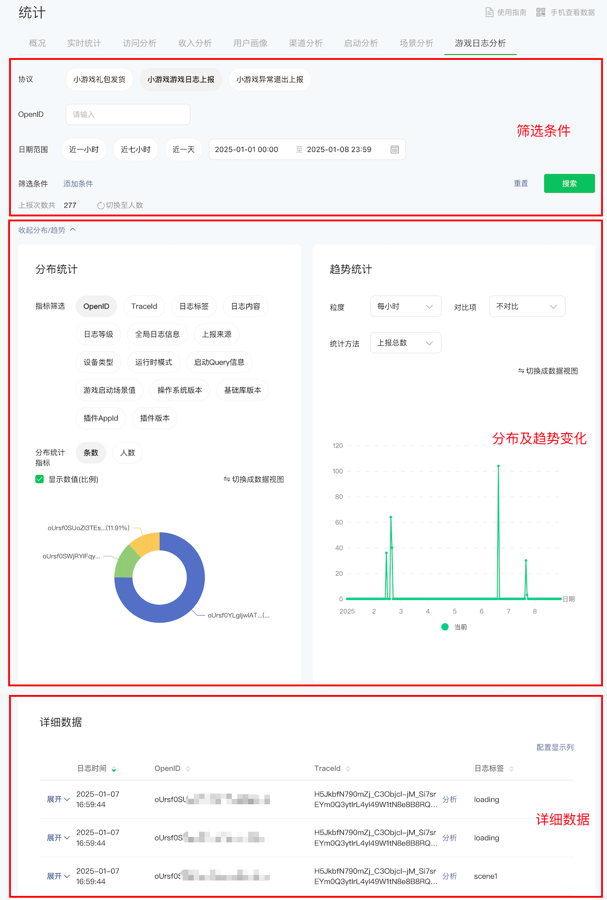
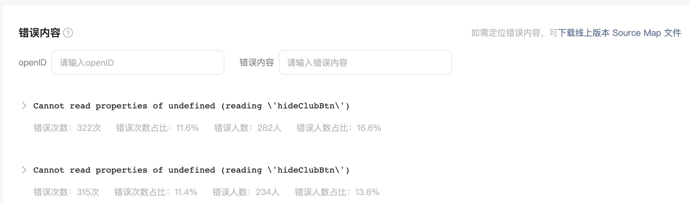

# 现网错误日志上报与排查

当游戏发布到现网时，开发者需要收集玩家遇到的错误、异常等问题并进行排查原因，本文阐述在微信小游戏环境的最佳实践。

开发者可通过如下三种途径收集到游戏异常数据：
- 用户反馈日志
- 小游戏实时日志
- JS Error错误日志

## 用户反馈日志

> 数据入口：[MP平台](https://mp.weixin.qq.com)-用户反馈

当玩家游戏中出现问题时，进行功能反馈将会提交“用户反馈日志“，开发者可以在后台下载到对应数据：

该功能需要两个必要条件：
1. 玩家提交反馈
   - 默认情况下，玩家可通过游戏右上方 "...-反馈与投诉-功能异常" 打开反馈入口。
   - 除此外，开发者也可通过使用[wx.createFeedbackButton](https://developers.weixin.qq.com/minigame/dev/api/open-api/feedback/wx.createFeedbackButton.html)主动创建反馈入口。

2. 开发者埋点打印日志
   - 默认情况下，适配插件将**自动**埋点游戏启动与特殊异常日志
   - 除此外，开发者看通过C# SDK的LogManagerxxx系列函数进行埋点上报

**建议：**

- 开发者埋点上报购买物品、打开广告、进入关卡等关键信息
- 开发者埋点上报异常捕捉的信息

## 游戏实时日志

> 数据入口：[MP平台](https://mp.weixin.qq.com)-基础数据-游戏日志分析

为帮助开发者更便捷地定位问题，从基础库 `3.7.4` 开始，我们推出了[小游戏实时日志分析功能](https://developers.weixin.qq.com/minigame/dev/guide/runtime/debug/gamelogmanager.html#%E5%A6%82%E4%BD%95%E4%BD%BF%E7%94%A8)。开发者可通过 [wx.getGameLogManager](https://developers.weixin.qq.com/minigame/dev/api/data-analysis/wx.getGameLogManager.html) 获取游戏日志实例并上报相关游戏日志，日志会进行汇聚并实时上报到小游戏管理后台。

**注意**

1. 相对于用户反馈日志，小游戏实时日志**不需要用户反馈行为**。
2. 需要开发者通过相关API上报游戏关键节点信息与异常日志。

## JS Error错误日志

> 数据入口：[We分析](https://wedata.weixin.qq.com/)-性能质量-JS分析

微信小游戏框架会在顶层监控到任何**未捕捉的JS异常**。

使用Unity WebGL转换方案的游戏通常会有这几种错误会产生：
- 导出选项中禁用异常，当触发异常时将走到js abort相关逻辑，此处将产生异常。
- 适配插件自身脚本错误
- 其他JS层未捕获异常
