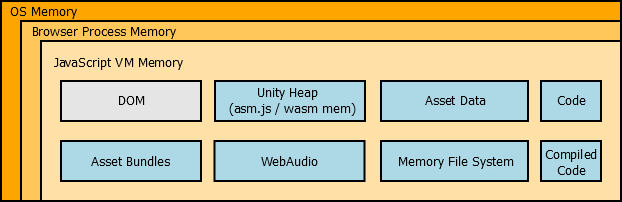
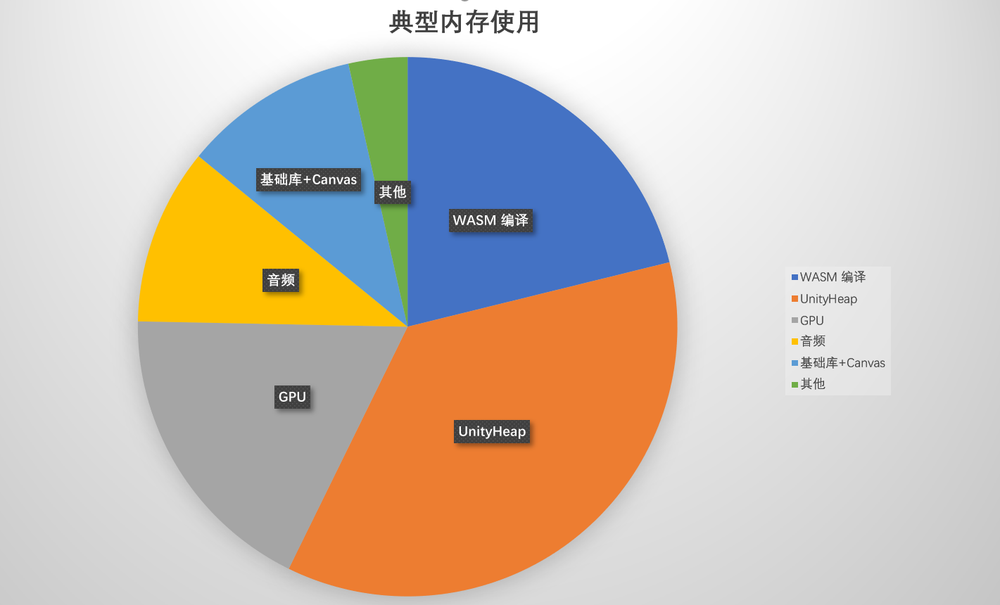
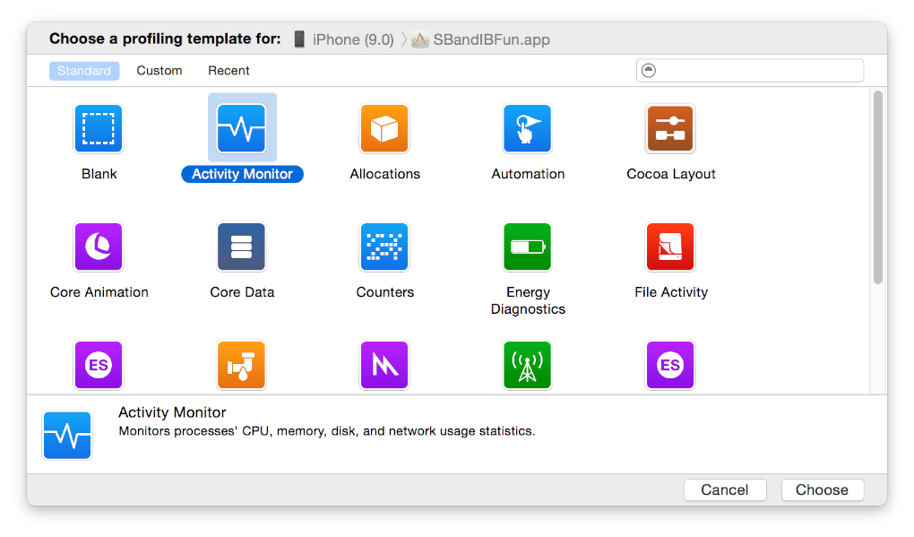
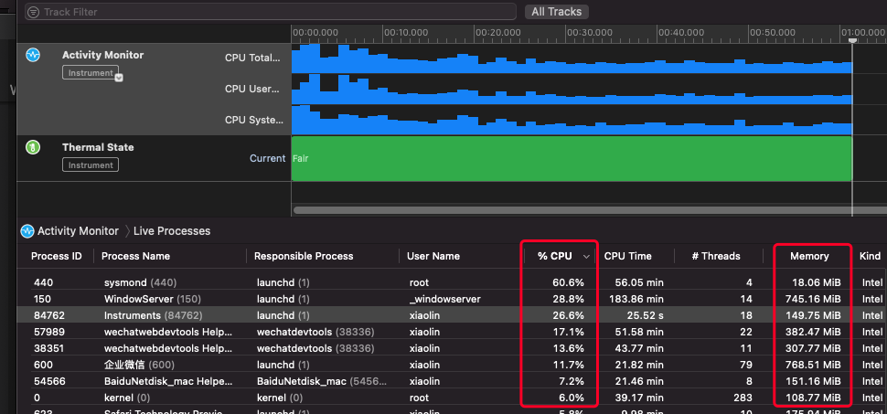
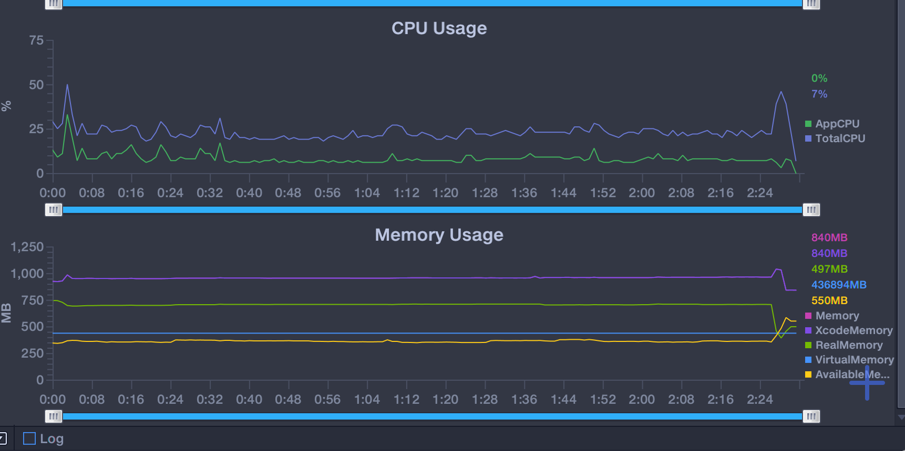
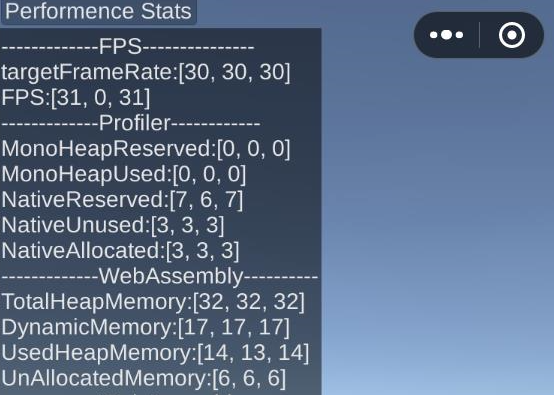
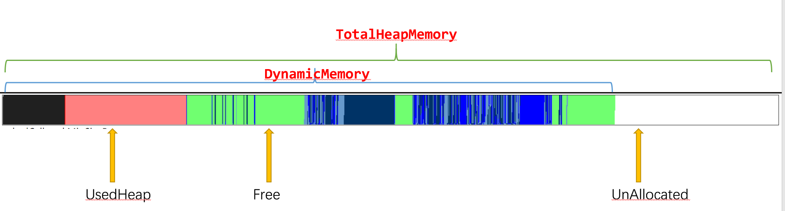
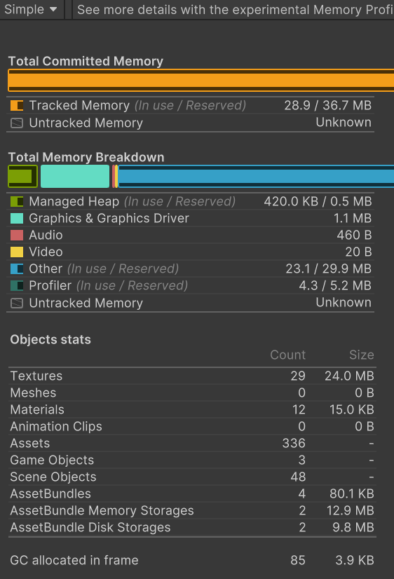
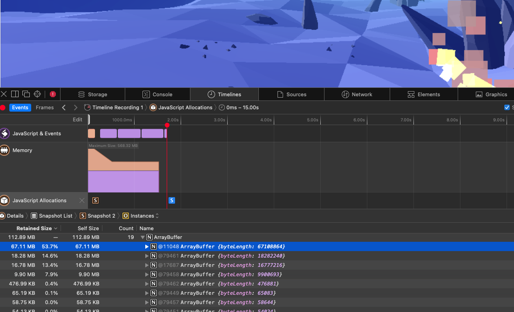

# 优化Unity WebGL的内存
## 一、内存与OOM
Unity WebGL游戏通常比普通H5(JS)游戏占用更大的内存，在操作系统的控制策略下超出阈值时非常容易被OOM。

为了提高游戏在中低端机型的稳定性，内存优化极为重要。那么，多大的内存是合理的呢？
我们建议内存峰值控制在以下范围([性能评估标准](PerfMeasure.md))：
1. Android: 低档机 < 1.2G,  中高档机 < 1.5G
2. iOS: 低档机 < 1G, 中高档机 < 1.4G

相对而言，Android机型的内存更为宽松。

iOS低档机为iPhone 6sp/7/8等RAM 2G机型为主，中高档机为iPhone 7P/8P/iPhoneX/iPhone11等RAM 3G或以上机型。

## 二、Unity WebGL适配小游戏的内存结构
Unity WebGL内存结构可先参考：

[Unity博客：了解 Unity WebGL 中的内存 (Understanding Memory in Unity WebGL)](https://blogs.unity3d.com/2016/09/20/understanding-memory-in-unity-webgl/?_ga=2.221731928.1756133398.1638172136-1917727044.1634213664)

[Unity博客：Unity WebGL 内存：Unity 堆 (Unity WebGL Memory: The Unity Heap)](https://blog.unity.com/technology/unity-webgl-memory-the-unity-heap)

Unity WebGL是以WebAssembly+WebGL技术为基础的应用，运行在浏览器环境，因此游戏内存的分配也是完全托管在这个环境中。

适配在小游戏后，小游戏进程也就成为了“容器”，虽然不再是标准的浏览器，但内存组成结构与上图基本一致，典型游戏的内存占用如下图所示：

- 基础库+Canvas：在小游戏环境中并不存在DOM，但依然会存在一些基本消耗，比如小游戏公共库，Canvas画布等。典型地，***小游戏公共库约占用内存100~150MB，Canvas 画布与设备物理分辨率相关***，比如iPhone 11 Promax占用约80MB。

- Unity Heap: 托管堆、本机堆与原生插件底层内存。举例，游戏逻辑分配的C#对象等托管内存、Unity管理的AssetBundle和场景结构等本机内存、第三方原生插件(如lua)调用的malloc分配。

- WASM编译: 代码编译与运行时指令优化产生的内存，在Android v8、iOS JavascriptCore中还需要大量内存进行JIT优化

- GPU内存：纹理或模型Upload GPU之后的显存占用, 由于Unity2021之前不支持压缩纹理，纹理内存会造成明显膨胀。

- 音频：Unity将音频传递给容器（浏览器或小游戏）后，播放音频时将占用的内存。目前UnityAudio将自动适配微信小游戏，***特别地请避免使用fmod播放长音频***。

- 其他： 
   - Emscripten使用[文件系统](https://emscripten.org/docs/api_reference/Filesystem-API.html)模拟Linux/POSIX接口，***代价是占用与文件同等大小的内存***。 请勿使用首资源包、Addressable Cache机制、WWW.LoadFromCacheOrDownload等Cache API***
   - 网络请求造成的浏览器端JS临时内存、垃圾回收
   - 
        

## 三、内存查看工具
我们从大到小各个角度去监控和分析游戏的内存情况：

进程级别: Perfdog、Android Studio、 Mac Xcode Instrument

UnityHeap(CPU主内存): 性能面板、ProfilingMemory、JavaScript Heap

引擎与资源：UnityProfiler

### 3.1 进程总内存
查看总内存时，我们需要先确定监控的小游戏进程名称：
- Android：WeChat AppBrand1/2
- iOS:普通模式WeChat、高性能模式(WebContent)
#### Instruments in Xcode(iOS)

使用“Activity Monitor”，选择对应的设备-all processes-捕捉，即可看到所有进程的CPU与内存情况.

#### Perfdog（Android or iOS）
使用[Perfdog](https://perfdog.qq.com)选择对应的设置-进程名，即可看到相关性能数据，iOS设备应以紫色的XcodeMemory为准。

### 3.2 UnityHeap
UnityHeap非常关键，典型由以下几部分组成：
- 托管堆， C#对象托管对象、游戏状态
- 本机堆， Unity Native产生，引擎内部对象
- 原生内存，第三方插件（如lua）直接调用malloc产生

分析手段：
1. 勾选转换面板"ProfilingMemory"
2. 导出面板勾选“显示性能面板”或unity-namespace.js中enableProfileStats变量打开性能面板(注意：提审版本请勿显示).
游戏左上角显示Performence Stats性能面板

每项指标有三个数值：当前帧、最小值、最大值。

**通常而言：MonoHeap + NativeReserverd + 原生插件内存 = DynamicMemory， 因此开发者需要关注这几部分内存。**

Unity引擎视角：
- MonoHeapReserved: 托管堆的内存预留内存
- MonoHeap：托管堆(如C#业务逻辑)当前的内存使用量 
- NativeReserverd：本机堆(Native)内存分配峰值
- NativeUnused：本机堆(Native)空闲内存值
- NativeAllocated：本机堆(Native)当前的内存使用量
  
  注意：第三方原生插件(如lua)分配内存并未呈现，需开发者自行分析。

底层分配器视角：

- TotalHeapMemory: UnityHeap总预分配内存大小
- DynamicMemory：UnityHeap使用上限
- UsedHeapMemory：UnityHeap真实使用量
- UnAllocatedMemory：UnityHeap预留量

底层分配器：
- 绿色为空闲内存或碎片，底层分配器会尽量复用
- 白色为预留部分，可被使用 
- 其他颜色，已被业务使用

### 3.3 ProfilingMemory
ProfilingMemory可以分析UnityHeap底层分配器的分配细节，任何分配都会产生记录，因此我们可以通过该能力分析更详细具体的分配行为。

关于该能力的使用请查阅[使用ProfilingMemory分析内存](UsingMemoryProfiler.md)

### 3.4 Unity Profiler
当发现UnityHeap(尤其是Native)占用比较高时，可通过UnityProfiler进一步分析问题所在。关于该工具在微信小游戏的使用请查阅[使用 Unity Profiler 性能调优](UnityProfiler.md)，推荐使用Unity InstantGame版本增强的Profiler功能，下载地址请查阅[推荐引擎版本](UnityVersion.md)。

### 3.5 JavaScript Heap
由于Unity WebGL是托管在浏览器环境中，因此JavaScript Heap包含了大部分（并非全部）我们关注的内存， 通常我们可以使用浏览器自带的内存工具。 但需要注意的是***JavaScript Heap通常无法看出具体内存使用，发现该部分内存明显大于我们预留的UnityHeap，应检查是否有使用Unity Cache进行文件缓存，务必避免这样使用。***
#### 微信开发者工具
#### FireFox Memory(PC)
#### iOS Safari Timeline(PC or iOS)

### 四、内存优化方案
计算公式：
小游戏基础库 + Cavnas + 编译内存 + UnityHeap + Gfx显存 + 音频 + JavaScript内存。
UnityHeap = max(托管/Mono内存) + max(Native/Reserved内存 + C原生代码内存)

以iOS高性能模式为例，一款代码(导出目录/webgl/Build/xxx.code.unityweb或code.wasm)大小为30MB的游戏占用内存为：
小游戏基础库(130MB) + Cavnas(70MB) + 编译内存(300MB) + UnityHeap + Gfx显存 + 音频 + JavaScript(通常<100MB)。

假如游戏需要支持低档机型，将内存控制到1G以内，业务侧(UnityHeap, Gfx显存，音频，JavaScript)需控制在500MB左右。我们此处给出转换游戏中最容易遇到的内存问题与解决方案，如果开发者遇到内存问题时请逐个排查优化。

### 4.1 WASM代码编译内存
- 问题原因：Unity WebGL将所有代码(引擎、业务代码、第三方插件)编译为跨平台的WebAssembly二进制代码，运行时需进行编译执行。编译所占用内存占用非常大（如在iOS系统，30MB未压缩代码需300MB运行时编译内存）。
- 解决办法：
  - 1. [使用代码分包工具](WasmSplit.md)能降低原编译代码内存50%以上。 
  - 2. 手动删除多余插件，减少不必要的Unity模块引入(如物理、Unity数据统计等)

### 4.2 GPU纹理内存
- 问题原因：Unity 2021才开始支持移动平台的压缩纹理，使用RGBA、DXT等纹理格式将导致巨大的内存开销与运行时解压消耗。
- 解决办法：
  - 1. [压缩纹理优化](CompressedTexture.md)能最大程度地减少内存与解压开销。
  - 2. 升级引擎至2021使用ASTC压缩纹理

### 4.3 UnityHeap
- 问题原因：UnityHeap是用于存储所有状态、托管的对象和本机对象，往往由于场景过大或由于业务原因造成瞬间内存峰值。***由于Unity WebGL在单首帧内无法GC***，单帧内瞬间的内存使用非常容易造成crash。同时，***Heap是只增不减且存在内存碎片的。***
- 解决办法: 
  - 1. 转换面板设置合理的“UnityHeap预留内存”，切忌超出使用
  - 2. 避免场景过大导致瞬间峰值
  - 3. 避免过大的AssetBundle导致瞬间峰值
  - 4. 避免单帧内分配过多的对象, ***切忌产生跳跃峰值***
- 如何设置“UnityHeap预留内存”？该值仅表示UnityHeap的峰值进行预留，避免内存不足时导致扩容产生的尖刺；
  - 1. 导出面板勾选“显示性能面板”或unity-namespace.js中enableProfileStats变量打开性能面板
  - 2. 将游戏运行一段时间，观察DynamicMemory的峰值
  - 3. UnityHeap=DynamicMemory+少量静态内存(通常<10MB)，因此转换面板的“UnityHeap预留内存”设置为略大于DynamicMemory峰值(可多预留50-100MB，以实际游戏为准)。建议值：超休闲游戏256,中度游戏(模拟经营、卡牌成长)496，重度游戏(SLG,MMO)768。
  - 4. UnityHeap不宜过大，当UnityHeap>=1024MB时，大部分设备将启动失败；UnityHeap>=500MB时，32位微信(约5%用户)与iOS普通模式大概率启动失败，建议中轻度游戏不超过该值。

### 4.4 首资源包与AssetBundle内存
- 问题原因：首资源包永远占用内存且无法释放；首资源包和AssetBundle自带的cache机制都会使用Emscripten使用[文件系统](https://emscripten.org/docs/api_reference/Filesystem-API.html)，应避免使用。
- 解决办法：
  - 1. 减少首资源包大小，此部分始终占用内存无法释放, 使用AssetBundle；
  - 2. AssetBundle按需加载，及时释放以节省内存；
  - 3. AssetBundle使用时被解压占用Unity Native内存，应减少AssetBundle大小；
  - 4. 避免使用Unity自带的文件缓存机制， ***首资源包和AssetBundle都不应使用文件Cache***；

### 4.5 音频内存
- 问题原因：音频将占用小游戏环境的内存
- 解决办法：
   - 1. 不要使用fmod播放长音频，如游戏BGM
   - 2. 控制音效数量，同时存在的音频数不应该超过20个
   - 3. 尽量强制使用单声道音频，双声道会产生2倍内存消耗

### 4.6 其他常见优化手段
- [Unity加载和内存管理](https://zentia.github.io/2018/04/11/AssetBundle/)
- [性能优化，进无止境-内存篇（上）](https://blog.uwa4d.com/archives/optimzation_memory_1.html)
- [性能优化，进无止境-内存篇（下）](https://blog.uwa4d.com/archives/optimzation_memory_2.html)
- [全面理解Unity加载和内存管理](https://gameinstitute.qq.com/community/detail/100741)

## 五、QA
1. Q: 如何解决iOS高性能模式出现内存过大导致游戏关闭，常见优化步骤如何？
   - iOS高性能模式下，由操作系统管理内存上限，在3G RAM机型上限是1.5G，安全内存峰值是1.2-1.3G左右
   - 进程内存离1.5G上限还有较大差距就崩溃了，请检查“UnityHeap预留内存“是否足够
   - 请使用Perfdog或mac Instrument查看WebContent进程内存是否在安全范围内
   - 进程内存中的业务内存(UnityHeap, GPU)是每个项目的主要差异点：打开性能面板查看DynamicMemory，峰值不要超过500M；使用Perfdog查看Android版本的GL、GFX显存
   - 请务必使用代码分包、压缩纹理（2021以上可使用引擎ASTC，低版本使用微信压缩纹理）

2. Q: 在Unity Profiler看到内存才200MB+，是否代表游戏内存无问题

   - 不是。游戏占用内存必须以真机环境为准，使用Perfdog（Android or iOS）或 Instruments in Xcode(iOS)测试对应进程的内存占用。
   - Unity Profiler仅能看到Unity Heap相关内存，并不包含小游戏公共库、Cavas、WebAssembly编译以及容器其他内存。

3. Q: 转换面板设置内存值多少合适？
   
   - 请看前文关于UnityHeap预留内存的说明
   
