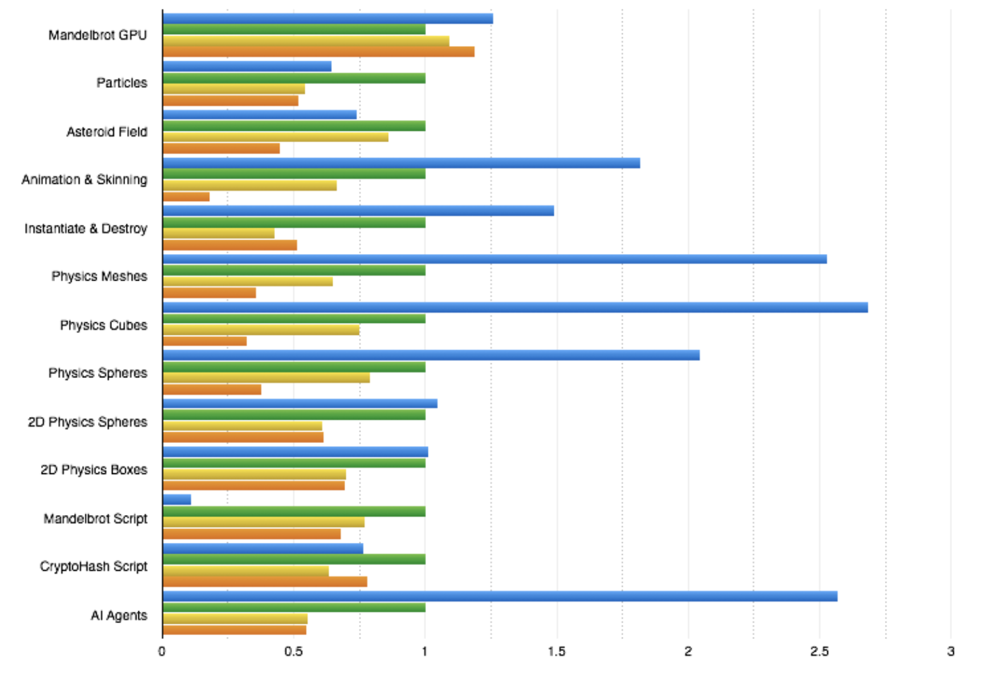
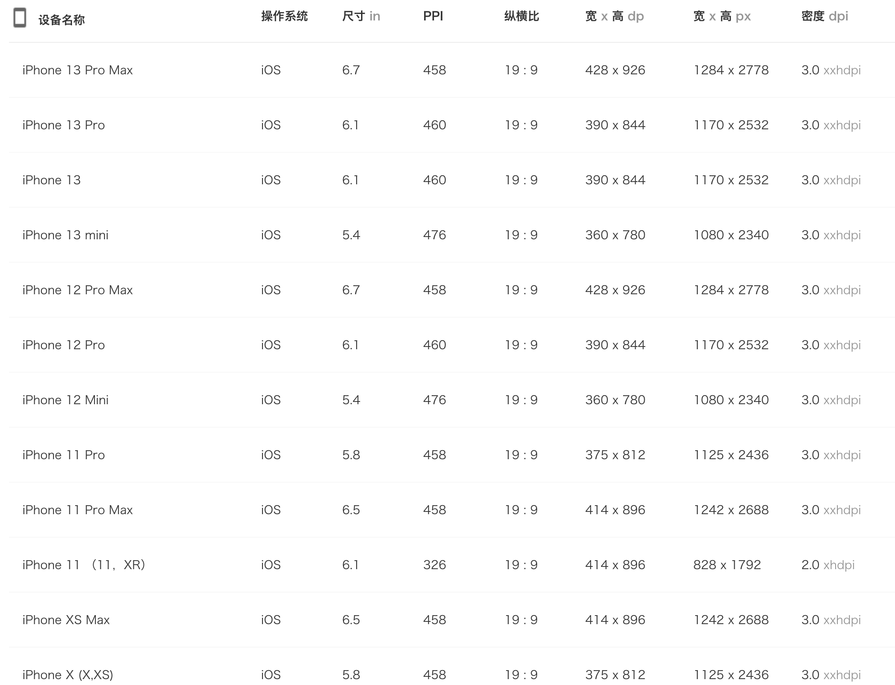

# 优化Unity WebGL的运行性能
## 一、运行性能概述
Unity WebGL是以WebAssebly(WASM)+WebGL为核心的技术方案，运行性能会极大影响可承载的游戏内容玩法。

本文主要介绍Unity WebGL与基于JS引擎的普通H5游戏、原生APP手游之间技术栈导致的性能差异，以及不同系统平台(Android、iOS、Windows PC)之间的性能差异。其次阐述在微信小游戏环境下最佳的性能优化工具与常见优化手段。

### Unity WebGL VS APP的运行性能差异
- CPU性能差异 

    - Unity WebGL是以WASM虚拟机的形式运行在类浏览器环境中，因此CPU算力会受限于虚拟机的执行效率。
    - Unity WebGL目前不支持多线程，导致部分模块比如AI、动画、渲染无法得到多线程的加速。
    
    这是导致了Unity WebGL与APP存在性能差距的最主要因素。***通常而言，Unity WebGL是APP手游性能的1/3，开发者应该特别注意CPU侧的性能瓶颈。***
    
    可通过[Benchmarking Unity performance in WebGL](https://blog.unity.com/technology/benchmarking-unity-performance-in-webgl)了解Unity不同模块与手游APP的性能差异。
    
    
    
    
    
- GPU性能差异

    - Unity是以WebGL API进行渲染，其中WebGL1.0相当于OpenGLES2.0, WebGL2.0相当于OpenGLES3.0。
    - WebGL在原生的渲染API进行封装存在少量负荷带来的开销，但基本的渲染能力与原生APP接近。
    - 渲染特性如GPU Instantcing、SRP Batcher需要WebGL2.0。 （需要注意的是，当APP手游使用了这些特性时，在小游戏未开启WebGL2.0时则会进一步拉大差距）


### WASM VS JS的运行差异

- WASM是强类型语言，这将使得JIT优化能更准确预判运行期类型，因此相对于JS能更快达到JIT指令优化后的峰值。通常而言，WASM~=1.5 * JS, 即JS运行效率的50%以上。
- Unity引擎目前没有很好地针对浏览器环境优化（比如WASM与原生调用频次、不必要的代码路径裁）会比较臃肿，一些应用场景反而不如JS轻量。

因此，两者在实际使用时并不能简单以语言算力对比，需要以实测游戏为准。

### 系统平台之间的性能差异
- Android与Windows PC使用V8作为WASM虚拟机内核，支持JIT，在相同算力条件下两者性能是接近的。但要注意移动平台散热更差，因此对性能更苛刻。
- iOS默认为普通模式，不支持JIT，可用于超休闲游戏；中重度游戏建议开启[iOS高性能模式](iOSOptimization.md)以支持JIT，但该模式需要更多精力进行调优，特别是启动发烫与内存方面。


## 二、优化目标
由于Unity WebGL的性能无法完全达到原生APP的性能水平，***开发者需要根据不同品类的游戏建立不同的最低机型要求和流畅度标准。*** 建议：
- 轻度休闲游戏应保证低档机型30fps以上，需特别注意机型兼容性(可使用小游戏云测获取兼容性报告)，以达到买量用户覆盖度。
- 中重度游戏应保证中高档机不限帧时达到40fps以上，实际运行可限帧30以保持长时间挂机运行的发热量。

详细的基准机型与性能要求可参考[性能评估标准](PerfMeasure.md)，***微信小游戏平台对上线无严格的性能要求，需要开发者根据自身游戏商业化要求制定。***
## 三、常用优化工具
### 3.1 小游戏Android CPU Profiler(推荐)
微信小游戏请[使用 Android CPU Profiler 性能调优](AndroidProfile.md)，在勾选Profile-funcs选项后，使用工具在真机上获取Profile数据以分析热点函数和性能瓶颈，非常建议开发者熟练使用，无论是启动耗时或运行时流畅分析都非常有用。
- 工具本身不会造成大幅度的性能降低
- 精确获取每帧性能瓶颈，也支持时间段内的汇总信息
- 支持真机获取，能准确反映游戏实际运行情况

### 3.2 Unity Profiler
Unity Profiler的运行原理是在Unity Editor监听固定端口，Unity WebGL游戏运行时以WebSocket连接并定期发送性能数据。
- 工具需要开启development模式，对性能有较大影响
- 可获取函数热点、内存与模块上报数据（比如物理、动画等）
- 不是很稳定，部分版本会出现无法连接的情况
- 内存数据不准确，并不能反应真实使用情况，内存工具请查阅[优化Unity WebGL的内存](Design/OptimizationMemory.md)

### 3.3 小游戏云测

小游戏云测是使用大量真实的移动设备测试游戏的功能、性能、兼容性。
- 重点关注兼容性问题，比如黑屏、无法启动问题
- 启动与运行性能由于网络和设备条件稳定性问题不一定准确，建议以[性能评估标准](PerfMeasure.md)实测为准
- 运行环境以CR识别+随机点击，开发者也可以通过WX.cs的接口判定当前云测环境让游戏自动运行特定逻辑

## 三、常见优化手段
### 1. 配置加载与协议解析
不用使用XML、JSON解析大文件，尤其是在游戏启动阶段，字符串类型解析器将耗费大量CPU算力与产生GC。比如大型游戏在使用Addressable时catalog文件往往会超过10MB，导致解析过慢而影响启动速度，此时应使用其他资源管理比如AssetBundle来减少资源索引文件大小。同样地，在游戏过程中也尽量避免这类CPU消耗。

### 2. LUA性能
Unity WebGL环境的lua不支持JIT，因此需要避免用于重度逻辑。可[使用 Android CPU Profiler 性能调优](Design/AndroidProfile.md)查看LUA的耗时占比。

### 3. 物理性能
请参考文档[优化物理性能](https://docs.unity3d.com/cn/2021.3/Manual/iphone-Optimizing-Physics.html)，适当调整Fixed Timestep与 Maximum Allowed Timestep降低计算频率。

### 4. 实例化
由于Unity WebGL是单线程模型，因此耗时长的CPU运算会影响帧率。较为普遍的是AssetBundle加载与Prefab实例化，通过优化逻辑分帧加载可大幅度提升游戏体验。

### 5. 限制帧率
限制帧率有利于降低设备发热量与提升游戏时长，对帧率不敏感游戏建议使用。小游戏平台请勿使用Application.targetFramerate限帧，应使用WX.setPreferredFramesPerSecond控制更为平滑。

### 6. 限制分辨率
限制分辨率以一定的画质牺牲来降低对设备消耗，在小游戏平台请勿使用Unity的SetResulution等接口修改分辨率，应使用DevicePixelRatio来控制。设备默认DevicePixelRatio(最后一列dpi)如下：



如需设置iOS的设备分辨率可以在game.js增加以下代码：
```
if(wx.getSystemInfoSync().platform == 'ios') window.devicePixelRatio = 2; 
``` 
- 可降低渲染压力可明显降低设备发热量
- 减少内存使用，降低分辨率后可降低50-100MB内存
- 需开发者自行评估DevicePixelRatio降低后的品质变

### 7. 使用压缩纹理
在压缩纹理不支持的情况下，纹理会由于需要在CPU中软解为RGB/RGBA32造成巨大的CPU和内存消耗，运行中的这种行为会造成明显的帧率卡顿问题，建议使用[压缩纹理优化](CompressedTexture.md)。

### 8. WebGL2.0说明
Unity WebGL较多渲染优化特性依赖WebGL2.0, 因此这里需要针对该特性在小游戏环境的支持进一步说明。
- 小游戏Android平台在8.0.24已支持WebGL2, 用户占比>80%
- 小游戏iOS高性能模式需要iOS系统版本>=15.0，用户占比>70%
- WebGL2.0特性较多，平台暂不保证所有能力完善，开发者务必验证游戏所所用到的特定支持情况

因此，需开启WebGL2.0的开发者要关注用户占比与验证特性的实际表现（关于用户占比，微信广告可筛选iOS系统版本信息规避）。

### 9. 减少Drawcall
大量DC会造成非常大的CPU压力，当场景渲染物件过多时应该采取适当的措施减少Drawcall
- 标准渲染管线，适当使用Static Batch以减少DC
- 可开启WebGL2.0时使用GPU Instantcing
- 尽可能地设置LOD、可见范围以降低渲染物件

### 10. 使用SRP Batcher
Uinty WebGL的SRP Batcher需要两个先决条件：Unity 2021以上 + WebGL2.0


