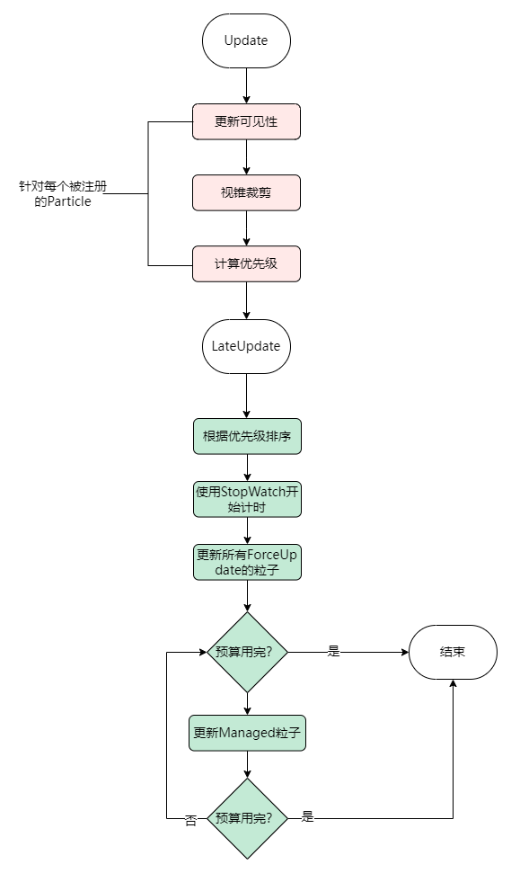
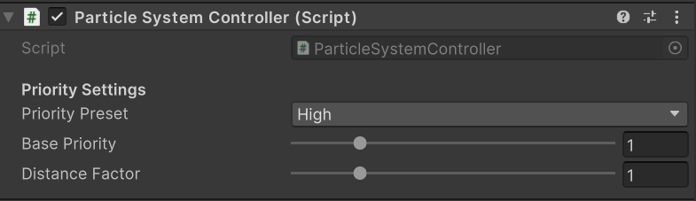
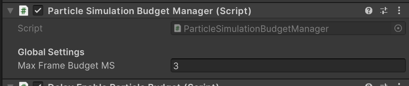
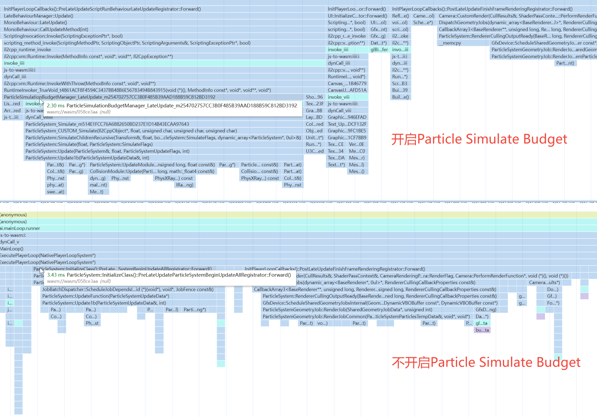

# 性能优化实战——使用Particle Budget系统优化粒子性能

## 背景
在Unity的游戏项目中，针对粒子较多的场景，往往粒子的更新会占用比较高的开销：

粒子的性能优化一直困扰开发者——如何在粒子的性能、表现和管理成本之间达到平衡？

本文介绍一种高级优化方案：`Particle Update Budget`。通过限制每帧的粒子模拟预算，从而得以在粒子的性能和表现之间达到平衡。此外，该方案涉及的需要配置的参数也较少，也意味着较低的管理成本。

## 原理介绍

### 核心理念

本方案的核心组件为`ParticleSimulationBudget`和`ParticleSystemController`。是针对每个Particle System，根据其优先级手动进行`Particle.Simulate`方法的调用。

 - `ParticleSystemController`：管理某个Particle System，负责设定该Particle System的优先级相关参数，将其注册到`ParticleSimulationBudget`，以及计算该Particle System的优先级。
 - `ParticleSimulationBudget`：单例管理类，维护两个粒子数组：每帧强制更新的`ForceUpdate`粒子与根据优先级按需更新的`Managed`数组。针对`Managed`数组，系统会根据时间预算进行`Particle.Simulate`方法的手动调用。

流程图如下：

该方案的优点如下：

 1. **平衡性能与表现**：在CPU负载较高时，可以保证帧率；而在CPU负载较低时，可以保证效果。相比起强制降帧方案，对表现更加友好。
 2. **负载可控**：可以确保粒子的模拟模块开销不高于一个最高值，助于帧率的稳定。
 3. **管理成本低**：针对高、中、低配平台，只需要进行预算值的配置即可。

### 粒子优先级的计算

粒子的优先级决定了这一帧该粒子是否需要更新，优先级的计算考虑如下因素：

 1. 该粒子的基准优先级预设类别：被标记为`High Priority`的粒子比`Normal`的粒子优先级更高
 2. 距离上一次该粒子更新的时间间隔：该粒子越久没有更新，则优先级越高
 3. 该粒子与相机的距离：如果该粒子离相机越近，则优先级越高

各因素之间通过数值关系组合，最终获得该粒子在这一帧的更新优先级。

具体的公式可以查看Demo工程中的`ParticleSystemController.CalculatePriority`方法。当然，读者也可以根据自己的需求自定义公式。

 注：理论上屏占比比距离是一个更加合理的因素，但是屏占比的计算需要进行两次矩阵的计算，对性能反而有负面的影响。

### 组件细节
 - `ParticleSystemController`组件
 该组件与`Particle System`挂载在同一个GameObject下：
 
 `Priority Preset`可选：`Force Update`（强制更新）、`High Priority`（高优先级）、`Normal`(正常优先级)。

 - `ParticleSimulationBudgetManager`组件
 该组件为一个全局单例：
 
 可以在这个组件中通过`Max Frame Budget MS`属性进行预算的设置（以毫秒为单位）。

## 性能数据

我们在场景中放置了101个粒子特效，其中4个粒子被设置为`Force Update`、34个粒子被设置为`High Priority`、剩下的被设置为`Normal`。

默认我们将所有的`Particle System Controller`组件的Enable设为False，并且模拟20s，让每个粒子的数量都膨胀到一定数量后，开启CPU Profiler。

我们使用的测试设备为Mi 8 UD，Budget设为2ms每帧，结果如下：

可以看到，Budget方案下，`ParticleSimulationBudgetManager.LateUpdate`函数开销略高于2ms。而原方案下，所有的粒子都会进行模拟操作，开销为3.43ms，且不可控。

## 总结

本文介绍的Particle Budget系统提供了一种有效的Unity粒子性能优化方案，主要特点和优势包括：

1. **核心机制**：
   - 通过ParticleSystemController和ParticleSimulationBudgetManager两个核心组件实现
   - 采用优先级调度机制，综合考虑预设优先级、更新间隔和相机距离等因素

2. **主要优势**：
   - 性能与表现的平衡：在保证帧率的同时尽可能维持粒子效果
   - 负载可控：确保粒子模拟开销不超过预设预算值
   - 管理简便：只需配置预算值和优先级预设，无需复杂调优

3. **应用建议**：
   - 适用于粒子密集的场景，特别是移动端性能敏感项目
   - 可根据目标平台性能调整预算值(高配平台可适当增加预算)
   - 对关键特效使用Force Update，次要特效使用优先级管理

可以参考[Demo](https://github.com/wechat-miniprogram/minigame-unity-webgl-transform/tree/main/Demo/particlebudget)，开发者可根据项目需求灵活调整优先级计算策略和预算值。
