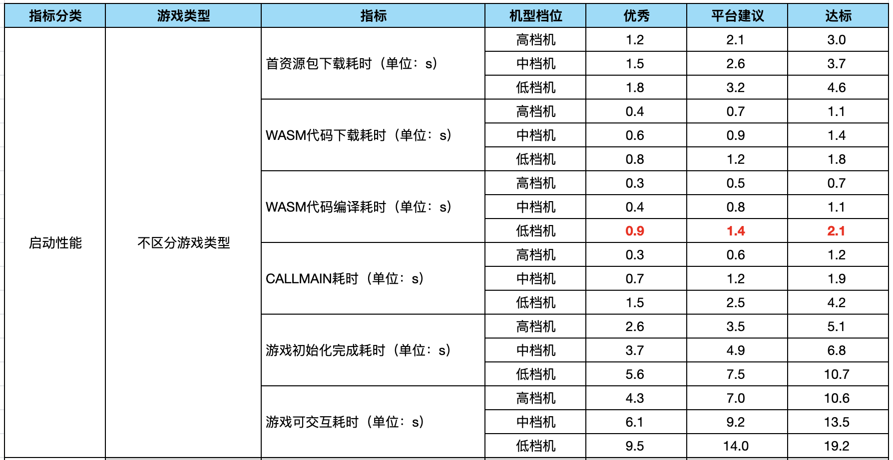
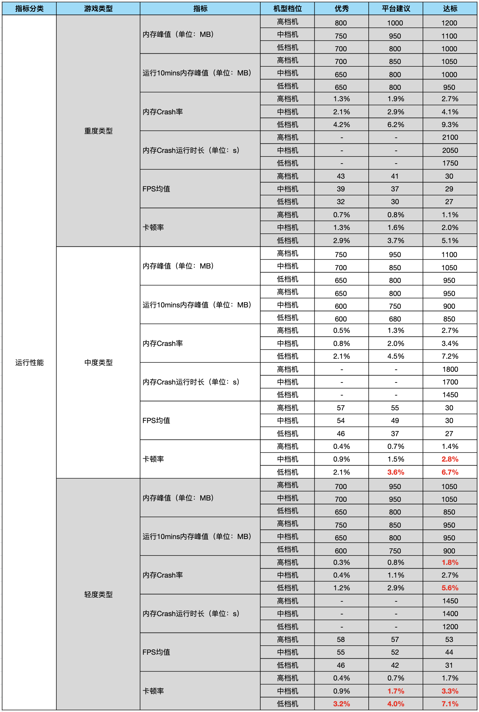
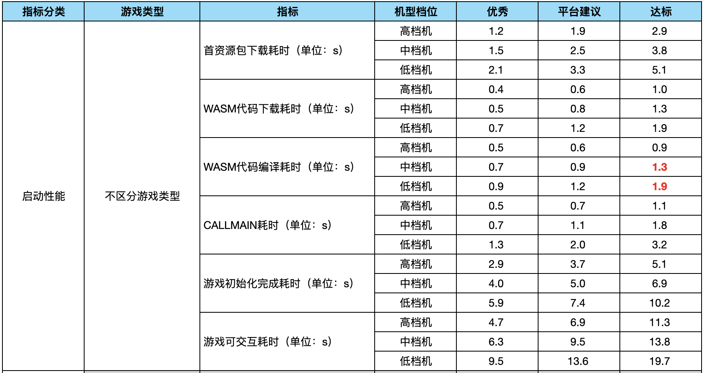
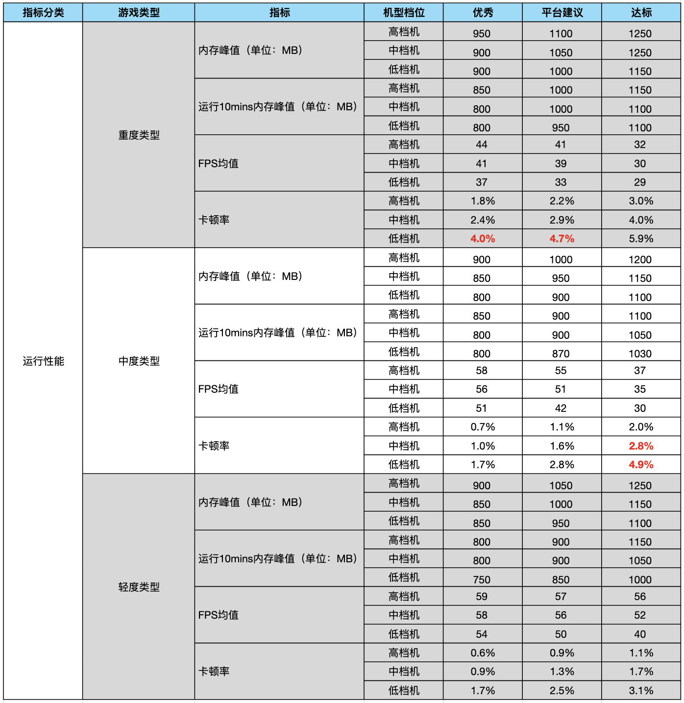

# Unity WebGL小游戏适配方案性能标准

## 为什么需要性能评测标准？

Unity性能评测标准用于开发者优化游戏性能数据，提升用户体验。评测标准根据小游戏整体的性能数据表现，结合操作系统、机型分档等多种维度建立。

## 评测标准细则

### 性能基线

评测小游戏性能首先需要确定性能基线, 即先确定机型设备条件，开发者可通过[机型档位映射](https://developers.weixin.qq.com/minigame/dev/guide/performance/perf-benchmarkLevel.html#%E6%9C%BA%E5%9E%8B%E6%A1%A3%E4%BD%8D%E4%B8%8EBenchmarkLevel%E7%9A%84%E6%98%A0%E5%B0%84%E5%85%B3%E7%B3%BB)获取机型档位的参考机型。

### 游戏类型说明

| 分类 | 定义  |
| :---: | --- |
| 重度 | 玩法较复杂，通常包含较多游戏场景或支持多人在线游戏（eg: MMO、SLG品类等） |
| 中度 | 包含一定养成玩法、内置内购商城等（eg: 模拟经营、卡牌等） |
| 轻度 | 仅包含简单操作、无养成体系、无内购，以休闲娱乐为主（eg: 棋牌等） |

### 指标与测量方法

Unity小游戏的启动可参考[启动流程与时序](Startup.md)

|   | 定义 | 测量方法 |
| --- | --- |--- |
| 首资源包 | 游戏首个data资源文件 | 位于导出目录/webgl/md5.webgl.data.unityweb.bin.txt, CDN使用gzip压缩 |
| WASM代码 | 游戏代码压缩包 | 位于导出目录/minigame/wasmcode/md5.webgl.wasm.code.unityweb.wasm.br, CDN使用gzip压缩 |
| 核心资源 | 除首资源包外进入游戏核心玩法所需的资源量 | 业务自定下载，通常为AssetBundle |
| CALLMAIN | 引擎和首场景(Loading)初始化 | 通过timelog,或日志查看“CALLMAIN耗时” |
| 游戏初始化完成 | 引擎和首场景完成，出现首个业务场景 | 通过timelog, 或日志查看“游戏启动耗时” |
| 游戏可交互完成 | 游戏核心场景完成 | 通常定义为用户可交互的时机，可通过[启动留存上报能力](ReportStartupStat.md)上报统计。 eg：休闲游戏为**核心玩法**，RPG游戏为**创角** |
| 内存峰值 | 内存峰值 | 进程内存峰值，测量方法请参考[优化Unity WebGL的内存](OptimizationMemory.md) |
| 内存异常退出运行时长| 由于内存不足而使小游戏发生Crash时，当前游戏的运行时长，表示游戏的稳定运行时长 | 开发者可通过 [小游戏数据助手](https://developers.weixin.qq.com/minigame/analysis/assistant.html)（数据-性能分析）或 [MP-研发工具箱-性能数据](https://mp.weixin.qq.com/wxamp/frame/pluginRedirect/pluginRedirect?action=plugin_redirect&plugin_uin=1041&lang=zh_CN) 获取游戏的现网玩家的性能采集数据 通过[小游戏数据助手](https://developers.weixin.qq.com/minigame/analysis/assistant.html)查看（仅包含线上用户数据） |
| 帧率 | 核心玩法的平均帧率 | 测量5分钟以上游戏核心玩法帧率，取平均值 |
| 卡顿率 | 核心玩法的平均卡顿率 | 测量5分钟以上游戏核心玩法卡顿率，取平均值 |

#### 开发者需要关注哪些性能指标

| 阶段 | 重点关注指标 |
| :---: | --- |
| 启动 | 1. 游戏初始化完成耗时  2. 游戏可交互耗时 |
| 运行 | 1. 内存峰值  2. FPS均值  3. 卡顿率  4. 内存异常退出率(iOS)  5. 内存异常退出运行时长(iOS) |
| 兼容性问题 | 1. 逻辑异常  2. 黑/白屏  3. JS Error |

### 代码与资源体积

| 能力 | 下载量 |
| --- | --- |
| 首资源包(gzip压缩后) | <5MB |
| WASM代码(br压缩后) | <5MB |
| 核心玩法资源 | <30MB |

### 评测标准

> 评测标准更新时间：2024-08-13（历史现网标准请查阅[历史评测标准](#历史评测标准)）

评测标准依赖于 **现网真实玩家上报的性能数据** 和 **云测试批量测试数据** 统计得出。

**注意：**

* FPS均值为大盘游戏数据计算所得，由于游戏可能会存在限帧逻辑，数据**仅供参考**，建议游戏依据自身游戏特性，合理控制游戏帧率表现。
* 设备平台的内存统计口径参考社区公告[《小游戏内存口径》](https://developers.weixin.qq.com/community/minigame/doc/0008662363cdb87ba25f8bf1250801?blockType=2)。
* **红色**指标值表示指标标准下降，未标注颜色指标值则表示当前指标项标准提升（与历史评测标准相比）或 与原有标准一致。

#### iOS性能评测标准

***启动性能***

***运行性能***

重点关注：`内存峰值`、`运行10mins内存峰值`、`内存异常退出率`、`内存异常退出运行时长`

#### Android性能评测标准

***启动性能***

***运行性能***

### 评测工具

#### 现网阶段

##### 性能报告

为了能够帮助开发者快速了解游戏整体的性能情况，平台通过对评测标准和游戏性能数据的整合，面向开发者提供一个较为全面的大盘性能监控系统，详细可通过 [性能监控系统](https://developers.weixin.qq.com/minigame/dev/guide/performance/perf-audit/perf-system-overview.html) 进行了解和使用。

##### 性能数据

开发者可通过 [小游戏数据助手](https://developers.weixin.qq.com/minigame/analysis/assistant.html)（数据-性能分析）或 [MP-研发工具箱-性能数据](https://mp.weixin.qq.com/wxamp/frame/pluginRedirect/pluginRedirect?action=plugin_redirect&plugin_uin=1041&lang=zh_CN) 获取游戏的现网玩家的性能采集数据。

#### 开发阶段

> 使用网络模拟工具1MB/s条件

##### 小游戏云测试

云测试服务是一套完整易用的在线测试服务，以帮助开发者更高效、更全面地进行自动化游戏性能测试、兼容性测试。更多详情可查阅[小游戏云测试](https://developers.weixin.qq.com/minigame/dev/guide/performance/perf-tools-cloudtest.html)。

##### 性能诊断工具

微信小游戏性能诊断工具用于查看 开发版/体验版 运行时的网络和接口调用、运行性能以及启动耗时等信息，协助开发者更精确地定位问题并提供优化建议，详情可查阅[性能诊断工具](https://developers.weixin.qq.com/minigame/dev/guide/performance/perf-audit/perf-audit-tool.html)。

##### Perfdog

使用[PerfDog](https://perfdog.qq.com/)测试，PerfDog记录性能数据并上传，取平均值，每种机型测试3组数据再取平均，内存峰值取最大值。

### 历史评测标准

|  更新日期   | 文档 |
| :-----: | :--: |
|  2024.08.13  | 当前标准 |
|  2023.05.17  | [评测标准文档](./performance-standard/PerfMeasure_20230517.md) |