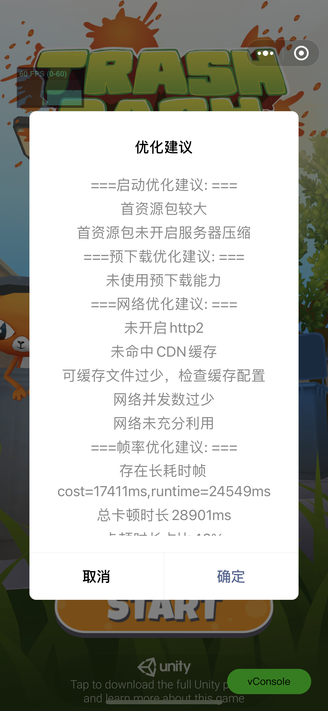
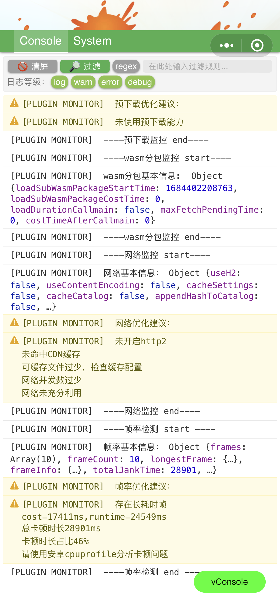
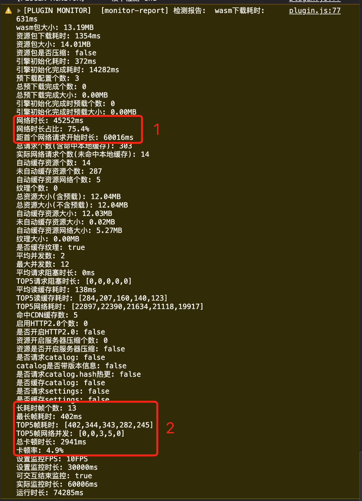
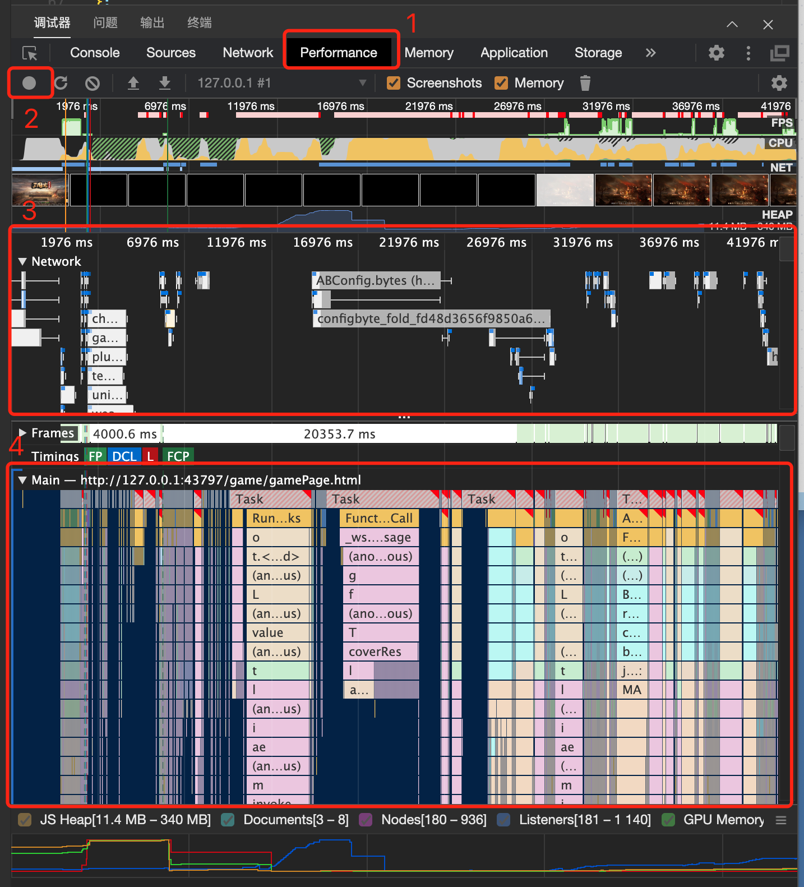

# 最佳实践检测工具
- [最佳实践检测工具](#最佳实践检测工具)
  - [作用](#作用)
  - [如何使用](#如何使用)
  - [检测示意](#检测示意)
  - [检测指标解释](#检测指标解释)
    - [启动检测](#启动检测)
      - [监控指标](#监控指标)
      - [优化建议概览](#优化建议概览)
    - [预下载检测](#预下载检测)
      - [监控指标](#监控指标-1)
      - [优化建议概览](#优化建议概览-1)
    - [wasm分包检测](#wasm分包检测)
      - [监控指标](#监控指标-2)
      - [优化建议概览](#优化建议概览-2)
    - [网络信息检测](#网络信息检测)
      - [监控指标](#监控指标-3)
      - [优化建议概览](#优化建议概览-3)
    - [帧率检测](#帧率检测)
      - [监控指标](#监控指标-4)
      - [优化建议概览](#优化建议概览-4)
  - [优化分析工具](#优化分析工具)
    - [微信开发者工具](#微信开发者工具)

## 作用
为了使游戏达到比较好的性能表现，仍需要开发者结合游戏实际情况进行优化。平台针对启动和运行输出了大量优化手段，使用最佳实践检测，可帮助开发者在**开发阶段**针对问题进行优化

## 如何使用
版本要求：`转换插件版本 > 202305230000`

导出小游戏默认在**开发版和体验版**开启检测，可通过`minigame/unity-namespace.js`修改

```js
// 最佳实践检测配置
unityNamespace.monitorConfig = {
  enableMonitor: true, // 是否开启检测（只影响开发版/体验版，线上版本不会检测）
  fps: 10, // 帧率低于此值的帧会被记录，用于分析长耗时帧，做了限帧的游戏应该适当调低
  showResultAfterLaunch: true, // 是否一直检测到游戏可交互完成
  monitorDuration: 30000, // 仅当showResultAfterLaunch=false时有效, 在引擎初始化完成(即callmain)后多长时间停止检测
}
```

默认检测条件如上。插件并不知道什么时候检测截止，可选择可交互上报后或在引擎初始化完成(`callmain`)后多少ms截止，根据游戏实际情况修改。

1. 有上报游戏可交互[`WX.ReportGameStart()`](ReportStartupStat.md#三、上报自定义阶段)的游戏
应该设置`showResultAfterLaunch=true`，同时会忽略`monitorDuration`的值

1. 未上报游戏可交互上报的游戏
应设置`showResultAfterLaunch=false`，此时根据`monitorDuration`的值截止检测

## 检测示意

优化建议通过弹框提示，详细内容通过vconsole打印

1. 弹框提醒优化建议



2. console打印详细信息



3. console打印检测报告，可着重关注网络和卡帧的数据


## 检测指标解释

### 启动检测
检查框架启动阶段的耗时和资源大小

#### 监控指标
```
{
  assetLoadCost: number; // 首资源包下载耗时，单位ms
  assetContentLength: number; // 首资源包大小(未压缩原始大小)，单位bytes
  useContentEncoding: boolean; // 首资源包是否开启服务器压缩
  wasmLoadCost: number; // wasm包下载耗时，ms
  wasmContentLength: number; // 启动下载的wasm包大小，单位bytes
  useCodeSplit: boolean; // 是否使用了wasm代码分包
  callmainCost: number; // 引擎初始化耗时，ms
}
```

#### 优化建议概览
当提示优化建议时，可采用对应的优化手段
1. `未使用wasm代码分包`
- 条件: `useCodeSplit`为`false`，未使用wasm代码分包
- 优化手段: [使用代码分包工具](WasmSplit.md)

2. `首资源包较大`
- 条件: `assetContentLength`超过15 * 1024 * 1024，即未压缩的首资源包超过15MB
- 优化手段: [首资源包下载与体积](StartupOptimization.md#_2-2-1-首资源包下载与体积)

3. `首资源包未开启服务器压缩`
- 条件: `useContentEncoding`值为`false`，服务器未开启br或gzip
- 优化手段: [首资源包下载与体积](StartupOptimization.md#_2-2-1-首资源包下载与体积)

4. `callmain耗时较长，请用安卓cpuprofile分析热点函数`
- 条件: iOS平台`callmainCost>1500`或安卓平台`callmainCost>3000`
- 优化手段: [引擎初始化与开发者首帧逻辑](StartupOptimization.md#_2-2-3-引擎初始化与开发者首帧逻辑)

### 预下载检测
检查预下载列表使用情况，分为引擎初始化完成(`callmain`)和检测完成时两个结果

> vconsole输出如下：`预下载基本信息: xxx , callmain完成时预下载信息: xxx`。其中xxx为js对象

#### 监控指标
```
{
  loadedCount: number; // 已预下载完成数量
  loadingCount: number; // 正在预下载数量
  loadedSizeStr: string; // 已预下载完成大小字符串表示, eg: 10.1MB
  loadedSize: number; // 已预下载完成大小，bytes
  hitCacheCount: number; // 命中CDN缓存的数量
  useH2: boolean; // 是否启用HTTP2
  useContentEncoding: boolean; // 是否开启了服务器压缩
  preloadListLength: number; // 预下载资源个数
}
```

#### 优化建议概览
1. `未使用预下载能力`
- 条件: `preloadListLength=0`; 即导出时未配置预下载列表
- 优化手段: [使用预下载功能](UsingPreload.md)

2. `已发起预下载，但未完成，请检查预下载资源是否过大，或是否下载过慢`
- 条件: 引擎初始化完成时，`loadingCount != 0` 且 `loadedCount = 0`; 表示预下载已发起但未完成
- 优化手段: [使用预下载功能-注意事项第五点](UsingPreload.md#注意事项)，预下载文件体积不应过大，将优先需要使用的资源放到列表头部

3. `预下载资源较小，请将大资源调整到预下载列表顶部`
- 条件: 引擎初始化完成时 `loadedSize < 1 * 1024 * 1024 (1MB)` 或停止检测时 `loadedSize < 5 * 1024 * 1024 (5MB)`
- 优化手段: 适当增加预下载资源大小

4. `预下载资源个数较多`
- 条件: `preloadListLength > 15`；即预下载列表数大于15
- 优化手段: 减小预下载个数

5. `预下载资源量较大`
- 条件: `loadedSize > 20 * 1024 * 1024 (20MB)`；即总预下载大小超过20MB
- 优化手段: 减小预下载资源量，过大的资源下载会造成带宽抢占，推荐由游戏自行控制加载时机

### wasm分包检测
使用wasm代码分包后，检查wasm分包代码的加载时机，加载分包造成的卡顿时长，用来分析分包收集是否合理。若加载时机过早、阻塞时间过长，则需要优化。

> tips: 在新包做wasm分包期间可能会频繁提示优化建议

#### 监控指标
```
{
  loadSubWasmPackageStartTime: number; // 开始下载wasm子包的时间，ms
  loadSubWasmPackageCostTime: number; // （仅安卓）加载子包耗时，ms
  loadDurationCallmain: boolean; // 是否在引擎初始化期间加载子包
  maxFetchPendingTime: number; // （仅iOS高性能）最大阻塞时间，ms。iOS高性能加载子包代码时会卡顿
  costTimeAfterCallmain: number; // 引擎初始化完成后多长时间开始加载子包，ms
}
```

#### 优化建议概览
1. `wasm子包在callmain期间加载，请使用分包工具继续收集`
- 条件: `loadDurationCallmain=true`
- 优化手段: 分包收集不足，使用分包工具[继续迭代](WasmSplit.md#迭代流程)

2. `wasm子包加载时机过早，请使用分包工具继续收集`
- 条件: `costTimeAfterCallmain < 30000 (30s)`
- 优化手段: 游戏前期不应加载子包，当前期出现子包加载，则需要[继续迭代](WasmSplit.md#迭代流程)

3. `缺失函数过多，请使用分包工具继续收集`
- 条件: `maxFetchPendingTime > 2000`
- 优化手段: [iOS高性能模式收集](WasmSplit.md#ios-高性能模式收集很卡)  [继续迭代](WasmSplit.md#迭代流程)


### 网络信息检测
检查可缓存资源配置、CDN配置、并发数数、请求量、资源量

#### 监控指标
```
{
  useH2: boolean, // 是否开启HTTP2.0
  useContentEncoding: boolean, // 是否开启服务器压缩
  cacheSettings: boolean, // settings.json是否自动缓存
  cacheCatalog: boolean, // catalog.json是否自动缓存
  appendHashToCatalog: boolean, // catalog.json是否带上了hash或其他用于区分版本的信息
  requestCataHash: boolean, // 是否请求了catalog.hash文件用于资源热更新
  requestBundleSettings: boolean, // 是否请求了settings.json
  requestBundleCatalog: boolean, // 是否请求了catalog.json
  loadCount: number, // 已发起请求数
  loadedCount: number, // 已完成请求数
  loadedSizeStr: string, // 请求回包总大小的字符串表示，eg: 10.1MB
  loadedSize: number, // 请求回包总大小，bytes
  hitCacheCount: number, // 命中CDN缓存个数
  cacheableCount: number, // 可自动缓存个数
  loadFromCacheCount: number, // 使用本地缓存的个数
  startTime: number, // 首个请求开始时间
  duration: number, // 监控时长
  networkTime: number, // 有网络请求的总时长
  maxLoadingCount: number, // 最大并发数，基于业务侧统计，会大于10个，表示有请求会排队
  avgLoadingCount: number, // 平均并发数
  loadedTasks: IBaseRequestInfo[], // 已下载完成请求详细信息
}

// 请求详细信息如下
interface IBaseRequestInfo {
  url: string; // 请求URL
  startTime: number; // 请求开始时间
  statusCode?: number; // 服务器状态码
  enableContentEncoding?: boolean; // 是否开启了服务器压缩
  endTime?: number; // 请求介绍时间
  duration?: number; // 请求耗时
  protocol?: string; // 网络协议，h2或http1.1
  receivedBytedCount?: number; // 回包大小，bytes
  hitCache?: boolean; // 是否命中CDN缓存
  isReadFromCache?: boolean; // 是否使用本地缓存
  cacheable?: boolean; // 是否自动缓存的资源
}

```

#### 优化建议概览
1. `未开启http2`
- 条件: `useH2=false`
- 优化手段: 服务器开启HTTP2.0，通过多路复用和头部压缩的特性，能提升细碎文件的下载效率

2. `未命中CDN缓存`
- 条件: `hitCacheCount=0`
- 优化手段: 发布新版本时，建议进行CDN预热，避免直接从源站拉取资源

3. `请勿缓存settings.json`
- 条件: `requestBundleSettings=true` 且 `cacheSettings=true`
- 优化手段: Addressables的`settings.json`文件用来记录打包配置，不应该缓存到本地。取消此文件的自动缓存，[哪些资源会自动缓存](FileCache.md#二、哪些资源会自动缓存)

4. `可将catalog.json配置为可缓存文件`
- 条件: `requestBundleCatalog=true` 且 `cacheCatalog=false`
- 优化手段: Addressables的`catalog.json`记录了所有资源文件的描述信息和依赖关系，一般大小较大，推荐缓存到本地，[哪些资源会自动缓存](FileCache.md#二、哪些资源会自动缓存)

5. `catalog.json被缓存且无hash/版本信息, 会导致无法更新`
- 条件: `requestBundleCatalog=true` 且 `cacheCatalog=true` 且 `appendHashToCatalog=false`
- 优化手段: `catalog.json`缓存到本地若无版本标识，会导致无法更新到最新版本, [缓存规则](FileCache.md#三、缓存规则)

6. `请勿请求catalog.hash来做资源热更新，小游戏平台不支持`
- 条件: `requestCataHash=true`
- 优化手段: `catalog.hash`记录了`catalog.json`的hash，用来热更新资源，但小游戏平台不支持，推荐使用`catalog.json`文件名带hash的方式来管理catalog版本，参见建议第五点

7. `可缓存文件过少，检查缓存配置`
- 条件: `cacheableCount < loadCount / 2`，可缓存资源小于总请求数的一半
- 优化手段: 检查[缓存配置](FileCache.md#二、哪些资源会自动缓存)，是否资源文件大部分未缓存。提高可缓存数量

8. `网络并发数过少`
- 条件: `avgLoadingCount < 5`，平均并发数小于5
- 优化手段: 并发数较少可能导致细碎文件较多时网络利用率不高，业务侧提高请求并发数

9. `网络未充分利用`
- 条件: `networkTime / duration < 0.7`, 网络时间占监控时长占比不足70%
- 优化建议: 可能由于游戏业务初始化逻辑较重，cpu繁忙，在cpu繁忙时未充分利用网络空闲；建议：在开始长耗时逻辑前，发起资源下载任务，充分利用网络。可使用[微信开发者工具辅助分析](#微信开发者工具)


### 帧率检测
检查是否有大长帧，标记大长帧出现的位置，辅助定位是cpu耗时还是网络耗时导致启动慢

#### 监控指标
```
{
  frames: string[]; // 长耗时的帧
  frameCount: number; // 长耗时帧的个数
  longestFrame: { // 最长帧信息
      frame: string; // 帧数
      frameCost: number; // 单帧耗时, ms
      runtime: number; // 游戏运行时长, ms
  };
  frameInfo: IWrongFrame; // 长耗时帧信息
  totalJankTime: number; // 总卡帧时长, ms
  currentRuntime: number; // 当前游戏运行时长, ms
  jankRate: number; // 卡顿率
}
```

#### 优化建议概览
卡帧问题，均需要使用cpuprofile定位。[使用Android CPU Profiler性能调优](AndroidProfile.md)、[使用Unity Profiler性能调优](UnityProfiler.md)


1. `存在长耗时帧cost=xxxms,runtime=xxxms`
- 条件: `longestFrame.frameCost > 1000 (1s)`

2. `总卡顿时长xxxms`
- 条件: `totalJankTime > 5000 (5s)`

3. `卡顿时长占比xx%`
- 条件: `jankRate > 0.3`

## 优化分析工具

### 微信开发者工具


- step1: 点击调试器-performance
- step2: 点击录制按钮
- step3: 分析网络并发和网络耗时
- step4: 查看每帧耗时，与此帧网络并发