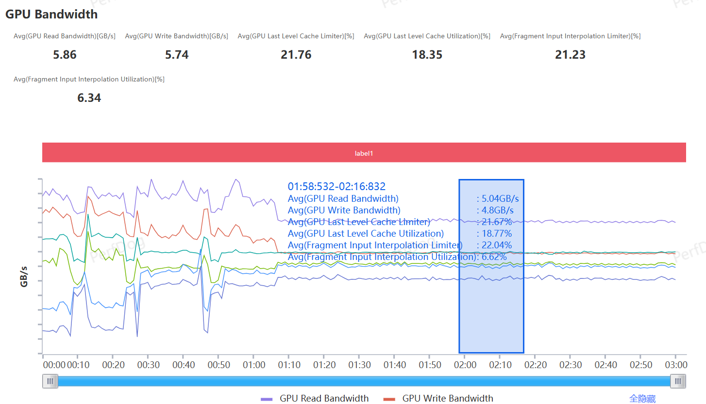
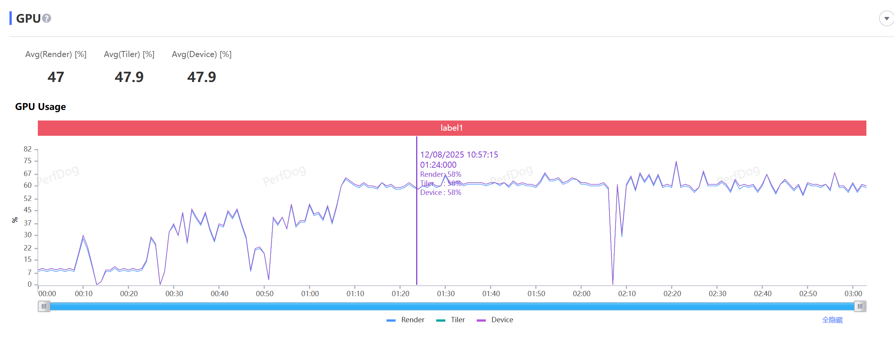

# 微信小游戏功耗分析指引 --iOS 篇

## 引言

移动互联网快速发展，微信小游戏凭借便捷性和社交性成为热门休闲选择。移动端设备上，微信小游戏的功耗表现对于用户体验具有显著的影响。本文将介绍微信小游戏功耗分析的通用流程，供开发者参考。

## 微信小游戏运行模式

在 iOS 端，微信小游戏具备普通模式、高性能模式和高性能 + 模式三种运行模式。

普通模式下，微信小游戏运行在微信中。

高性能模式下，微信小游戏运行在WebContent进程中。

高性能 + 模式下，微信小游戏的业务逻辑运行在WebContent中，但是小游戏的渲染逻辑则运行在微信进程中。

因此，针对这三种运行模式，我们需要关注不同的进程：

| 模式  | 关注进程        |
| ------ | ----------------- |
| 普通模式  | 微信进程        |
| 高性能模式  | WebContent进程    |
| 高性能+模式 | 微信进程+WebContent进程 |

## 功耗来源介绍

微信小游戏在iOS设备端主要的功耗来源为CPU、GPU、屏幕显示和网络传输。这四大来源中，屏幕显示所占的功耗开销主要取决于玩家的设置与设备的特点（例如：玩家手动将屏幕调亮、iPad设备屏幕较大因此耗电更多），而网络传输的功耗开销更多集中于游戏冷启动阶段。

因此，开发者需要重点关注和优化的是CPU和GPU带宽所带来的功耗开销。就微信小游戏而言，在刨去屏幕显示与网络传输的功耗开销后，CPU和GPU带宽所占功耗开销比例预期约为1.2:1（注：该数值为预估数值，针对不同的游戏品类，该比例亦有差异）

## 功耗指标

### 电池功耗指标

在小游戏运行时，电池的功耗当然是最直观的评估指标。

当前业界已有若干方案可以采集电池的功耗，可以使用Perfdog等工具进行指标数据的采集。

采集指标时，需要注意如下事项：

*  确保设备当前不处于充电状态（无论是usb还是magsafe）——电池处于充电状态时该数据将完全不可信

*  采集电池功耗时，目前的数据更新周期最快为20s，建议采集时长不低于2分钟

*  采集功耗时，建议将设备的其他应用退出，并且注意将音量、屏幕亮度设置为固定值，避免引入其他影响因子

我们建议微信小游戏的平均功耗不要超过3kmW。若超过该值，则设备将不可避免的出现发热、掉电等情况。

某些优化较好的标杆游戏可以将其控制到2.6kmW，开发者们可以以该功耗值为目标进行优化。

### Power Profiler指标

xcode 26 beta版本中，苹果提供了[Power Profiler](https://developer.apple.com/documentation/Xcode/measuring-your-app-s-power-use-with-power-profiler)工具，用于评估该进程对于功耗的影响。

`Power Profiler`提供了`CPU Impact`、`GPU Impact`、`Display Impact`和`Network Impact`四个维度的数值指标，用于评估一个进程在这四个维度上的耗电情况：

值得注意的是：这些数值在四个维度的量纲是一致的，因此这些数值可以跨维度对比，用于判别当前游戏的功耗来源。但是由于不同的设备对应的指标数据评估方法是有差别的，因此这些数值无法跨设备对比。此外，在USB连接中，该值依然可以正常获取。

针对微信小游戏的Power Profiler，可以选择webcontent进程，也可以选择wechat进程进行评估。

由于`Power Profiler`的指标值随着设备类型的不同而不同，因此难以给出一个通用的标杆值进行参考。在此，我们提出相应标杆游戏在`iPhone 15`设备下的值，供开发者们参考：

| Impact类型  | 标杆参考值 |
| ------ | ----------------- |
| CPU Impact  | 6.2       |
| GPU Impact  | 3.1    |

### 其他指标

#### CPU相关指标

针对计算逻辑开销较重的微信小游戏，除了使用`Power Profiler`里的`CPU Impact`指标进行CPU功耗的评估外，我们可以通过`Perfdog`采集小游戏相关进程的CPU使用率：

如果`CPU使用率`指标较高，则意味着当前CPU带来的功耗开销较高，需要进行相应的优化。

注意：不同的运行模式下，需要关注的进程也随之不同。参考`微信小游戏运行模式`小节来确定当前应该监测哪个进程。

我们建议将AppCPU使用率的数值控制在25%以下，标杆游戏可以将该值控制到16%以下。

#### GPU相关指标

##### GPU Bandwidth
在DRAM带宽开销中，因渲染而产生的GPU带宽开销占了绝大部分比重。我们可以通过`Perfdog`里GPU Counter类别中的`GPU Bandwidth`来进行带宽数据的评估：

该指标在`Power Profiler`中被归属为GPU Impact。

该指标越低越好，我们建议将Read Bandwidth与Write Bandwidth均控制在10GB/s以下。某些标杆游戏能够做到将其优化到6G/s以下，从而对于发热控制有较好的助益。

##### GPU Usage

使用`Perfdog`，可以获取到整体的`GPU Usage`，该类别包含`Render Utilization`、`Tiler Utilization`和`Device Utilization`指标：

该指标主要用于OpenGL ES应用的评估，可参考[官方文档](https://developer.apple.com/library/archive/documentation/3DDrawing/Conceptual/OpenGLES_ProgrammingGuide/ToolsOverview/ToolsOverview.html)。

针对微信小游戏的GPU使用率评估，该指标也有一定意义。

针对画面要求不高的游戏，我们建议将指标控制在40%以下。针对画面要求较高的游戏，我们也建议将其控制在65%以下。某些标杆游戏可以将该指标控制在60%以下，从而能够进行较好的发热控制。

#### XHR带宽

微信小游戏的高性能+模式运行中，可能涉及到webcontent进程与微信进程的通信。而通信过程中的数据序列化，可能带来带宽的开销。

通过右上角的三点-->开发调试-->打开调试，可以开启调试面板。

点击左上角的框框，从而可以切换为XHR次数与带宽查看：

我们建议在游玩场景时尽量降低XHR次数。某些标杆游戏为可以将XHR次数降低到1，这样可以有效控制XHR通信而导致的带宽功耗。

注：如果场景绘制流程中，有太多的动态合批。可能会导致XHR的通信量显著上升，建议开发者关注。

### 指标建议一览表

| 指标 | 推荐值 | 标杆值 |
| ------ | ------ | ------ |
| 电池功耗 | 3000mW | 2600mW |
| CPU/GPU Impact（iPhone 15设备） | 7.5/5.0 | 6.2/3.1 |
| CPU使用率 | 25% | 16% |
| GPU带宽 | 10GB/s | 6GB/s |
| GPU使用率 | 65% | 60% |
| XHR次数 | 低于3 | 1 |

## 优化方案

当定位到相关的功耗热点后，我们就需要开始着手进行功耗的优化，以下列出一些常见的功耗优化方案：

### 使用GPU Resident Drawer
针对复杂场景的绘制，Unity/团结引擎提供了[GPU Resident Drawer](https://developer.unity.cn/projects/686b447dedbc2a6b14c2915c)的方案，它可以有效降低复杂场景的绘制功耗。

### 关闭HDR
针对微信小游戏，开启HDR将带来约40MB的显存开销，以及一次全分辨率的RT拷贝的操作，从而产生较高的带宽开销。

针对团结引擎，如果使用的是built-in管线，建议前往GraphicsSetting中的tier2（微信小游戏平台使用tier2中的设置）关闭默认开启的hdr。

针对URP管线，需要在URP Asset中进行HDR渲染的关闭。

### 降低RT的使用
由于RT的使用及切换会显著增加GPU带宽的开销。因此当定位到GPU带宽功耗较高时，应当首先排查是否存在大量使用RT的功能，并且考虑将其降级或禁用。

以下是常见的使用RT的功能：
 - Bloom、调色、全屏勾边等后处理效果
 - 阴影绘制
 - 反射、折射等效果

此外，可以排查渲染管线是否存在以下情况：
 - 如果Backbuffer设置成了srgb格式，而后处理需要使用线性空间计算时，则引擎可能会创建一个临时的RT。此时可以考虑将backbuffer改为Linear，从而避免这个临时RT的创建。
 - 在Unity针对Webgl平台的渲染管线中，Backbuffer中可能会带有depth信息，从而增大RT的体积。如果你的游戏中不需要深度信息，则可以考虑指定depthBufferBits为0，从而避免自动创建Depth纹理。
 - 如果大量使用了高精度的RT，可以考虑将精度降低，例如将R32换成R16。

### 使用压缩率更高的贴图压缩格式

如果是由于贴图尺寸过大而导致GPU带宽开销较高，则可以考虑在表现效果允许的前提下，使用压缩率更高的贴图压缩格式.

### 通过调整DPR值进行渲染分辨率的调整
针对iOS设备，可以通过降低dpr的方式进行渲染分辨率的调整。例如在iOS设备上，如果dpr（Device Pixel Ratio）默认是3.0，那么可以将其尝试设置为[2.0 ～ 2.5]。

### 降低CPU功耗开销
当CPU功耗占主导时，我们则需要通过优化CPU效率的方式进行功耗的优化，本文提出以下方向供开发者参考：
 - GPU Skin
当场景内存在大量的Skinned Mesh Renderer时，CPU蒙皮将带来很大的CPU开销。团结引擎已经提供了GPU Skinning的支持，开发者们也可以自行实现GPU Skinning的功能，从而降低蒙皮带来的CPU功耗开销。
 - 粒子模拟优化
如果场景内的粒子数量较多，则粒子更新将会带来繁重的CPU开销。可以尽量使用Local Space Simulation、合理的粒子LOD设置来降低粒子的更新开销；也可以手动设置Particle Simulation Budget方案，从而进行总体的控制。此外，针对发射数量较少的粒子，可以考虑直接使用Mesh来进行模拟，从而减轻CPU的负担。
- 使用性能深度分析工具来定位性能瓶颈
针对未知的CPU开销，可以考虑使用性能深度分析工具来定位CPU的性能瓶颈。

### 控制帧率

我们可以通过调整帧率的方式，从而以最直观的方式降低游戏整体的功耗。开发者们可以根据自身的需求，设置目标帧率，或者将目标帧率进行动态调整，从而控制游戏整体的功耗。