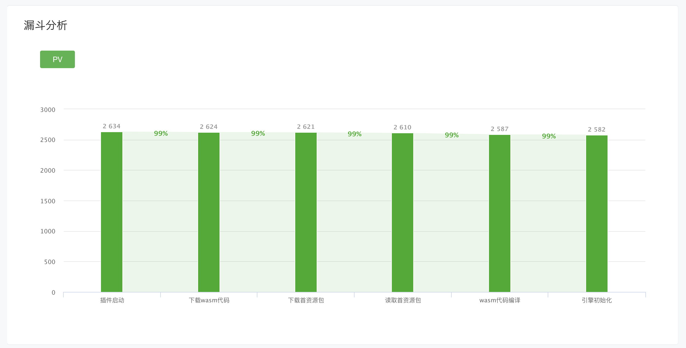
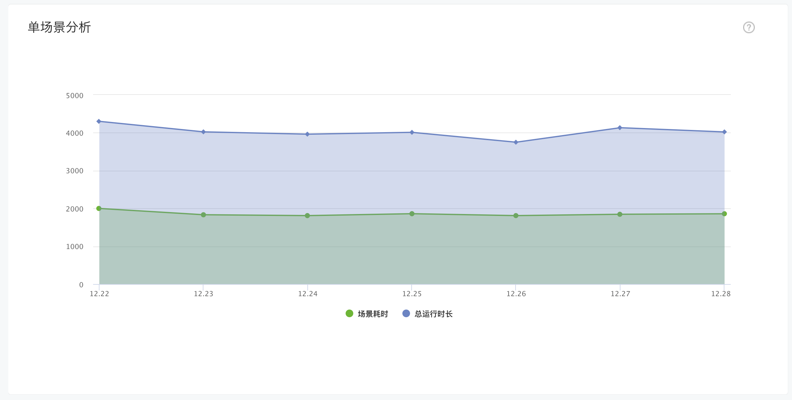

# 启动留存数据上报统计

## 一、概述
在小游戏环境下，玩家对启动时长与体验非常敏感（尤其从“广告”等买量场景进入的玩家）。开发者往往需要分析玩家从点击到进入游戏核心玩法的整个过程流失率。
[Unity Loader](UsingLoader.md)的数据统计功能如下：
1. Unity Loader插件自动统计了代码包、首包资源、代码编译、引擎与首场景初始化，无需手动上报
2. 通过C# SDK接口让开发者上报自定义启动阶段，分析每个环节可能存在的流失

## 二、上报广告信息
为了帮助开发者分析广告渠道的留存数据，达到最好的买量效果，Loader提供了上报广告参数的能力，用于区分**不同广告位/广告类型/素材类型**的数据。

#### 如何上报？
广告买量时，带上广告相关自定义参数，Loader自动上报
eg: `adSpaceType=1&adType=1&materialType=1`

- adSpaceType: 广告位类型；一个广告位可以投放不同类型的广告
- adType: 广告类型；一个广告类型可以投放不同素材
- materialType: 素材类型

取值范围：1-200; 默认为0

## 三、上报自定义阶段
为了详细统计玩家的流失情况以便开发者进行优化，我们拆分了三个部分。

其中**自动上报**为Unity Loader自动完成开发者无需关注，但**自定义阶段**与**启动加载完成**需开发者主动调用接口进行上报。详细接口可参考C# SDK中的WX.cs，文档可查看[启动场景上报分析](https://developers.weixin.qq.com/minigame/dev/guide/performance/perf-action-start-reportScene.html) 及 [wx.reportScene](https://developers.weixin.qq.com/minigame/dev/api/data-analysis/wx.reportScene.html)

**1. 游戏完成所有加载时上报**

当游戏完成所有加载阶段，进入核心玩法时(如进入新手引导或大厅)调用
``` C#
      WX.ReportGameStart()
```
**2. 上报当前自定义阶段错误信息**
``` C#
      WX.ReportGameSceneError(int sceneId, int errorType, string errStr, string extJsonStr)
```
sceneId同**启动场景上报分析**

errorType取值：[0,10000]

示例：
``` C#
      // 假设Loading场景中A资源完成为1001, 需要知道完成的留存率
      WX.ReportScene(new ReportSceneParams()
      {
            sceneId = 1001,
            costTime = 100,
            metric = new Dictionary<string, string>()
            {
                  { "testkey1", "1" },
                  { "testkey2", "2" }
            },
            dimension = new Dictionary<string, string>()
            {
                  { "testkey1", "testvalue1" },
                  { "testkey2", "testvalue2" }
            },
            complete = (res) =>
            {
                  Debug.Log("ReportScene complete" + res);
            },
            success = (res) =>
            {
                  Debug.Log("ReportScene success: " + res);
            },
            fail = (res) =>
            {
                  Debug.Log("ReportScene fail: " + res);
            }
      });
      
      // 所有加载完成，玩家可以交互(如休闲游戏已进入核心玩法、MMO游戏进入创角时), 需要知道留存率
      WX.ReportGameStart();
```

## 四、获取Loader启动阶段
从启动时序可以知道Loader启动阶段分为以下五个阶段
- wasm代码包下载
- wasm编译
- 首包资源下载
- 首包资源读取
- 引擎初始化(callmain)

当业务侧需要使用Loader启动数据时，可以使用Loader暴露的进度事件上报到自己的系统
> tips: 目前只支持js调用
```js
gameManager.onLaunchProgress = (e) => {
      // e: LaunchEvent
      // interface LaunchEvent {
      //   type: LaunchEventType;
      //   data: {
      //     costTimeMs: number; // 阶段耗时
      //     runTimeMs: number; // 总耗时
      //     loadDataPackageFromSubpackage: boolean; // 首包资源是否通过小游戏分包加载
      //     isVisible: boolean; // 当前是否处于前台，onShow/onHide
      //     useCodeSplit: boolean; // 是否使用代码分包
      //     isHighPerformance: boolean; // 是否iOS高性能模式
      //   };
      // }
      if (e.type === launchEventType.launchPlugin) {

      }
      if (e.type === launchEventType.loadWasm) {

      }
      if (e.type === launchEventType.compileWasm) {

      }
      if (e.type === launchEventType.loadAssets) {

      }
      if (e.type === launchEventType.readAssets) {

      }
      if (e.type === launchEventType.prepareGame) {

      }
}
```

类型枚举
```js
export const launchEventType = {
  launchPlugin: 0, // 插件启动
  loadWasm: 1, // 下载wasm代码
  compileWasm: 2, // wasm代码编译
  loadAssets: 3, // 下载首资源包
  unzipAssets: 4, // 解压首资源包
  readAssets: 5, // 读取首资源包
  prepareGame: 6, // 引擎初始化
};
```

## 五、获取数据统计

> 请注意！需前往【公众平台 - 能力地图 - 生产提效包 - 快适配 】开通后，方可查看数据

数据报表包含Unity Loader自动上报与开发者自定义阶段。关注总体流失漏斗以确定需要优化的方向，同时分阶段的耗时分布有利于帮助我们分析该阶段的对应耗时的用户占比。

数据报表统计分析请参考文档[启动场景上报分析-数据分析](https://developers.weixin.qq.com/minigame/dev/guide/performance/perf-action-start-reportScene.html) 进行查看。





***注：***

1. 若使用的 `转换插件版本<202211101011`（对应`Unity Loader版本<1.1.2`），数据统计报表需要建联[小游戏研发助手](IssueAndContact.md)获取。
2. 数据报表数据未来会开放到《小游戏数据助手》。
