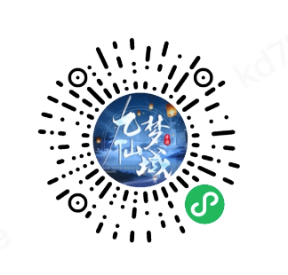
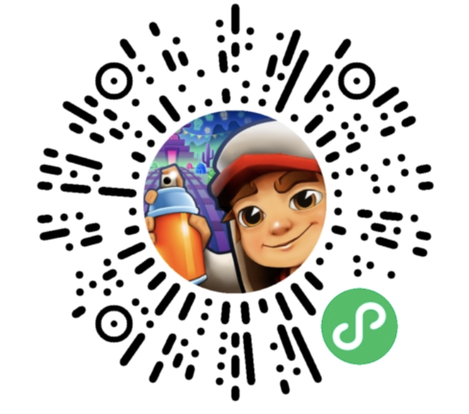
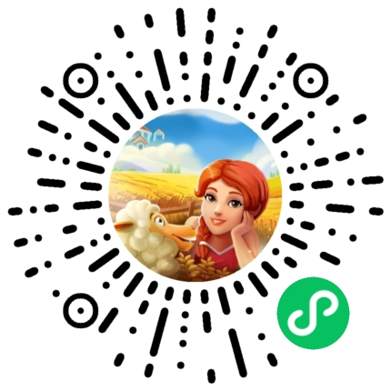

# 转换案例

文档为使用Unity WebGL适配小游戏方案的部分上线游戏。
> 转换案例目的是分享学习，若作者认为不适合分享，请联系小游戏研发助手删除。
> 如开发者希望分享案例，也可通过小游戏开发助手添加。

## 无尽冬日

SLG品类，探索冻土，重建家园

## 九梦仙域

重度MMO品类，仙侠为题材，主要讲述在仙域大陆上，玩家扮演一个攀星阁学艺有成，不断提升自身，立志阻挡魔族入侵的游戏。

## 地铁跑酷

超好玩的3D跑酷手游！简单的上手操作，丰富的游戏画面，众多的城市场景，让你爱不释手！

## 谜题大陆

 一款独具创新的魔幻三消策略小游戏，神奇的消除战争之旅！带你探索不一样的魔幻体验！

## 三国吧兄弟

## 鱼吃鱼

## 剑心吟

 重度MMO品类

## 巨兽战场

 重度SLG品类， 3D恐龙自由捕捉

 ## 小小蚁国

 2023年度热门休闲小程序《小小蚁国》，建立你的地下王国！

## 翡翠大师

模拟经营游戏，玩家将体验到富有风险的翡翠原石选石过程，通过切石，设计，抛光的流程获得精美的翡翠雕刻成品，让自己的翡翠珍宝展馆发展壮大，熠熠生辉；在得到成就感的同时收获相关的翡翠知识。

## 超能世界

## 大侠不哭

 喜欢武侠世界，曾梦想惩恶扬善、和志同道合的伙伴携手闯仗剑走天涯！
 
## 我叫MT2

由乐动卓越研发的精美3D手游，延续了传统《我叫MT》的经典特色。钓鱼挖矿，外域探险玩法都将为您呈现独一无二的掌中魔幻世界！

  ## 葫芦娃大作战

 
  ## 大圣顶住

 

  ## 银河战舰

  ## 守护球球

