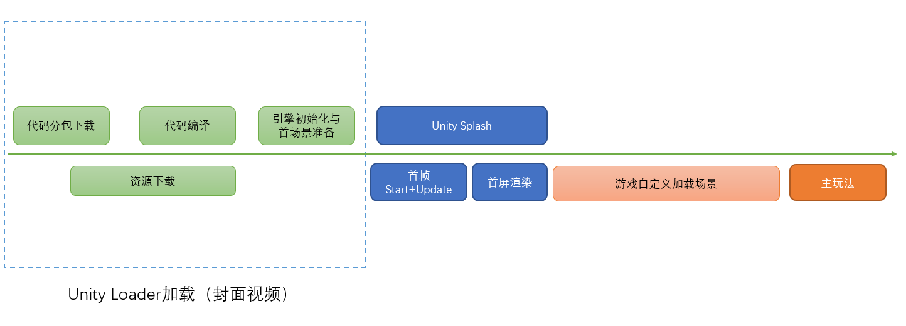
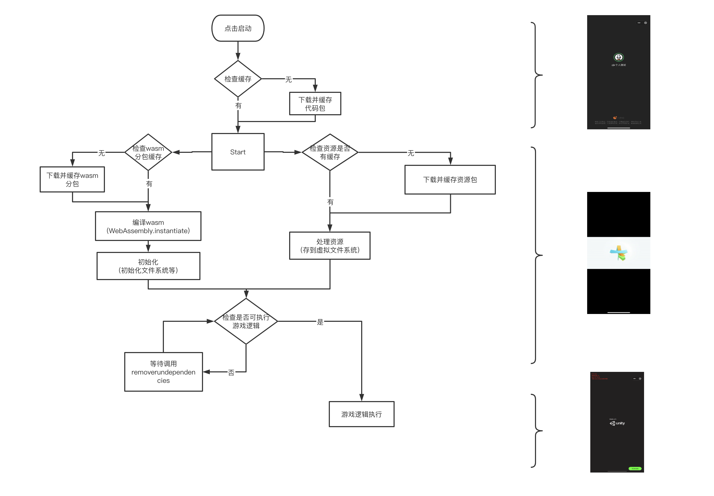

# 小游戏启动流程与时序

## 启动加载时序
Unity WebGL转换的小游戏主要依靠Unity Loader进行初始化，典型的流程如下图所示：

## Unity Loader工作流程

关键过程：
1. 启动准备阶段有两个处理分支：资源与代码分包处理，两者并行。
2. 资源(data)处理：下载、解压并保持在内存，资源包括：构建场景及依赖、Resource目录所有资源、Unity默认内建资源
3. 代码分包(wasm.code.br)处理：下载代码分包，解压到内存、编译与实例化
4. 完成准备阶段后进入Unity引擎初始化与首场景加载

## QA:
1. 有哪些文件需要放CDN服务器？
首资源包：webgl/ProjectName.data.unityweb.bin.txt
资源分包：Adressable/AssetsBundle生成的文件

2. 资源(data)或资源包是否需每次下载？
为加快二次启动，默认loader再次启动时资源(首包资源或资源分包)将直接使用本地缓存。如需手动删除缓存可在真机中小游戏下拉历史栏将小游戏删除。

