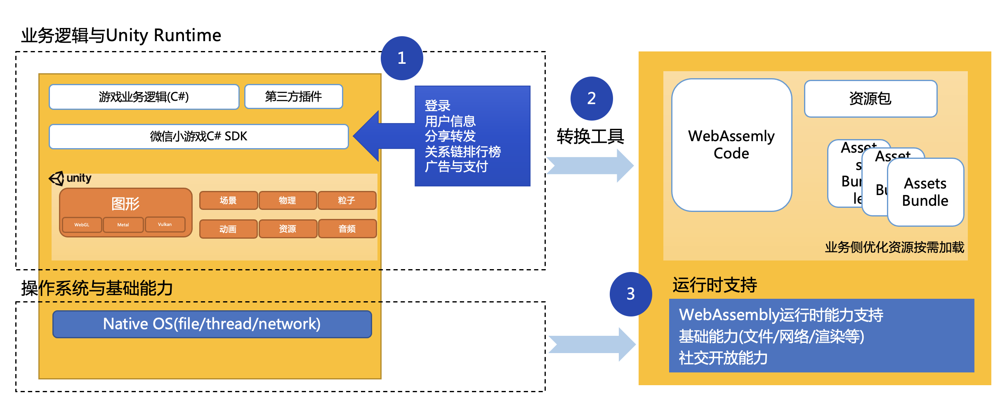

# Unity WebGL小游戏适配方案概述
## 一、技术原理

Unity的BuildTarget支持WebGL平台，WebGL导出包是基于WebAssembly技术运行在浏览器环境。 
为了能让导出包运行在微信小游戏环境，我们提供了以下支持：
* 开发阶段：提供平台能力的C# SDK帮助开发者快速对接平台能力 
* 导出阶段：转换打包工具，进行Unity WebGL胶水层适配，直接转换成小游戏包 
* 运行阶段，提供WebAssembly基础能力，微信底层接口支持

## 二、接入流程
接入流程请参考文档[Unity WebGL微信小游戏转换指南](Guide.md)

## 三、参考资料
1. https://emscripten.org/
2. https://docs.unity3d.com/Manual/webgl-gettingstarted.html
3. https://forum.unity.com/forums/webgl.84/
4. http://webassembly.org.cn/getting-started/developers-guide/
5. https://developer.mozilla.org/zh-CN/docs/WebAssembly/C_to_wasm

 
