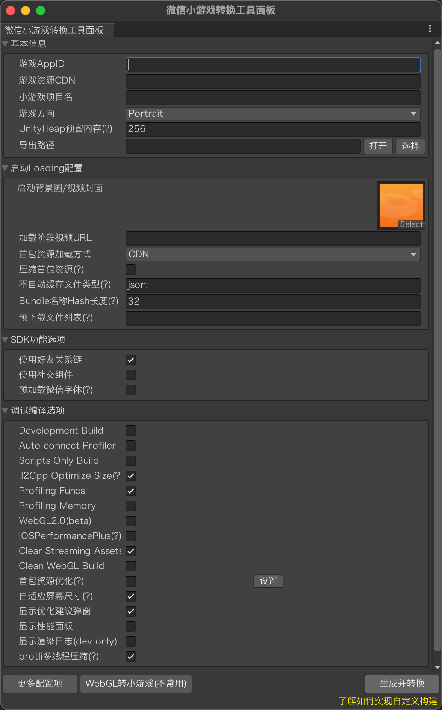
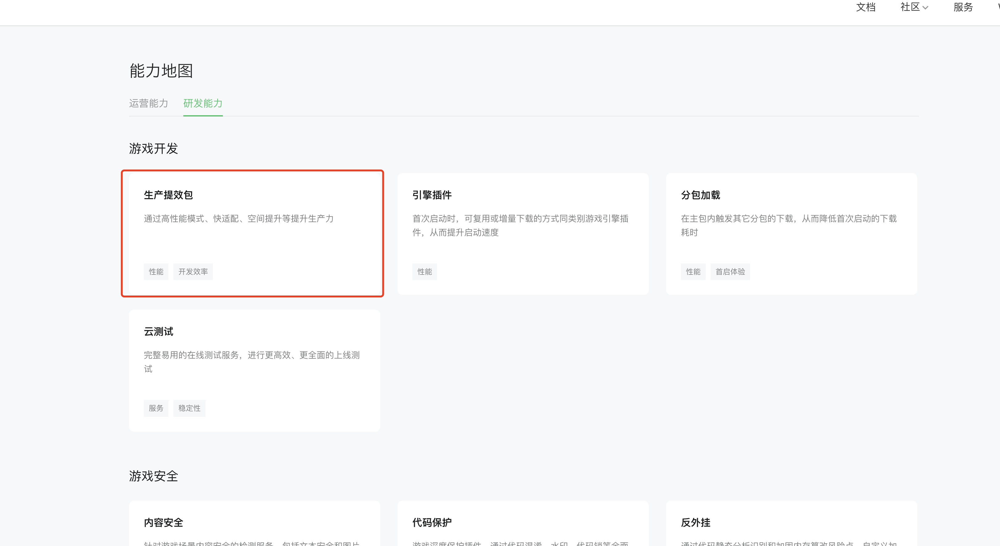

# 转换工具导出微信小游戏

## 一、Unity导出WebGL

添加需要导出的scene
   


建议仅勾选Loading场景，后续场景使用AssetsBundle/Addressable进行按需加载。


## 二、适配小游戏

### 2.1 转换小游戏
顶部菜单栏 点击 微信小游戏 -> 转换小游戏， 填写相应参数，点击`导出WEBGL并转换为小游戏`按钮 ，等待转换完成。



其中：
1. 必须
- 游戏appid：小游戏的appid(勿用测试appid, 注册开通小游戏请查阅[快速上手
](https://developers.weixin.qq.com/minigame/dev/guide/))
- 游戏资源CDN：游戏资源所在HTTP或CDN地址
- 导出路径：转换后文件目录
2. 可选
- 小游戏项目名：开发者工具中展示的小游戏项目名
- 首包资源加载方式：CDN-使用CDN下载首包资源；小游戏分包-使用小游戏代码分包下载资源
- 加载阶段视频URL：启动需要一定耗时，在启动加载时会循环播放这段视频，视频格式请参考[视频规范](video.md)
- 启动背景/视频封面图：启动阶段背景图片；如果配置了加载阶段视频URL，则作为视频封面。
- 游戏方向：游戏是横屏还是竖屏，可选值参考[deviceOrientation](https://developers.weixin.qq.com/minigame/dev/reference/configuration/app.html)
- 不自动缓存文件类型：游戏资源CDN下不自动缓存的文件类型，具体参见[AssetBundle缓存](UsingLoader.md)
- Bundle名中Hash长度：自定义AssetBundle名中Hash长度用于缓存控制，具体参见[AssetBundle缓存](UsingLoader.md)
- 预下载列表：网络空闲时预下载的资源，[使用预下载](UsingPreload.md)
- SDK功能选项：[好友关系链](OpenData.md) [音频优化](AudioOptimization.md)
- 调试编译选项

### 2.2 了解转换后目录结构
在转换完成后，会在导出路径下生成如下目录

```bash
.
├── backup
├── minigame
└── webgl
```

- backup为转换工具的资源备份目录
- minigame为小游戏项目
- webgl为unity导出为webgl后的资源和代码目录


### 2.3 资源部署
转换完成后，参照[资源部署与缓存](DataCDN.md)章节进行资源部署，并了解启动Loader在加载资源时的缓存逻辑。

### 2.4 小游戏预览
1. 下载小游戏开发者工具
[微信开发者工具](https://developers.weixin.qq.com/miniprogram/dev/devtools/download.html)

> 需要下载，`稳定版 Stable Build`，非小游戏版！

2. 导入项目
参考[小游戏快速开始](https://developers.weixin.qq.com/minigame/dev/guide/#%E5%AE%89%E8%A3%85%E5%B9%B6%E5%90%AF%E5%8A%A8%E5%BC%80%E5%8F%91%E8%80%85%E5%B7%A5%E5%85%B7)

导入转换后的`minigame`目录

3. 工具预览


注意：
> 项目使用了小游戏Unity适配插件，若小游戏是第一次使用本插件，在开发者工具会报错提示插件未授权


**请前往mp后台-能力地图-生产提效包-快适配，开通使用**




4. 真机预览
点击**预览**，扫码二维码预览即可。

请不要使用真机调试！！
请不要使用真机调试！！
请不要使用真机调试！！
 
## 三、使用脚本集成到自己的构建系统
如果你希望将导出插件集成到自己的发布流程，想脚本调用的话，可修改 `Assets/WX-WASM-SDK/Editor/MiniGameConfig.asset`配置，然后调用WXEditorWindow 的 DoExport方法导出小游戏
 ```
 var win = new WXEditorWindow();
 win.DoExport();
 ```

### `MiniGameConfig.asset`支持的配置
#### 与转换面板配置有对应关系的配置项
```
// 基本设置
Appid -- 小游戏appid
CDN -- 游戏资源CDN
projectName -- 小游戏项目名
Orientation -- 游戏方向
maxStorage -- 最大内存
DST -- 导出路径
// 启动Loader设置
bgImageSrc -- 背景图/封面图
VideoUrl -- 加载阶段视频URL
assetLoadType -- 首包资源加载方式
bundleExcludeExtensions -- 不自动缓存文件类型
bundleHashLength -- bundle名中hash长度
// 预下载
preloadFiles -- 预下载文件列表，用;分隔
// SDK功能
UseFriendRelation -- 使用好友关系链
UseAudioApi -- 使用微信音频API
// 调试编译选项
DevelopBuild -- Development Build
AutoProfile -- Autoconnect Profiler
ScriptOnly -- Scripts Only Build
profilingFuncs -- Profiling Funcs
Webgl2 -- WebGL2.0
DeleteStreamingAssets -- DeleteStreamingAssets
```
#### 不常用配置
使用说明参考[Loader配置](UsingLoader.md)
```
// 资源加载与缓存
dataFileSubPrefix: 配置首包资源加载路径
bundlePathIdentifier: URL中包含特定标识符时需要自动缓存，用;分隔
defaultReleaseSize: 达到缓存上限时默认额外清理的存储大小，用;分隔
needCacheTextures: 是否开启纹理缓存
texturesPath: 纹理存储路径
texturesHashLength: 纹理中hash长度
// 启动界面
loadingBarWidth: 加载进度条宽度
HideAfterCallMain: 是否初始化完成立即隐藏封面
```

## 四、常见问题
请查阅[技术常见问题QA](DevelopmentQAList.md)
