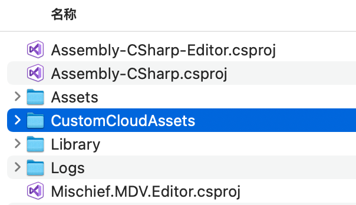

# Unity Instant Game导出至微信小游戏指南

​		除 [Unity WebGL小游戏快适配](https://github.com/wechat-miniprogram/minigame-unity-webgl-transform/blob/main/Design/Summary.md) 方案外，Unity 官方也提供了 Instant Game 转换工具可以实现 Unity 游戏转化至微信小游戏平台的能力，本文将对两种方案的转化进行量化指标的对比，方便开发者们根据不同的需要选择适合自己游戏的方案进行接入。

本文的内容包括：

- 两者转化差异对比
- 真机性能测评
- 方案选择建议
- Instant Game 导出至微信小游戏实践

## 转化差异能力对比

| 指标           | Unity 快适配 | Instant Game工具                 |
| -------------- | ------------ | -------------------------------- |
| 转化人力       | 适中         | 较少/适中                        |
| 懒加载资源类型 | 常见纹理资源 | 纹理、模型、骨骼动画、音频资源   |
| 纹理压缩格式   | DXT、ASTC    | ASTC                             |
| 自有CDN        | 支持         | 不支持(腾讯云CCD)                |
| 必要的代码修改 | 通常需要适配 | 较少编写                         |
| WebGL          | 1.0、2.0     | 1.0                              |
| 首包资源处理   | 通常需要     | 默认不需要，但达到最佳效果仍需要 |

## 性能测评

​		本文针对相同的 Unity 游戏（[Unity塔防模板游戏](https://learn.unity.com/project/ta-fang-mo-ban?uv=2017.2)）进行两种转化方案上的性能进行测评，重点关注首屏呈现效率、帧率、内存、网络请求等进行分析测评。

### 转化差异

#### Instant Game：

​		未对游戏进行逻辑上的修改，仅进行转化过程中必要的配置。

#### WeiXin Tool：

1. 对关卡场景完整打成多个独立 Addressable 包，上传 CDN ，场景加载由原字符串直接载入改为 AA 包加载；
2. 首场景体积过大新增用于载入首场景的 Loading 场景。

### 首屏幕呈现效果


| 转换方案     | 首屏幕呈现时间 |
| ------------ | -------------- |
| Instant Game | 8.8s           |
| WeiXin Tool  | 4.5s           |


### PerfDog测试结果

测试设备信息请详见报告

- Android Instant Game：https://perfdog.qq.com/case_detail/2744514
- Android Wei Xin Tool：https://perfdog.qq.com/case_detail/2744500

### 内存(Memory Usage)		


## 方案选择建议

​		对于目前平台而言，已经存在大量被 **小游戏快适配** 方案所转化的线上游戏，该方案的成熟性是较高的。在转化上需要花费时间，集中处理的位置通常为资源的异步加载，首包资源优化快速载入首屏画面等处，然而对于平台提供的一些特有的能力而言，本身仍需开发者进行专项的能力迭代。Instant Game 方案对于未使用 Bundle 来异步加载资源的游戏工具能够让游戏在几乎不需代码修改时即在微信小游戏平台真机运行，但整体的体验还是存在缺陷性，例如增大了 loading 界面的等待时间，对于较大的场景而言被打包成远程的 Bundle 来异步加载，下载资源期间由于没有提供用户界面上的反馈，会给用户一种“卡住”无响应的假象等。

​		总结的来说，对于大型复杂的游戏而言，无论是选择哪一种方案，都不能在免修改工程的情况下给出最理想的游戏效果，因此根据自己的研发团队选择转化方案进行适配已经专项优化即可。对于小型的休闲游戏而言，选择 Instant Game 方案可以快速进行转化，有效的降低工时，但需注意 CCD 服务的费用预算。

## 实践指南

本章以 [Unity塔防模板游戏](https://learn.unity.com/project/ta-fang-mo-ban?uv=2017.2) 作为使用Unity Instant Game工具导入至微信小游戏真机运行的实践案例，相关资源下载地址：

Windows平台：

- Unity Editor：[Editor_2021.2.5f1c301_a9](https://unity-1258948065.cos.ap-shanghai.myqcloud.com/test/AutoStreamerTest1/Release/Alpha/c301_a9/UnitySetup64.exe)
- WebGL Build Support: [UnitySetup-WebGL-Support-for-Editor-2021.2.5f1c301.exe](https://unity-1258948065.cos.ap-shanghai.myqcloud.com/test/AutoStreamerTest1/Release/Alpha/c301_a9/UnitySetup-WebGL-Support-for-Editor-2021.2.5f1c301.exe)

MacOS平台：

- Unity Editor：[Editor_2021.2.5f1c301_a9](https://unity-1258948065.cos.ap-shanghai.myqcloud.com/test/AutoStreamerTest1/Release/Alpha/c301_a9/Unity.pkg)
- WebGL Build Support: [UnitySetup-WebGL-Support-for-Editor-2021.2.5f1c301.pkg](https://unity-1258948065.cos.ap-shanghai.myqcloud.com/test/AutoStreamerTest1/Release/Alpha/c301_a9/UnitySetup-WebGL-Support-for-Editor-2021.2.5f1c301.pkg)

InstantGame Package：

[com.unity.instantgame.zip](https://unity-1258948065.cos.ap-shanghai.myqcloud.com/test/AutoStreamerTest1/Release/Alpha/c301_a9/com.unity.instantgame.zip)


### CCD服务

​		CCD服务是由 Unity Instant Game 统一提供的 CDN 服务，通常而言游戏中被 Auto Streaming 分离的资源将被托管至 CCD 服务


### 资源压缩处理

​		若在 `Auto Streaming - Cfg&Publish` 面板中勾选 `Use AutoStreaming` 选项，则项目底层对于资源加载时将启用该模式运行，


### AssetsBundle指引

​		与微信小游戏快适配方案相同的是，若游戏内逻辑使用了自定义的远程AB包的加载，则不可避免的需要手动对AB包加载部分进行相应的修改，本节将对AB包的加载进行介绍。

​		Auto Streaming 对开发者自己构建的AB包在资源扫描时会对其进行识别，在工程中对这些资源进行低清资源的生成以及替换，在替换后，开发者需要重新对这些 bundle 进行构建，使得生成的 bundle 具备较小的体积，bundle 内原来的高清资源由 CCD 服务自行托管，需要时将异步的加载并更新在游戏的环境内，自定义AB包的运行原理如下图所示。


​		Instant Game 提供了一个目录用于对自定义资源的上传，位于工程根目录（与Assets目录同级）的 `CustomCloudAssets` 目录内，如下图所示：



​		经过工具的低清资源生成后，需要重新构建AB包，一般将资源放入`CustomCloudAssets/CustomAB` 内并在`Auto Streaming - Cfg&Publish` 面板内执行 `Upload to CCD` 即完成上传  ，未来放入该目录内的资源将被如下路径访问到：

```c#
// 例如 CustomCloudAssets/CustomAB/MyBundle01.ab
string CCD_HEADER = AutoStreaming.CustomCloudAssetsRoot;
string Uri = CCD_HEADER + "CustomAB/MyBundle01.ab";		//CCD资源地址
```

​		游戏内对于本地的Bundle加载的代码需要变更为远程加载，下面给出一种加载案例：

```c#
public class XXX : MonoBehaviour
{
    public Image img;		// Image
    void Start()
    {
      	//加载AB包并渲染至 Image
        StartCoroutine(LoadABAsync("MyBundle01"));
    }
  
    IEnumerator LoadABAsync(string abName)
    {
      	//首先加载 AB 包的 Manifest，用于读取经过 Hash 后的 ab 包资源
        var uwr = UnityWebRequestAssetBundle.GetAssetBundle(
            AutoStreaming.CustomCloudAssetsRoot + "AssetBundles"
            );
        yield return uwr.SendWebRequest();
        if (uwr.result != UnityWebRequest.Result.Success)
        {
            Debug.Log(uwr.error);
            yield break;
        }
        AssetBundle manifestbundle = DownloadHandlerAssetBundle.GetContent(uwr);
        AssetBundleManifest abm = manifestbundle?.LoadAsset<AssetBundleManifest>("AssetBundleManifest");
        var hashName = GetABNamesWithHash(abm);
        
      	//从字典表中得到 ab包 完整的资源名（含Hash部分的）
      	var abNmaeWithHash = hashName[abName];

      	//预加载的远程资源完整地址
        string abUri = AutoStreaming.CustomCloudAssetsRoot + "CustomAB/" + abNmaeWithHash;
      
        UnityWebRequest request = UnityWebRequestAssetBundle.GetAssetBundle(abUri);
        yield return request.SendWebRequest();
        if (request.isHttpError)
        {
            Debug.LogError(GetType() + "/ERROR/" + request.error);
        }
        else
        {
          	//此处成功下载并加载 ab包 资源，后续根据需要自行使用包内资源
            AssetBundle ab = (request.downloadHandler as DownloadHandlerAssetBundle).assetBundle;          
            
          	// ab.LoadAsset
            Sprite temp = ab.LoadAsset<Sprite>("Image01");
            img.sprite = temp;
            ab.Unload(false);
        }
        request.Dispose();
    }
  	
  	//基于 AssetBundleManifest 生成 ab包 完整资源字典表
    private Dictionary<string,string> GetABNamesWithHash(AssetBundleManifest abm)
    {
        var hashNames = abm.GetAllAssetBundles();
        Dictionary<string, string> ABNamesDict = new Dictionary<string, string>();
        foreach(var hashName in hashNames)
        {
    				//这里请注意正则表达式规则是否符合项目的 ab包 的命名，本案例中后缀为 「.ab」
            bool b = Regex.Match(hashName, "_[0-9a-f]{32}.ab$").Success;
            //如果有后缀，相应的 「 hashName.Length - 33 - 3 」 也需要对应修改
            var abName = b ? hashName.Substring(0, hashName.Length - 33 - 3) : hashName;
            ABNamesDict.Add(abName, hashName);
        }
        return ABNamesDict;
    }
}
```

**总结而言，整体的步骤应为：**

1. 游戏工程先以默认方式构建1次bundle；
2. 在 `Auto Streaming - Cfg&Publish` 面板 `Custom AB Assets` 项点击 `Search AB` 按钮对构建的 bundle 目录扫描；
3. 在  `Auto Streaming - Texture Streaming` 面板 `Sync Textures` 后根据需要选中资源(支持全选快捷键)  `Generate Placeholaders` + `Generate AssetBundles`
4. 此时需要重新构建 AB包；
5. 将 Asset Manifest 文件放至 `CustomCloudAssets` 目录内，其余 AB包 放至 `CustomCloudAssets/CustomAB/` 目录内；
6. 在`Auto Streaming - Cfg&Publish` 面板内执行 `Upload to CCD` 即完成上传；
7. 在需要加载 AB包 位置进行代码的修改。


### Addressable指引

​		相。		

​		