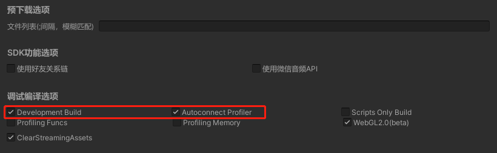

# 使用Unity Profiler性能调优
1. 导出选项时勾选"Development Build"与"Autoconnec Profiler"



2. 打开Unity-Window-Analysis-Profile窗口

 

   Unity将自启动监听端口34999等待调试链接，对于WebGL版本会启动websockify.js(用于websocket转发)。
此时，导出的WebGL游戏在浏览器时能自动连接到Unity Profiler。

3. 微信开发者工具小游戏Profile
使用转换脚本导出微信小游戏包并启动小游戏，微信小游戏将自动连接到Unity Profiler
 

4. 真机调试
Android或iOS启动之后将使用"ws://ip:port"自动连接到“Unity Profiler”， 如果无法连接请关注vConsole输出的IP：Port是否可达。
如果需要手工调整端口可通过修改以下代码：
```
     if(port == 54998) 
     {
        url = "ws://127.0.0.1:54998"
     }
     ws = new WebSocketConstructor(url, opts);
     ws.binaryType = "arraybuffer";
```

> 一般来说，保持端口为54998，如修改端口需重启websocketfy.js：
> windows: "$UNITY_PATH/Editor/Data/Tools/nodejs/node.exe" "$UNITY_PATH/Editor/Data/PlaybackEngines/WebGLSupport/BuildTools/websockify/websockify.js" 0.0.0.0:port localhost:34999
> mac: /Applications/Unity/Hub/Editor/$Verson/Unity.app/Contents/Tools/nodejs/bin/node /Applications/Unity/Hub/Editor/$Verson/PlaybackEngines/WebGLSupport/BuildTools/websockify/websockify.js 0.0.0.0:port localhost:34999 -vv

5. 注意事项
- 并非每个Unity版本UnityProfiler都稳定，如果发现无法正常的情况请尝试更换小版本
- Unity2021建议使用InstantGame版本，支持增强的Profiler数据，下载地址请查阅 [推荐引擎版本](UnityVersion.md)


附录:

- Profiler窗口使用说明 https://docs.unity3d.com/cn/2019.4/Manual/ProfilerWindow.html


