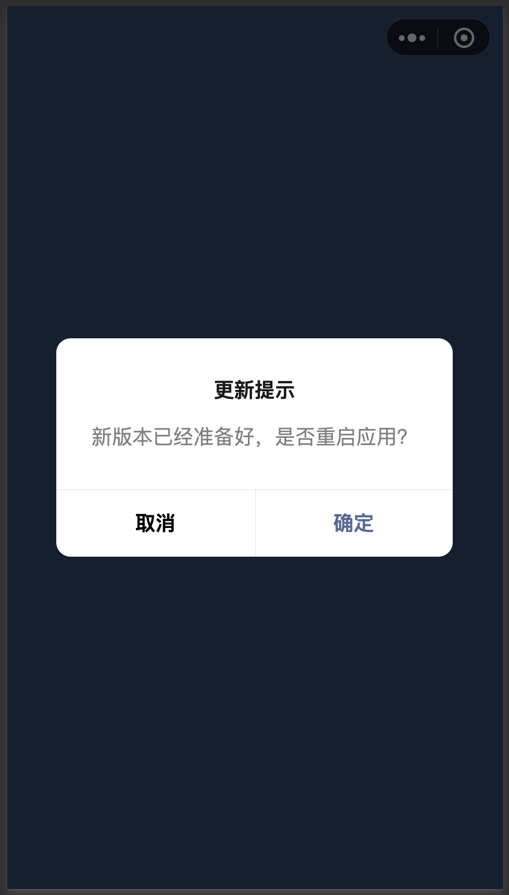

# 版本更新

## 代码更新
请阅读文档，了解小游戏的[更新机制](https://developers.weixin.qq.com/minigame/dev/guide/runtime/update-mechanism.html)

## 更新策略：
### 1. 静默更新（默认方式）
这种形式和APP版本类似，比如应用市场自动更新。游戏发新版本后，**在打开小游戏前，会静默更新到最新版本**。
但小游戏包体的更新机制和APP不同，开发者在管理后台发布新版本的小游戏之后，**无法立刻影响到所有现网用户**，如果某个用户本地有小程序的历史版本，此时打开的可能还是旧版本，**最差情况下，也在发布之后 24 小时之内下发新版本信息到用户**。

> 缺点：更新不及时，依然可能体验到旧版本内容，需要注意保证旧版本资源可访问。

适合于对版本一致性要求不高的游戏使用

### 2. 强制更新
#### 2.1 实时检测更新(UpdateManager)
戏运行期间检查是否有新版本，**当新版本可用后，提示用户重启更新**

转换插件有提供配置来自动使用这项能力，通过勾选【导出面板-更多配置项-Project Conf】中的配置`needCheckUpdate`。

> 缺点：由于重启后，可能涉及资源下载，可能导致用户流失。

#### 2.2 设置最低可用版本 
- 如果希望用户始终打开最新版本，可通过`mp后台-设置-基本设置-小程序最低可用版本`，修改为最新版本

## 资源更新
请查看[资源部署-资源更新说明](./DataCDN.md)