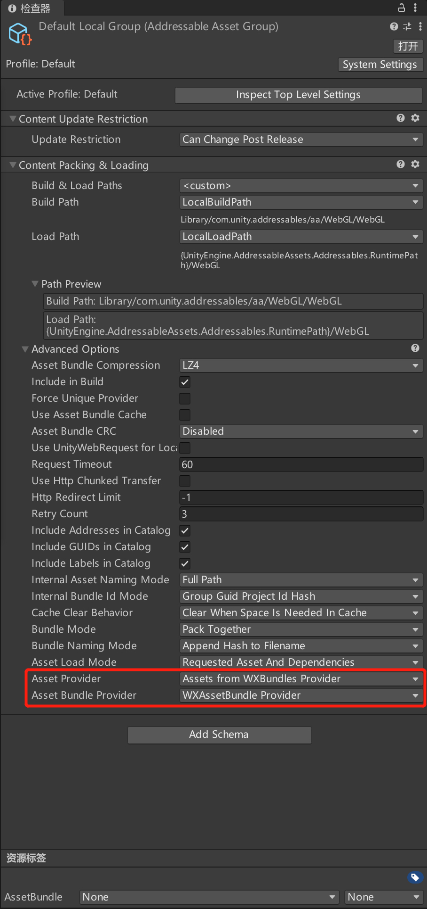
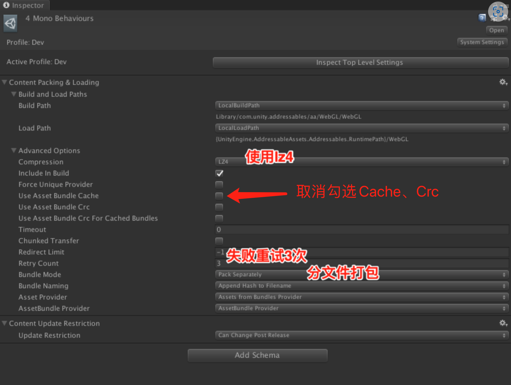

# 使用Addressable Assets System进行资源按需加载
## 一、概述
对于Unity WebGL转换的小游戏启动耗时，资源下载通常是贡献最大的部分。这是由于手游APP往往很少针对首包资源进行特殊优化。
那么，接下来的问题是：小游戏中多大的首包资源合适？ 剩余的游戏资源如何加载？
在此，我们建议得优化原则是：
> 1. 首包资源量不超过5M
> 2. 资源按需延迟加载，拆分得尽量细
   
本文介绍如何使用Unity新的资源管理流程[Addressable Assets System](https://docs.unity3d.com/Packages/com.unity.addressables@1.1/manual/index.html)进行资源的按需加载。

附可参考的项目：
https://github.com/wechat-miniprogram/minigame-unity-webgl-transform/tree/main/Demo/Addressable


## 二、Addressable在小游戏中的应用
### 2.1 什么是Addressable Assets System
Unity在2018版本中推出了Addressable Assets System（以下简称Addressable）的预览版本，并在2019的版本中已经成为正式版本，可以用于生产（仅表示发布时间，实际上大部分Unity版本都可正常使用）。
Addressable提供了以下能力：
> 低使用门槛：使用Addressable在开发前期就进入快速开发的阶段，使用任何你喜欢的资源管理技术，你都能快速的切换来Addressable系统中，几乎不需要修改代码。

> 依赖管理：Addressable系统不仅仅会帮你管理、加载你指定的内容，同时它会自动管理并加载好该内容的全部依赖。在所有的依赖加载完成，你的内容彻底可用时，它才会告诉你加载完成。

> 内存管理：Addressable不仅仅能记载资源，同时也能卸载资源。系统自动启用引用计数，并且有一个完善的Profiler帮助你指出潜在的内存问题。

> 内容打包：Addressable系统自动管理了所有复杂的依赖连接，所以即使资源移动了或是重新命名了，系统依然能够高效地找到准确的依赖进行打包。当你需要将打包的资源从本地移到服务器上面，Addressable系统也能轻松做到，几乎不需要任何代价。

### 2.2 相对于AssetsBundles的优势
Unity中资源按需加载也可以使用老的AssetBundle，然而使用AB需要做不少的工作：标识Asset、组织Bundle、编译、Load/Unload、依赖关系以及后期维护的复杂工作。新一代的Addressable正是对这些痛点做了不少改进，开发者只需要将Asset设置为addressable然后加载即可，[功能强大并且学习曲线变得平滑]
(https://docs.google.com/document/d/1hPLNLdrF0qAvjEJTpKf-cuO_d4FCV0H2cqBeP1Zo6mA/edit)。


### 2.3 在小游戏中使用Addressable Assets System
无论是Addressable还是AssetBundle在微信小游戏底层都使用XHR进行远程资源访问，并使用微信小游戏文件存储系统进行缓存。对于已有的游戏资源，如果我们需要尽量少的工作量去做到像H5游戏按需加载，使用Addressable是最佳做法。

### 2.4 使用WXAssetBundleProvider节省内存

[WXAssetBundle](UsingAssetBundle.md#三更节省内存的wxassetbundle)可以减轻iOS的内存压力，对于使用Addressable的项目，需要替换Provider来使用WXAssetBundle。

1. 下载[WXAssetBundleProvider.cs](https://github.com/wechat-miniprogram/minigame-unity-webgl-transform/blob/main/tools/WXAssetBundleProvider.cs)，放到WX-WASM-SDK-V2/Runtime/目录下
2. 导入插件后会有WXAssetBundleProvider.cs缺依赖的报错，需要给WX-WASM-SDK-V2/Runtime 增加 Unity.ResourceManager 的引用


3. 进入AA的组设置修改Provider如下


4. 重新导出 AA包 和 小游戏

## 三、启动优化与资源优化实战
### 3.1 从首包开始
首包资源应该只包含首屏所需资源，比如Splash界面以及对应文案。

首屏资源需要注意：
> 1. 导出场景不要勾选任何其他场景
> 2. 不要打包字体文件，字体往往压缩率很低。
> 3. 通过Addressable检查Bultin分组，特别注意不要随意放置资源到Resources目录，该目录将无条件被打包到首包中。

通常，Unity首资源包的压缩率是比较高的，因为大多数Unity built资源是以文本形式存在。开发者应尽量减少首资源包压缩后大小，以zip压缩后体积为准，3M左右最佳，不应超过5M。

部署首资源包需要注意：
> 1. 使用“小游戏分包”时，小游戏底层会自动进行压缩减少网络传输。
> 2. 使用“CDN”时，务必在服务器对txt后缀开启“Brotli或gzip”。


### 3.2 资源按需加载
#### 3.2.1 场景动态加载
如前所述，我们构建时仅选择了splash/loading场景，那么主场景（如大厅/战斗等）该如何加载？此时我们可以**将每个场景单独作为Addressable分组**，在用到的时候才下载该场景包。


使用Addressables.LoadSceneAsync可以动态加载场景与获取加载进度：
```
    IEnumerator LoadMain()
    {
        var handle = Addressables.LoadSceneAsync("Assets/RPGPP_LT/Scene/rpgpp_lt_scene_1.0.unity", LoadSceneMode.Single, true);
        handle.Completed  += (obj) =>
        {
            Debug.LogWarning($"Load async scene complete{obj.Status}");
        };

        while (!handle.IsDone)
        {
            // 在此可使用handle.PercentComplete进行进度展示
            yield return null;
         }
    }
```
选择分组，设置分组属性如下：



如果我们仅将场景作为分组，其中静态摆放的物件不单独设置为Addressable也会一并打包到场景所在bundle。那么，这是会产生一个问题：两个场景都使用同样资源是否产生冗余？答案是肯定的！！
那么，如何消除冗余呢？当我们Adressable面板的Tools-->Analyze进行分析时，可看到以下内容：


此时，我们应将这些冗余的内容单独进行设置为Addressable。而更为简单的做法是：选中“Check Duplicate Bundle Dependencies”，点击“Fixed Selected Rules”，工具会自动将冗余项逐个设置为Addressable。


### 3.2.2 物件动态加载
除了静态场景外，我们还会经常动态实例化(Instantiate)或在内存中创建资源对象。比如：


``` C#
public class LoadAssetScript : MonoBehaviour
{
    public GameObject somePrefab;
    private void Start()
    {
        Instantiate(somePrefab);
    }
}
```
然而，这样做有个非常严重的问题：Prefab本身以及依赖的所有资源需要在场景加载前完成。在小游戏环境，**这意味着即使还没调用Instantiate，这部分资源就必须准备好，这会极大影响场景初始化速度**。

那么，如果我们希望把somePrefab以及它的依赖资源打包在Addressable分组进行按需下载应该如何做呢？答案是AssetReference。上述代码改写成：
```
public class LoadAssetScript : MonoBehaviour
{
    public AssetReference somePrefab;
    private void Start()
    {
        somePrefab.InstantiateAsync().Completed += (obj) =>
        {
           // 加载完成回调
        };
    }
}
``` 
或协程写法：
``` 
public class LoadAssetScript : MonoBehaviour
{
    public AssetReference somePrefab;
    private IEnumerator spawnSomathing()
    {
        var hanle = somePrefab.InstantiateAsync();
        while(!handle.IsDone) {yield return null;}
         // 加载完成回调
        var gameObject = hanle.Result;
    }
}
```
同时，对应的Prefab在editor中需设置为Addressable，并重新为somePrefab赋值。

### 3.3 小结
Unity WebGL转换的小游戏普遍存在首包资源较大的情况，而新Address提供了非常好的资源管理流程。我们建议开发者：
> 1. 精简首场景，首包资源中确保只包含轻量的首屏以及依赖资源
> 2. 延迟加载，避免业务逻辑需要全量资源的情况，设计上尽量按需加载
> 3. 资源拆分，利用Addressable进行更灵活和细粒度的拆解
> 4. 预加载，根据优先级设置需要预加载的分包，利用网络空闲期


## 四、如何优雅地异步加载

### 4.1 最基本的异步回调
``` C#
private void TextureHandle_Completed(AsyncOperationHandle<Texture2D> handle) {
    if (handle.Status == AsyncOperationStatus.Succeeded) {
        Texture2D result = handle.Result;
        // The texture is ready for use.
    }
}

void Start() {
    AsyncOperationHandle<Texture2D> textureHandle = Addressables.LoadAsset<Texture2D>("mytexture");
    textureHandle.Completed += TextureHandle_Completed;
}

``` 

### 4.2 使用协程
``` C#
public IEnumerator Start() {
    AsyncOperationHandle<Texture2D> handle = Addressables.LoadAssetAsync<Texture2D>("mytexture");

    //if the handle is done, the yield return will still wait a frame, but we can skip that with an IsDone check
    if(!handle.IsDone)
        yield return handle;

    if (handle.Status == AsyncOperationStatus.Succeeded) {
        Texture2D texture = handle.Result;
        // The texture is ready for use.
        // ...
    // Release the asset after its use:
        Addressables.Release(handle);
    }
}
```

### 4.3 使用await
``` C#
public async Start() {
    AsyncOperationHandle<Texture2D> handle = Addressables.LoadAssetAsync<Texture2D>("mytexture");
    await handle.Task;
    // The task is complete. Be sure to check the Status is successful before storing the Result.
}
```


## 五、旧系统资源改造
资源系统迁移可参考Unity官方文档[Upgrading to the Addressables system](https://docs.unity3d.com/Packages/com.unity.addressables@1.18/manual/AddressableAssetsMigrationGuide.html#the-assetbundles-method)
## 5.1 Resource改造
使用这种方式加载资源，通常需要再Asset或其子目录下创建Resources的文件夹，然后使用类似这种方式加载：

``` C#
       TextAsset text = Resources.Load<TextAsset>("MyConfig");
```
然而，Resources目录的内容都会被打包进首包资源，对于小游戏来说是**不推荐使用的方式**。
开发者在Addressable的default中能看到所有这些资源，我们需要将这些资源设置为“Addressable”，Unity将自动移动到“Resources_Moved”目录。
加载代码改写成：
``` C#
        var handle = Addressables.LoadAssetAsync<TextAsset>("MyConfig");
        if(!handle.IsDone) yield return handle;
         // 加载完成回调
         if (handle.Status == AsyncOperationStatus.Succeeded) {
            var gameObject = hanle.Result;
         }
```

## 5.2 AssetsBundle迁移
当打开Addressables Groups时，Unity提供了将所有AssetsBundle迁移到Addressable Asset Groups的功能。


## 六、部署
### 6.1  Addressable编译与部署
默认情况下，当编译Addressable资源时会输出到Library/com.unity.addressables/，项目发布为WebGL或转换为小游戏时Unity会自动拷贝Bundle文件到最终的生成目录下。我们只需要将对应的StreammingAssets上传到对应的CDN服务器即可。

### 6.2 资源预下载
 为了充分利用网络带宽，在网络空闲时可预下载游戏需要用到的AB包。详细配置请参考[使用预下载功能](UsingPreload.md)。


### 五、参考资料
1. Addressable Asset System for Unity (Overview)
https://docs.google.com/document/d/1hPLNLdrF0qAvjEJTpKf-cuO_d4FCV0H2cqBeP1Zo6mA/edit

2. 官方Demo
https://github.com/Unity-Technologies/Addressables-Sample

3. 视频范例
https://drive.google.com/file/d/1w-Lh_jsD2VSHNvkzexJLSc6bA3gUQC8d/view   

4. uwa关于Addressable的介绍
https://blog.uwa4d.com/archives/USparkle_Addressable4.html

4. Addressable与AssetBundle的对比
https://www.jianshu.com/p/8009c16fcab3
