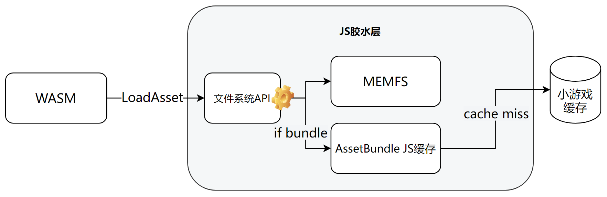
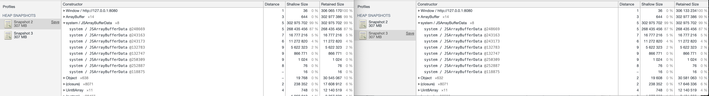
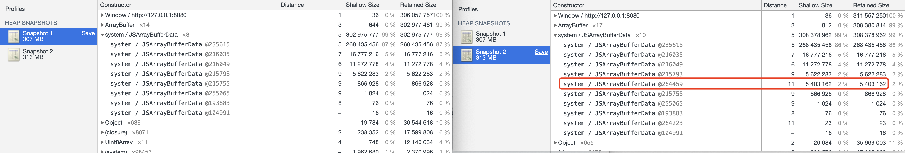

# 使用AssetBundle

*首先，相比AssetBundle，更推荐使用[Addressable Assets System](UsingAddressable.md)*

本文对AssetBundle使用做简要介绍，同时分析四种下载方式的内存占用情况

## 一、AssetBundle使用
注意：小游戏环境不支持assetbundle本地加载
### 1.1 AssetBundle打包参数建议
```c#
public static void Build()
{
    string dst = Application.streamingAssetsPath + "/AssetBundles";
    if (!Directory.Exists(dst))
    {
        Directory.CreateDirectory(dst);
    }
    BuildPipeline.BuildAssetBundles(dst, BuildAssetBundleOptions.AppendHashToAssetBundleName | BuildAssetBundleOptions.ChunkBasedCompression | UnityEditor.BuildAssetBundleOptions.DisableWriteTypeTree | BuildAssetBundleOptions.None, BuildTarget.WebGL);
}
```
打包bundle时，请使用如下参数
- 【重要】BuildAssetBundleOptions.AppendHashToAssetBundleName：bundle带上hash。在小游戏底层对bundle做缓存及缓存淘汰时，hash是重要依据，请查阅[小游戏资源缓存](FileCache.md)
- BuildAssetBundleOptions.ChunkBasedCompression：LZ4压缩方式，加载速度和包体大小更均衡。
- 如非需要新老Unity引擎版本兼容，请使用DisableWriteTypeTree提升加载速度与降低内存。
 
### 1.2 AssetBundle下载
从服务器下载bundle的方式主要以下两种：

- UnityWebRequestAssetBundle.GetAssetBundle
  ```c#
  UnityWebRequest request = UnityWebRequestAssetBundle.GetAssetBundle(uriPath);
  yield return request.SendWebRequest();
  if (request.isHttpError)
  {
      Debug.LogError(GetType() + "/ERROR/" + request.error);
  }
  else
  {
      AssetBundle ab = (request.downloadHandler as DownloadHandlerAssetBundle).assetBundle;
      // ab.LoadAsset
      ab.Unload(false);
  }
  request.Dispose();
  ```
- UnityWebRequest
  ```c#
  UnityWebRequest www = new UnityWebRequest(uriPath);
  DownloadHandlerAssetBundle handler = new DownloadHandlerAssetBundle(www.uri.ToString(), 0);
  www.downloadHandler = handler;
  yield return www.Send();
  if (www.isHttpError)
  {
      Debug.LogError(GetType() + "/ERROR/" + www.error);
  } else
  {
      AssetBundle ab = handler.assetBundle
      // ab.LoadAsset
      ab.Unload(false);
  }
  www.Dispose();
  ```

  
  ***特别地， 切忌使用WWW.LoadFromCacheOrDownload或WWW等带cache接口，WebGL模式下将会使用JS模拟文件系统带来额外内存消耗！***
 

## 二、在小游戏中使用AssetBundle

小游戏因其平台特殊性，需要保证加载速度，因此我们在底层对bundle文件做了缓存，开发者无须自己实现缓存。

游戏逻辑还是按照未缓存需要从网络下载去编写，插件底层会判断是否已有缓存。若未缓存则缓存此bundle；若已缓存，则返回缓存文件，实际不会发起网络请求。

可参见[资源缓存与淘汰](UsingLoader.md)

资源缓存与更新的不同，会导致APP与小游戏不同的加载流程
- 常见APP AssetBundle使用方式:

检查更新-->下载更新全量资源-->写入文件系统-->运行时LoadFromFile

   
- 微信小游戏 AssetBundle使用方式

打包ab时文件名带hash-->UnityWebRequest按需下载并使用资源

***在业务侧看来：总是使用异步接口从远程下载并使用，底层资源的缓存与更新已由适配层自动完成，游戏不再直接读写文件系统。***


## 三、更节省内存的WXAssetBundle
- 简介与原理

  Unity的 **AssetBundle.LoadFromFile()** 原本是打开一个文件流，LoadAsset通过文件描述符fd去读实际的目标对象。**因此不需要存储完整的AssetBundle（只需存储包头、查找表），可节省内存。**

  而由于[**WebGL的文件系统是在JS内存中维护的**](https://emscripten.org/docs/porting/files/file_systems_overview.html)，不会实际读写到磁盘，无法使用LoadFromFile()达到节约内存的目的。

  为此，我们在微信小游戏环境将文件系统接口桥接到了微信的文件系统接口，使其可以读写到小游戏缓存目录。同时提供了包装好的Unity SDK以便开发者使用。

  


- 使用说明

  Addressable也可使用，可参考[使用WXAssetBundleProvider节省内存](UsingAddressable.md#24-使用wxassetbundleprovider节省内存) 修改Provider。

  AssetBundle目前只支持异步加载。参考示例如下：

  ```C#
  // 【推荐】原本使用WebRequest的话可按如下修改
  using WeChatWasm;
  UnityWebRequest bundleReq = WXAssetBundle.GetAssetBundle(url); // UnityWebRequestAssetBundle => WXAssetBundle
  yield return bundleReq.SendWebRequest();
  AssetBundle bundle = (bundleReq.downloadHandler as DownloadHandlerWXAssetBundle).assetBundle; // DownloadHandlerAssetBundle => DownloadHandlerWXAssetBundle
  bundle.WXUnload(); //bundle还是AssetBundle类型，但需要调用扩展方法WXUnload()才可真正卸载
  ```

- 注意事项

  此套接口只可在微信小游戏环境下使用！需要同时导出WebGL版本的，建议自行在修改接口时候加编译宏方便控制导出版本。

  频繁读写磁盘损耗性能，于是我们仍旧在JS内存中维护了完整bundle的缓存，只有使用到已被清理的bundle时才会一次性从磁盘完整读进内存，而高频读取资源时通过缓存完成请求。**默认情况下5秒未使用的bundle会被从内存中清理。**

  读磁盘必定影响性能，所以我们只推荐对内存要求高的重度游戏使用。

## 四、AssetBundle下载API内存分析
 ### 4.1 切勿使用带Cache能力的线管接口

加载的bundle文件大小为5403162字节
```bash
-rw-r--r--  1  Users  5403162  6 22 16:07 image1_751427a66d22b184c95342d556354150
```
通过加载前后snapshot来对比总内存变化
- UnityWebRequestAssetBundle.GetAssetBundle/UnityWebRequest/WWW
   这三种加载方式加载前后内存无变化
   

- WWW.LoadFromCacheOrDownload
   加载bundle后内存增加了5403162字节，增加了bundle大小的内存，是因为WWW.LoadFromCacheOrDownload除了会将文件存入IndexDB外，还会存入内存中的UnityCache
   

**因此需要注意业务中不要使用已淘汰的WWW类，尤其WWW.LoadFromCacheOrDownload，当bundle数量多时，会浪费不少内存。**

 ### 4.2 尽可能使用Unload
- 当bundle从资源服务器下载并使用，会经历多次内存分配:
浏览器HTTP对象-->拷贝到WASM临时内存-->Unity ab内存文件(略大于ab本身体积， 相对于APP常用的LoadFromFile，WebGL这部分开销是额外的)
- 当HTTP对象dispose之后，Unity ab内存文件
- 当ab.Unload时，Unity ab内存文件释放

因此，最佳实践是业务应该尽可能早地使用ab.Unload(false)，自行维护Asset的引用计数管理资源。

## 四、参考资料
1. Introduction to Asset Bundles
  https://learn.unity.com/tutorial/introduction-to-asset-bundles#6028bab6edbc2a750bf5b8a7
2. Unity WebGL Memory Optimization: Part Deux
  https://blog.kongregate.com/unity-webgl-memory-optimization-part-deux/
3. Understanding Memory in Unity WebGL
  https://blog.unity.com/technology/understanding-memory-in-unity-webgl
4. AssetBundle API
  https://docs.unity3d.com/2019.4/Documentation/ScriptReference/AssetBundle.html
