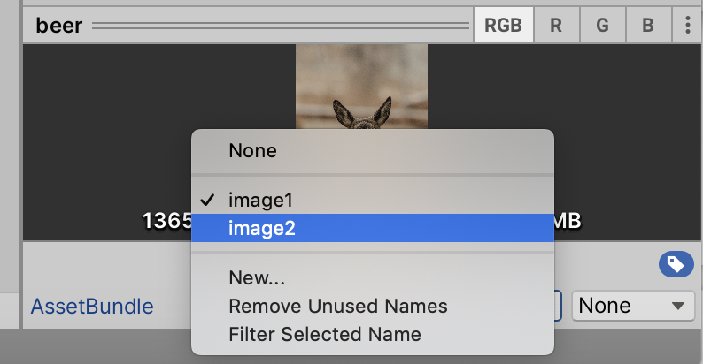

# 使用AssetBundle

*首先，相比AssetBundle，更推荐使用[Addressable Assets System](UsingAddressable.md)*

本文对AssetBundle使用做简要介绍，同时分析四种下载方式的内存占用情况

## 一、AssetBundle使用
注意：小游戏环境不支持assetbundle本地加载
### 1.1 组织资源
自行组织资源如何分组，以及各个bundle之间依赖关系，包名相同的资源会打包到一起

### 1.2 AssetBundle打包
```c#
public static void Build()
{
    string dst = Application.streamingAssetsPath + "/AssetBundles";
    if (!Directory.Exists(dst))
    {
        Directory.CreateDirectory(dst);
    }
    BuildPipeline.BuildAssetBundles(dst, BuildAssetBundleOptions.AppendHashToAssetBundleName | BuildAssetBundleOptions.ChunkBasedCompression | BuildAssetBundleOptions.None, BuildTarget.WebGL);
}
```
打包bundle时，请使用如下参数
- 【重要】BuildAssetBundleOptions.AppendHashToAssetBundleName：bundle带上hash。在小游戏底层对bundle做缓存及缓存淘汰时，hash是重要依据。
- BuildAssetBundleOptions.ChunkBasedCompression：LZ4压缩方式，加载速度和包体大小更均衡。
 
### 1.3 AssetBundle下载
从服务器下载bundle的方式主要以下四种。
**注意：WWW和WWW.LoadFromCacheOrDownload已不被Unity推荐使用**

- UnityWebRequestAssetBundle.GetAssetBundle
  ```c#
  UnityWebRequest request = UnityWebRequestAssetBundle.GetAssetBundle(uriPath);
  yield return request.SendWebRequest();
  if (request.isHttpError)
  {
      Debug.LogError(GetType() + "/ERROR/" + request.error);
  }
  else
  {
      AssetBundle ab = (request.downloadHandler as DownloadHandlerAssetBundle).assetBundle;
      // ab.LoadAsset
      ab.Unload(false);
  }
  request.Dispose();
  ```
- UnityWebRequest
  ```c#
  UnityWebRequest www = new UnityWebRequest(uriPath);
  DownloadHandlerAssetBundle handler = new DownloadHandlerAssetBundle(www.uri.ToString(), 0);
  www.downloadHandler = handler;
  yield return www.Send();
  if (www.isHttpError)
  {
      Debug.LogError(GetType() + "/ERROR/" + www.error);
  } else
  {
      AssetBundle ab = handler.assetBundle
      // ab.LoadAsset
      ab.Unload(false);
  }
  www.Dispose();
  ```

  
  ***特别地， 切忌使用WWW.LoadFromCacheOrDownload或WWW等带cache接口，WebGL模式下将会使用JS模拟文件系统带来额外内存消耗！***
 

## 二、在小游戏中使用AssetBundle

小游戏因其平台特殊性，需要保证加载速度，因此我们在底层对bundle文件做了缓存，开发者无须自己实现缓存。

游戏逻辑还是按照未缓存需要从网络下载去编写，插件底层会判断是否已有缓存。若未缓存则缓存此bundle；若已缓存，则返回缓存文件，实际不会发起网络请求。

可参见[资源缓存与淘汰](UsingLoader.md)

资源缓存与更新的不同，会导致APP与小游戏不同的加载流程
- 常见APP AssetBundle使用方式:

检查更新-->下载更新全量资源-->写入文件系统-->运行时LoadFromFile

   
- 微信小游戏 AssetBundle使用方式

打包ab时文件名带hash-->UnityWebRequest按需下载并使用资源

***在业务侧看来：总是使用异步接口从远程下载并使用，底层资源的缓存与更新已由适配层自动完成，游戏不再直接读写文件系统。***


## 三、AssetBundle下载API内存分析
 ### 3.1 切勿使用带Cache能力的线管接口

加载的bundle文件大小为5403162字节
```bash
-rw-r--r--  1  Users  5403162  6 22 16:07 image1_751427a66d22b184c95342d556354150
```
通过加载前后snapshot来对比总内存变化
- UnityWebRequestAssetBundle.GetAssetBundle/UnityWebRequest/WWW
   这三种加载方式加载前后内存无变化
   

- WWW.LoadFromCacheOrDownload
   加载bundle后内存增加了5403162字节，增加了bundle大小的内存，是因为WWW.LoadFromCacheOrDownload除了会将文件存入IndexDB外，还会存入内存中的UnityCache
   

**因此需要注意业务中不要使用已淘汰的WWW类，尤其WWW.LoadFromCacheOrDownload，当bundle数量多时，会浪费不少内存。**

 ### 3.2 尽可能使用Unload
- 当bundle从资源服务器下载并使用，会经历多次内存分配:
浏览器HTTP对象-->拷贝到WASM临时内存-->Unity ab内存文件(略大于ab本身体积， 相对于APP常用的LoadFromFile，WebGL这部分开销是额外的)
- 当HTTP对象dispose之后，Unity ab内存文件
- 当ab.Unload时，Unity ab内存文件释放

因此，最佳实践是业务应该尽可能早地使用ab.Unload(false)，自行维护Asset的引用计数管理资源。

## 四、参考资料
1. Introduction to Asset Bundles
  https://learn.unity.com/tutorial/introduction-to-asset-bundles#6028bab6edbc2a750bf5b8a7
2. Unity WebGL Memory Optimization: Part Deux
  https://blog.kongregate.com/unity-webgl-memory-optimization-part-deux/
3. Understanding Memory in Unity WebGL
  https://blog.unity.com/technology/understanding-memory-in-unity-webgl
4. AssetBundle API
  https://docs.unity3d.com/2019.4/Documentation/ScriptReference/AssetBundle.html
