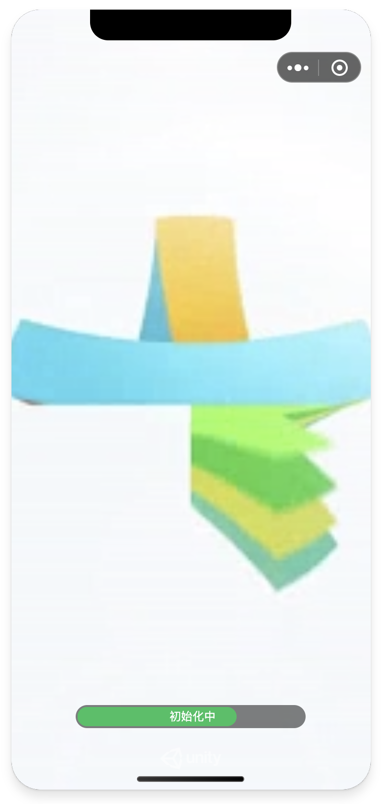

# 使用Loader进行游游戏加载

## 一、什么是Unity Loader？
Unity Loader是在微信小游戏环境加载Unity WebGL游戏的加载与适配器，使用微信小游戏插件技术开发，功能包括：
- WebAssembly代码分包加载与编译
- 资源加载与编译
- 启动进度显示
- 缓存策略
- 数据上报

## 二、如何使用Unity Loader插件
生成微信小游戏项目时，转换工具会在`game.json`中声明：
```json
"plugins": {
    "UnityPlugin": {
        "version": "major.minor.patch", // 可切换版本号
        "provider": "wxe5a48f1ed5f544b7",
        "contexts": [
            {
                "type": "isolatedContext"
            }
        ]
    }
}
```
这部分配置表示使用Unity Loader插件进行游戏加载，开发者无需手动修改

## 三、配置Unity Loader功能
### 3.1 资源下载
声明CDN地址
#### 转换插件相关配置

```
CDN: cdn地址
dataFileSubPrefix: 首包资源相对cdn地址的存放目录，默认首包资源放在cdn一级目录
```
### 3.2 启动界面
由于Unity WebGL启动加载需要一定时间，因此需要使用视频或图片等内容作为过渡以留住玩家。Unity Loader默认使用视频+进度信息呈现，开发者可以自定义封面/视频，可参考[启动Loader视频规范](video.md)进行配置。
  


#### 转换插件相关配置
```
bgImageSrc: 启动封面图；-- $BACKGROUND_IMAGE
VideoUrl: 启动视频；-- $LOADING_VIDEO_URL
HideAfterCallMain: 是否callmain完成后立即隐藏封面；-- $HIDE_AFTER_CALLMAIN
loadingBarWidth: 加载进度条宽度；-- $LOADING_BAR_WIDTH
```

#### game.js配置
```js
loadingPageConfig: {
  // 背景图或背景视频，两者都填时，先展示背景图，视频可播放后，播放视频
  backgroundImage: '$BACKGROUND_IMAGE', // 默认的背景图，可自行替换，支持本地图片和网络图片
  backgroundVideo: '$LOADING_VIDEO_URL', // 视频url，需要开发者提供，只支持网络url
  // 以下是默认值
  barWidth: $LOADING_BAR_WIDTH, // 加载进度条宽度，默认240，加载文案过长时可设置
  totalLaunchTime: 15000, // 默认总启动耗时，即加载动画默认播放时间，可根据游戏实际情况进行调整
  textDuration: 1500, // 当downloadingText有多个文案时，每个文案展示时间
  firstStartText: '首次加载请耐心等待', // 首次启动时提示文案
  downloadingText: ['正在加载资源'], // 加载阶段循环展示的文案
  compilingText: '编译中', // 编译阶段文案
  initText: '初始化中', // 初始化阶段文案
  completeText: '开始游戏', // 初始化完成
},
hideAfterCallmain: $HIDE_AFTER_CALLMAIN, // 是否callmain完成立即隐藏封面
```
> backgroundImage需要注意图片宽高不可超过2048，否则无法显示
> 使用coverview需要基础库版本>=2.16.1，插件已做兼容，若不支持，降级为使用离屏canvas渲染进度的方式
> hideAfterCallmain: 游戏业务Awake逻辑耗时较高时可能导致出现短暂黑屏，改为false可盖住黑屏，等游戏第一帧渲染时隐藏
### 3.3 首包资源加载方式
**加载方式在转换工具导出时就确定好了，开发者一般不需要修改**
当**游戏资源量比较少**时，可选择将首包资源作为小游戏分包加载，了解[小游戏分包](https://developers.weixin.qq.com/minigame/dev/guide/base-ability/sub-packages.html)
wasm代码已是通过代码分包加载，当**wasm代码+首包资源>20M时，资源包不可再使用小游戏分包加载**。
当首包资源通过小游戏代码分包下载时，会将首包资源存放在minigame/data-package这个分包下

#### 转换插件相关配置
```
assetLoadType: -- $LOAD_DATA_FROM_SUBPACKAGE
```

#### game.js配置
```js
let managerConfig = {
  /* 省略其他配置 */
  loadDataPackageFromSubpackage: $LOAD_DATA_FROM_SUBPACKAGE, // 转换工具自动替换
}
```
- 若手动将`loadDataPackageFromSubpackage`改为false，需要将webgl目录下的资源包上传到CDN，并将CDN地址填写到game.js`DATA_CDN`字段
- 同样的，若手动将`loadDataPackageFromSubpackage`改为true，需要将webgl目录下的资源包copy到minigame/data-package下

### 3.4 预加载资源
为了充分利用网络带宽，在网络空闲时可预下载游戏需要用到的AB包。详细配置请参考[使用预下载功能](UsingPreload.md)。

### 3.5 资源缓存与淘汰策略
loader会自动按一定规则做文件缓存，加快二次启动速度
详情参考[资源缓存](FileCache.md)
