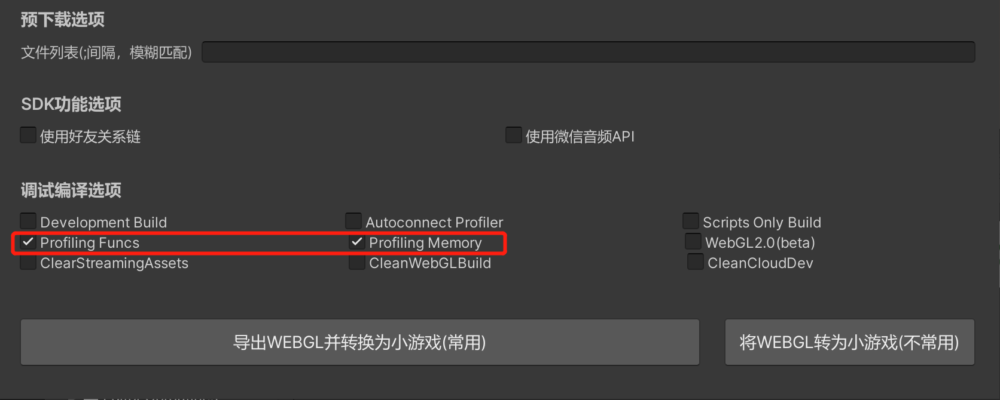
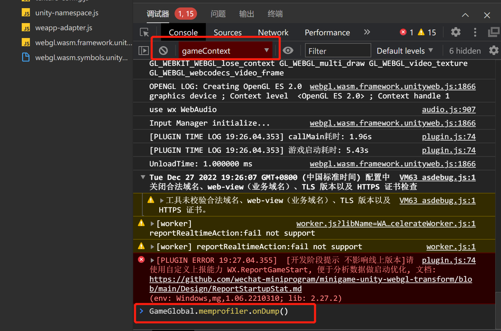
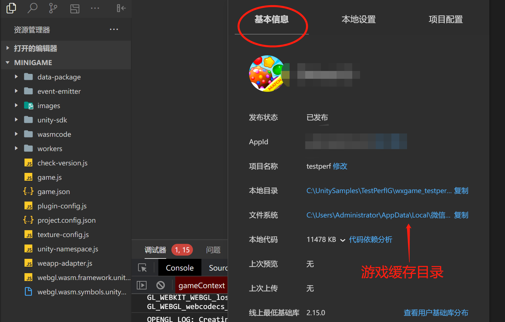
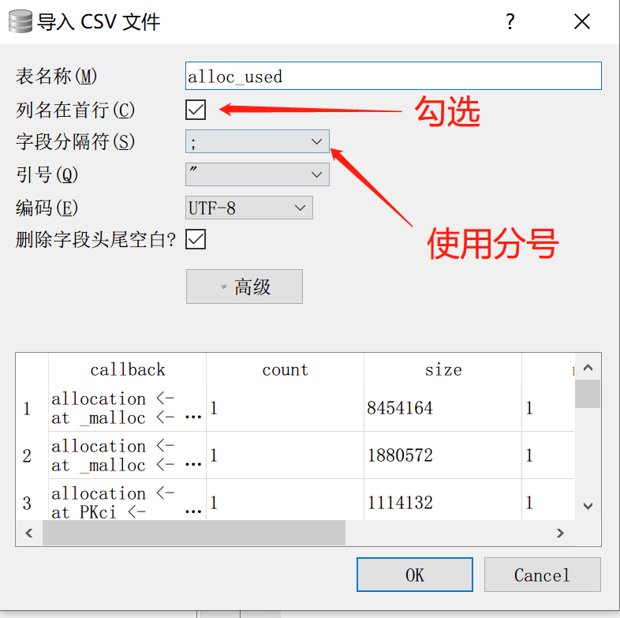
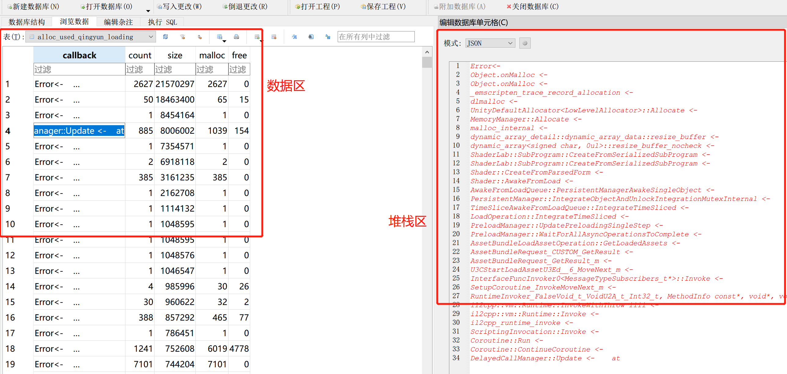

# 使用ProfilingMemory内存分析

## 概述
在微信开发者工具运行游戏，利用ProfilingMemory，我们可以分析UnityHeap(CPU主内存)的详细分配堆栈与统计数值

## 步骤
1. 游戏启动调用WeChatWASM.WX.InitSDK，并勾选导出选项"Profiling Funcs"与"Profiling Memory"，***请勿同时勾选"Development Build"选项！！！***


2. 在微信开发者工具运行游戏，过程中会自动记录所有内存分配数据

3. 导出内存堆栈数据
- 方式1：点击性能面板左上角的"ProfilingMemory Dump" 完成导出（开启性能面板可通过修改unity-namespace.js-enableProfileStats或C#调用OpenProfileStats）
- 方式2：者在微信开发者工具中选择gameContext, 并在Console输入命令: GameGlobal.memprofiler.onDump()。


4. 微信开发者工具-“游戏缓存目录/usr/alloc_used.csv”（Android位于data/com.tencent.mm/MicroMsg/wxanewfiles/最近使用时间的目录）拖拽并以csv方式导入sqlite数据库， 推荐使用[DB Browser for SQLite](https://sqlitebrowser.org/)

   
   

5. 对表格执行格式化换行
update alloc_used set callback=replace(callback, 'at ', x'0a')

## 数据分析
### 浏览数据
典型地，我们可以通过size进行排序分析内存最大占用的堆栈情况


其中：
- callback: 堆栈
- count: 当前存活的分配次数
- size: 当前使用内存
- malloc: 总分配次数
- free: 总释放次数

### SQL统计分析
我们可以在"执行SQL"窗口使用SQL进行数据统计和分析，常见的callback分配堆栈特征：

Unity 2021:
```
 所有内存： select sum(size) from alloc_used

 AssetBundle Storage Memory: select sum(size) from alloc_used where callback like "%AssetBundle_LoadFromMemory%" or callback like "%OnFinishReceiveData%" or callback like "%AssetBundleLoadFromStream%"


 AssetBundle Info:  select sum(size) from alloc_used where callback like "%get_assetBundle%" and callback not like "%AwakeFromLoad%"
 
 AssetBundle TypeTree: select sum(size) from alloc_used where callback like "%TypeTree%" 

 Lua: select sum(size) from alloc_used where callback like "%luaY_parser%" or callback like "%luaH_resize%" or callback like "%luaM_realloc%"

 Shader: select sum(size) from alloc_used where callback like "%ShaderLab%"

 IL2CPP runtime: select sum(size) from alloc_used where callback like "%MetadataCache%"

 非压缩纹理软解: select sum(size) from alloc_used where callback like "%Mipmap%"

Other： select sum(size) from alloc_used where callback not like "%xxx%" or callback not like "%xxx%"
 ```
 
 Unity 2018~2020：
 ```
 AssetBundle Storage Memory: select sum(size) from alloc_used where callback like "%AssetBundleLoadFromStreamAsyncOperation%" 
 
 AssetBundle Info: select sum(size) from alloc_used where callback like "%get_assetBundle%" and callback not like "%AwakeFromLoad%"
 
 AssetBundle TypeTree: select sum(size) from alloc_used where callback like "%TypeTree%"
 
 Lua： select sum(size) from alloc_used where callback like "%luaY_parser%" or callback like "%luaH_resize%" or callback like "%luaM_realloc%" 
 
 Shader: select sum(size) from alloc_used where callback like "%ShaderFromSerializedShader%"
 
 IL2CPP runtime: select sum(size) from alloc_used where callback like "%MetadataCache%" -19M
 
 动画数据： select  sum(size) from alloc_used where callback like "%AnimationClip%" -7MB
 
 非压缩纹理软解: select sum(size) from alloc_used where callback like "%Mipmap%"

 Other： select sum(size) from alloc_used where callback not like "%xxx%" or callback not like "%xxx%"
 ```
 
 除了常见的堆栈特征外，我们也可以根据业务自己的使用特点来进行SQL分析。

## 常见问题
### 1. 开启ProflingMemory后非常慢，特别是在有Lua逻辑的情况
- 首先，这是正常情况，因为每次分配内存都会获取堆栈信息导致运行慢
- Lua会存在大量分配行为，会加重这个问题， 因此我们提供了专门的内存分配器忽略Lua内存，具体做法：

1. 将[simpledlmalloc.c](../tools/simpledlmalloc.c)添加到xLua虚拟机源码目录下参与编译，（和lauxlib.c同一目录）
2. 参考[lauxlib.c](../tools/lauxlib.c)，在lua源码目录下的同名文件中增加`simple_dlmalloc`，并修改`LUALIB_API lua_State *luaL_newstate (void)` 为如下所示
   ```C
   #include "simpledlmalloc.c"
    static void *simple_dlmalloc (void *ud, void *ptr, size_t osize, size_t nsize) {
        (void)ud; (void)osize;  /* not used */
        if (nsize == 0) {
            dlfree(ptr);
            return NULL;
        }
        else
            return dlrealloc(ptr, nsize);
    }

    // using other_alloc instead of default dlmalloc to avoid print trace of lua
    LUALIB_API lua_State *luaL_newstate (void) {
        // lua_State *L = lua_newstate(l_alloc, NULL);
        lua_State *L = lua_newstate(simple_dlmalloc, NULL);
        if (L) lua_atpanic(L, &panic);
        return L;
    }
   ```

### 2. ProfilingMemory在真机上更容易出现内存崩溃
- ProfilingMemory功能需要额外的内存记录堆栈与相关统计，因此JS侧内存压力会更大
- 理论上UnityHeap(CPU主内存)在不同端上的行为基本是一致的，由于iOS内存更苛刻，建议使用微信开发者工具或Android真机进行内存堆栈导出
 

