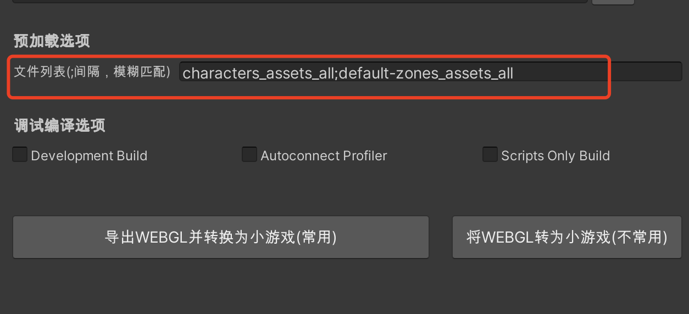

# 使用预下载功能
## 概述
通过 [启动流程与时序](Startup.md)我们知道，在UnityLoader加载过程中存在**网络空闲**的情况。特别是“引擎初始化和首场景准备”，影响该步骤包括：引擎自身模块与数据初始化，游戏首个场景加载以及Awake流程。这个过程是CPU处理密集，但网络空闲的期间，根据机型性能不同，通常**平均耗时会在3~6s**左右，我们可以在此阶段提前下载资源。

在引擎初始化期间，最多**并发10个**预下载。已发起但未完成的下载任务，以及列表中尚未发起的任务，会在引擎初始完成后继续进行，但**并发数为1个**。可通过`WX.SetConcurrent`修改引擎初始化后的预下载并发数，若想修改引擎初始化期间的并发数，需要使用js接口`GameGlobal.manager.setConcurrent`

## 配置方式
### 导出预下载列表


#### MiniGameConfig.asset相关配置
```
preloadFiles: -- $PRELOAD_LIST
```

在Unity转换导出插件填写文件列表，生成时工具会自动从**webgl/StreamAssets目录**找资源并填充到game.js。
运行时UnityLoader将根据列表内容在网络空闲期下载。

### 手动配置
除了在Unity转换导出插件填写文件列表外，也可以在生成的game.js手动配置：
``` js
let managerConfig = {
  /* 省略其他配置 */

  /** 
   * 假设: AB包打包到 path1/StreamingAssets/WebGL这个目录下; STREAMING_CDN是以path1为根路径上传到服务器的CDN地址
   */
  // 需要在网络空闲时预加载的资源，支持如下形式的路径。
  preloadDataList: [
    // '$STREAM_CDN/StreamingAssets/WebGL/textures_8d265a9dfd6cb7669cdb8b726f0afb1e',
    // '/WebGL/sounds_97cd953f8494c3375312e75a29c34fc2'
    "$PRELOAD_LIST" // 导出时自动替换
  ],
}
```

### 运行时配置「推荐」
可能存在资源热更，导致配置在预下载列表中的资源是旧版本的资源。支持通过接口在运行时动态修改预下载列表

#### 在插件启动前修改
在插件启动前，拉取游戏后台获取最新的预下载列表，修改 `managerConfig.preloadDataList` 或通过js接口 `GameGlobal.manager.setPreloadList` 修改

#### 引擎初始化完成后修改
同样的，拉取游戏后台接口获取最新的预下载列表后，通过C#接口 `WX.SetPreloadList` 修改

## 路径规范
- 若填写完成路径，如`$STREAM_CDN/StreamingAssets/WebGL/textures_8d265a9dfd6cb7669cdb8b726f0afb1e`；实际发起预载请求的URL采用填写的地址
- 若填写相对路径，如`/WebGL/sounds_97cd953f8494c3375312e75a29c34fc2`；实际发起请求的URL为`DATA_CDN/StreamingAssets/WebGL/sounds_97cd953f8494c3375312e75a29c34fc2`

## 如何验证
[查看插件调试信息](UsingLoader.md#36-插件调试信息), 当存在 `PreloadManager:` 字样日志，即为预下载。

## 注意事项
1. 预下载所有文件总体积应控制在合理范围内，通常可以3~5MB左右的内容。
2. 文件数量应控制在10个以内，在此阶段最多只能允许10个并发，超过将会排队。
3. UnityLoader插件已经考虑到业务会重复请求预下载的文件，游戏逻辑依然按未使用预下载的异步加载逻辑，无需做其他处理。如果预下载完成UnityLoader会立即构造网络数据返回，业务无感知。
4. 添加到预下载列表中的文件，需是插件会自动缓存的文件，否则会导致下载浪费，预下载无效，详见[资源缓存](FileCache.md)
5. 会按照列表顺序发起预下载，请将优先需要的资源放到列表前面。