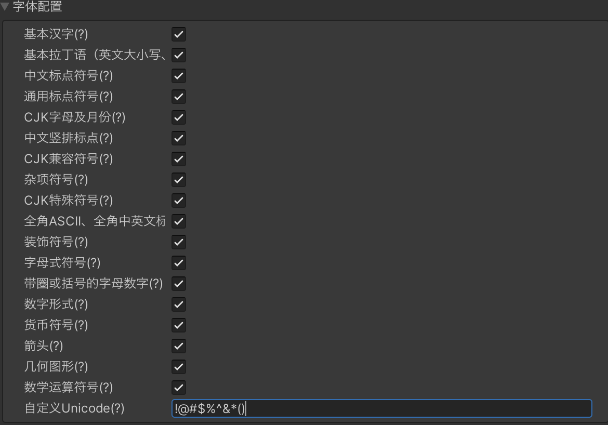

# 微信系统字体
游戏基本会使用中文，中文字体大小少则2-3M。

通过微信系统字体，从本地加载中文，可节省启动下载的资源量。在不支持使用微信系统字体时，回退成通过CDN下载后备字体的形式。

**IOS18暂不支持使用微信系统字体，必须提供后备字体才能正常使用。**

## 版本要求
`转换插件 >= 202306292010` 提供了 `WX.GetWXFont` 接口用于加载后备/系统字体

其中，微信客户端满足以下版本要求时，可从本地加载字体，无需网络下载
- 安卓微信客户端版本 >= 8.0.34
- iOS微信客户端版本 >= 8.0.39

若不满足客户端版本要求，首次从网络下载；当符合缓存规则时，后续从[本地文件缓存加载](FileCache.md)，因此必须提供 CDN 后备字体。

## 代码示例
详细示例可参考[系统字体demo](https://github.com/wechat-miniprogram/minigame-unity-webgl-transform/tree/main/Demo/WX_Font)

```csharp
var fallbackFont = "https://www......com/字体文件.ttf";
WeChatWASM.WX.GetWXFont(fallbackFont, (font) =>
{
    text.font = font;
    tmpText.font = TMP_FontAsset.CreateFontAsset(font);
});
```

## 相关日志
- 打开[插件调试日志](UsingLoader.md#_3-6-插件调试日志)
- 日志中查看以下字样 `[PLUGIN LOG xxx][font]`，例如
  - 使用微信字体：
    - `[PLUGIN LOG xxx][font] load font from local`
    - `[PLUGIN LOG xxx][font]读取字体文件耗时=xxms, 字体大小=xxMB`
  - 使用网络字体：
    - `[PLUGIN LOG xxx][font] load font from network, url=https://www......com/字体文件.ttf`
    - `[PLUGIN LOG xxx]xhr_onload: 字体文件.ttf,耗时=xxms,size=xx,无缓存`

异常日志：
- `[PLUGIN LOG xxx][font]无中文字体`：本地无可用系统字体，常见为安卓系统版本低于7.1
- `[PLUGIN LOG xxx][font]无字体文件内容`：读取字体文件失败，未知原因，可提供微信日志给平台侧排查

## 系统字体字符集

使用GetWXFont加载的字体集合可以在转换面板进行自定义，以减少加载的字体文件大小：



若需要某些特殊Unicode/仅需要部分Unicode，可以直接将需要的字符全部填入自定义Unicode中。

Unicode集合参考：

```js
// https://unicode.yunser.com/unicode
const unicodeRange = [
  // 基本汉字 https://www.unicode.org/charts/PDF/U4E00.pdf
  [0x4e00, 0x9fff],
  // 基本拉丁语（英文大小写、数字、英文标点）https://www.unicode.org/charts/PDF/U0000.pdf
  [0x0, 0x7f],
  // 中文标点符号 https://www.unicode.org/charts/PDF/U3000.pdf
  [0x3000, 0x303f],
  // 通用标点符号 https://www.unicode.org/charts/PDF/U2000.pdf
  [0x2000, 0x206f],
  // CJK字母及月份 http://www.unicode.org/charts/PDF/U3200.pdf
  [0x3200, 0x32ff],
  // 中文竖排标点 http://www.unicode.org/charts/PDF/UFE10.pdf
  [0xfe10, 0xfe1f],
  // CJK兼容符号 http://www.unicode.org/charts/PDF/UFE30.pdf
  [0xfe30, 0xfe4f],
  // 杂项符号 http://www.unicode.org/charts/PDF/U2600.pdf
  [0x2600, 0x26ff],
  // CJK特殊符号 http://www.unicode.org/charts/PDF/U3300.pdf
  [0x3300, 0x33ff],
  // 全角ASCII、全角中英文标点、半宽片假名、半宽平假名、半宽韩文字母 http://www.unicode.org/charts/PDF/UFF00.pdf
  [0xff00, 0xffef],
  // 装饰符号 http://www.unicode.org/charts/PDF/U2700.pdf
  [0x2700, 0x27bf],
  // 字母式符号 https://www.unicode.org/charts/PDF/U2100.pdf
  [0x2100, 0x214f],
  // 带圈或括号的字母数字 https://www.unicode.org/charts/PDF/U2460.pdf
  [0x2460, 0x24ff],
  // 数字形式 https://www.unicode.org/charts/PDF/U2150.pdf
  [0x2150, 0x218f],
  // 货币符号 https://www.unicode.org/charts/PDF/U20A0.pdf
  [0x20a0, 0x20cf],
  // 箭头 https://www.unicode.org/charts/PDF/U2190.pdf
  [0x2190, 0x21ff],
  // 几何图形 https://www.unicode.org/charts/PDF/U25A0.pdf
  [0x25a0, 0x25ff],
  // 数学运算符号 https://www.unicode.org/charts/PDF/U2200.pdf
  [0x2200, 0x22ff],
];
```
