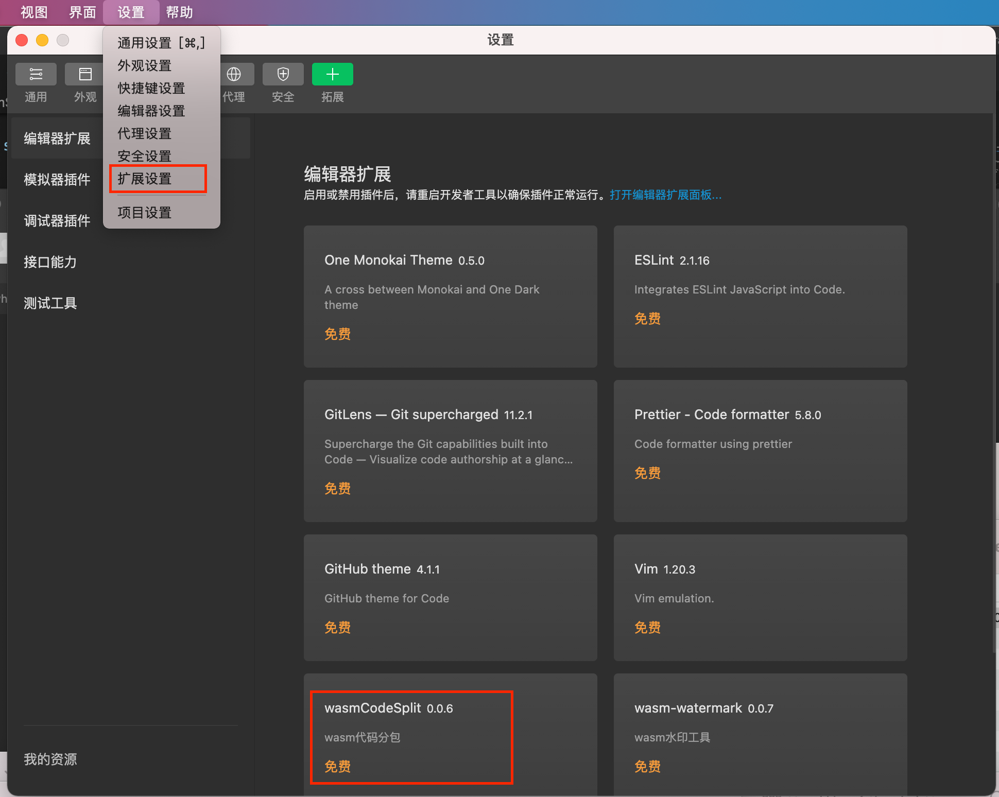
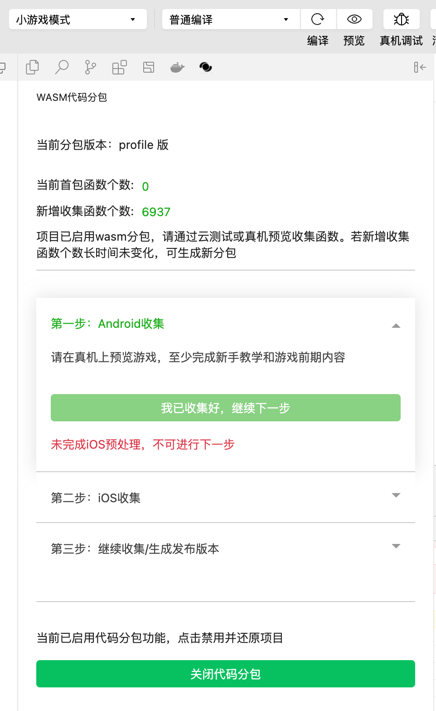

# 代码分包

## 介绍

unity导出小游戏项目后，代码是在一个wasm文件里，经过brotli压缩后，放在wasmcode目录下

一般小游戏的wasm大小都为30M左右，压缩后为6M左右

启动阶段，小游戏需要先下载完wasmcode再编译，这里会占用较高的内存和时间

因此我们提供了代码分包工具，将原来的wasm拆分为两个，一个用于启动加载，另一个可以延迟加载

使得小游戏可以先加载较小的首包进入主场景，再异步加载剩下的分包

## 作用

分包的作用在于优化启动时间

另外对于iOS新的高性能模式，分包还有两个作用：

1. 减少内存使用，以支持更多iOS低端机上运行高性能模式
2. 减少编译时间，降低了游戏前期的发烫情况

## 原理

目前我们采用了一种 Profile Guided Optimization 的方式，通过运行时收集信息，按函数粒度对小游戏的 wasm 代码包进行拆分

开发者可以在离线测试阶段，通过真机运行小游戏，并尽量覆盖游戏内的场景，特别是启动后最先进入的场景和关卡（**比如新手教学，游戏最初的关卡内容**）来收集信息

工具上会显示收集到的函数个数，这时候就可以重新分包，将收集到的函数加入首包

因此收集工作非常重要，收集的场景覆盖率越高，命中子包的时机就可以相应延后，使得首包可以满足大部分新玩家前几分钟的游戏进程

## 插件

我们提供了一个**微信开发者工具**里的**插件**来辅助分包过程，依赖的[开发者工具](https://developers.weixin.qq.com/miniprogram/dev/devtools/download.html)版本为 1.05.2104251 RC 及以上，稳定版 1.05.2105100 已支持

分包工作流如图所示

如图所示，对于未分包项目，开发者可以在插件里启用分包，然后配置版本信息，这时候会插件会自动开始第一次分包，变成已分包项目

对于已经分包的项目，开发者每次覆盖运行了一些场景，收集到有新增函数个数的时候，就可以生成下一个分包

需要特别注意，**发布的时候要注意使用发布版本**

### 打开分包

通过开发者工具的设置-拓展设置-编辑器自定义拓展，安装 wasmCodeSplit 这个插件（插件后续0.0.6及以下存在部分使用问题，但不影响分包结果，我们会在0.0.7修复相关问题）

### 迭代流程
 
1. 打开插件开关后，在目录树上的工具栏中，可以看到插件的按钮，如图所示，点击后即可进入插件页：

2. 点击启用代码分包，新导出的小游戏（注：同一游戏从 unity 的不同次导出也认为是新的）会提示输入版本描述，简单输入方便识别版本的描述即可，然后插件会自动进行首次分包

3. 第一次分包完成后，就可以开始迭代式收集，每一轮迭代流程如下：

第1步：android收集

第2步：iOS收集

第3步：可以选择再来一轮或者生成发布版本

1，2步里的收集过程：
- 点击开发者工具的预览，在真机上跑，有条件的话可以尽量覆盖各种机型(主流品牌)以及平台(Android/iOS)
- 当插件页显示的收集到增量函数个数相对稳定时，可以点击“我已收集好，继续下一步”

随着迭代轮数增多，新增函数会越来越少，这里没有完成收集的标准，建议开发者能回归覆盖游戏的各种启动场景即可（不同进度，二次启动等等），目的是为了延迟依赖剩下的分包的时间

**注意：**

* 分包过程中尽量不要对小游戏项目进行编辑，开发者工具上的console报错也可以忽略，等分包完成后回到上图界面再操作
* 在第一次进入iOS分包之前，需要对代码包做预处理，这里预计需要等待10-30分钟

### 关闭分包

如果想回退到未分包的版本，点击插件页的关闭代码分包按钮即可

### 增量分包

从unity每一次导出后的小游戏，都需要重新分包，对于小版本改动会产生比较烦人的工作量

因此我们支持了增量分包，可以在二次导出时，通过选择之前已经进行过分包的版本，在之前分包的基础上进行增量分包

这里主要是通过symbol文件，按函数签名识别相同函数来实现的，因此需要导出时有symbol文件

**注意**

由于unity 2021目前导出symbol的流程有问题，在unity修复之前，需要先手动执行下工具来导出symbol，具体见导出后的unity console信息

### FAQ

* 分包是否是必要的

对于iOS高性能模式，由于内存限制，游戏加载完整wasm基本就会内存crash。分包能降低内存占用，同时我们对子包支持按需加载，才让游戏能稳定跑起来

所以如果是使用了iOS高性能模式则是必须的

对于android和iOS普通模式，分包主要目的是优化启动加载，另外这两个runtime下由于子包可以全量加载，因此对游戏运行影响最多只有加载子包的一次性影响

我们也会在启动callmain后30s提前加载子包，在这个时间之后才触发未收集函数的情况也不会有加载子包的影响

* 收集到什么时候可以结束

按照我们经验，一般首包函数有整包个数的33%以上的时候就可以接受了，当然能尽量再收集完善刚好，个别游戏可能会接近50%

这时候不代表没收集的函数都没用了，实际上有些函数可能只是调用比较冷门，后续还是可能会被调到，可以通过分包插件面板的`新增收集函数个数`来留意线上新增的情况，

如果线上新增较多（超过50），可以考虑再往下分一次包然后提审发布

* 新增收集的函数要重新再次提审才会在首包吗

对的，用户下载的代码包只能是提审发布过的

* 会不会最终跑到所有函数都收集的情况

目前还没出现这种情况，超过整包50%的都很少

大部分游戏收集1小时的函数个数都在33%到50%之间

可以等收集函数超过75%了再来考虑这个问题

* iOS高性能模式刚开始收集时进不去游戏

iOS高性能模式由于加载子包的实现不同，刚开始收集时又基本是跑子包函数，所以最开始的收集会比较卡

这个时候可以观察分包插件面板，如果能看到有新增函数个数的变化，一般就是没问题的。如果出现卡顿（并且有新增函数）或者新增函数较多（超过50），可以先继续往下生成分包，再进行收集。游戏运行会随着收集越来越流畅

* iOS高性能模式代码分包后内存反而变得很高

这种情况一般是太多新增函数（比如几百个），iOS高性能模式的子包代码也会占用大量内存，可以继续生成分包，将这部分函数放在首包（放首包的内存占用相对小些）

* 没有看到增量分包的界面

由于增量分包是新增的功能，因此之前的项目不能被用来增量更新。更新分包插件后，第二次导出的版本开始才可以使用

另外对于unity 2021的版本，注意检查下minigame目录下有没有webgl.wasm.symbols.unityweb这个文件，没有的话注意按照导出时unity console的指引执行工具生成这个文件