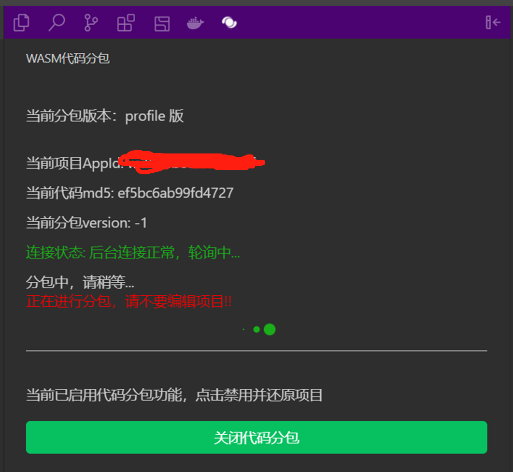

# 代码分包

- [代码分包](#代码分包)
  - [概述](#概述)
    - [背景](#背景)
    - [作用](#作用)
  - [实现原理](#实现原理)
  - [插件安装](#插件安装)
  - [插件更新](#插件更新)
  - [插件使用](#插件使用)
      - [启用分包](#启用分包)
      - [输入版本描述](#输入版本描述)
      - [等待上传文件](#等待上传文件)
      - [等待预处理](#等待预处理)
      - [选择是否增量分包](#选择是否增量分包)
      - [等待分包](#等待分包)
      - [android收集 + iOS收集](#android收集--ios收集)
      - [重复收集与生成](#重复收集与生成)
    - [关闭分包](#关闭分包)
    - [注意事项](#注意事项)
  - [FAQ](#faq)
    - [分包是否是必要的](#分包是否是必要的)
    - [收集到什么时候可以结束](#收集到什么时候可以结束)
    - [游戏内容难以遍历完整怎么办](#游戏内容难以遍历完整怎么办)
    - [分包总大小比原始包大](#分包总大小比原始包大)
    - [新增收集的函数要重新再次提审才会在首包吗](#新增收集的函数要重新再次提审才会在首包吗)
    - [会不会最终跑到所有函数都收集的情况](#会不会最终跑到所有函数都收集的情况)
    - [iOS 高性能模式收集很卡](#ios-高性能模式收集很卡)
    - [iOS 高性能模式代码分包后内存反而变得很高](#ios-高性能模式代码分包后内存反而变得很高)
    - [iOS 高性能模式出现 impport section's count is too big](#ios-高性能模式出现-impport-sections-count-is-too-big)
    - [没有看到增量分包的界面](#没有看到增量分包的界面)
    - [增量分包没生效](#增量分包没生效)
    - [如何更新分包插件](#如何更新分包插件)
    - [分包插件安装失败](#分包插件安装失败)
    - [分包插件卡住](#分包插件卡住)
    - [内存优化版本未观察到内存优化](#内存优化版本未观察到内存优化)
    - [如何查看分包插件日志](#如何查看分包插件日志)
  - [Changelog](#changelog)
    - [v1.1.10](#v1110)
      - [Fixed](#fixed)
    - [v1.1.9](#v119)
      - [Feature](#feature)
    - [v1.1.8](#v118)
      - [Changed](#changed)
    - [v1.1.6](#v116)
      - [Changed](#changed-1)
    - [v1.1.5](#v115)
      - [Fixed](#fixed-1)
    - [v1.1.4](#v114)
      - [Fixed](#fixed-2)
    - [v1.1.2](#v112)
      - [Changed](#changed-2)
    - [v1.1.0](#v110)
      - [Added](#added)
    - [v1.0.2](#v102)
      - [Added](#added-1)
## 概述

### 背景

unity 导出小游戏项目后，代码是在一个 wasm 文件里，经过 brotli 压缩后，放在 wasmcode 目录下

一般小游戏的 wasm 大小都为 30M 左右，压缩后为 6M 左右

启动阶段，小游戏需要先下载完 wasmcode 再编译，这里会占用较高的内存和时间

因此我们提供了代码分包工具，将原来的 wasm 拆分为两个，一个用于启动加载（主包），另一个可以延迟加载（子包）

使得小游戏可以先加载较小的首包进入主场景，再异步加载剩下的分包

另外对于iOS高性能模式，子包不会加载，会转为按函数粒度按需加载

### 作用

分包的作用在于优化启动时间

另外对于 iOS 新的高性能模式，分包还有两个作用：

1. 减少内存使用，以支持更多 iOS 低端机上运行高性能模式
2. 减少编译时间，降低了游戏前期的发烫情况

## 实现原理

目前我们采用了一种 Profile Guided Optimization 的方式，通过运行时收集信息，按函数粒度对小游戏的 wasm 代码包进行拆分

开发者可以在离线测试阶段，通过真机运行小游戏，并尽量覆盖游戏内的场景，特别是启动后最先进入的场景和关卡（比如新手教学，游戏最初的关卡内容）来收集信息

工具上会显示收集到的函数个数，这时候就可以重新分包，将收集到的函数加入首包

因此收集工作非常重要，收集的场景覆盖率越高，命中子包的时机就可以相应延后，使得首包可以满足大部分新玩家前几分钟的游戏进程

我们提供了一个微信开发者工具里的插件来辅助分包过程，依赖的[开发者工具](https://developers.weixin.qq.com/miniprogram/dev/devtools/download.html)版本为 1.05.2104251 RC 及以上，稳定版 1.05.2105100 已支持

## 插件安装
通过开发者工具的设置-拓展设置-编辑器自定义拓展，安装 wasmCodeSplit 这个插件

## 插件更新

开发者工具上（如果用的是stable版，非minigame版）的插件一般是自动更新的

手动更新

## 插件使用

分包插件按小游戏的md5（wasmcode下的wasm文件名里的md5）来区分不同的小游戏包

相同md5的小游戏包会复用同一份分包结果

对于新构建的小游戏包，分包流程如下：

* 点启用代码分包
* 输入当前项目版本描述
* 等待上传代码包
* 等待预处理
* 选择是否增量分包，然后下一步
* 等待第一次分包
* 进入正式分包阶段，先android收集，然后继续下一步
* iOS收集，然后继续下一步
* 选择生成profile或者release包，然后收集，这一步可以重复进行

最后一步这里已经可以随时上传体验版了

具体操作和注意事项如下

#### 启用分包

打开插件开关后，在目录树上的工具栏中，可以看到插件的按钮，如图所示，点击后即可进入插件页：
   

#### 输入版本描述
   

#### 等待上传文件
   

#### 等待预处理
   

**注意：如果出现红框中的提示，说明这里的状态更新已经中断，需要重启开发者工具**

这一步一般是分钟级的耗时，**如果等待超过10分钟，建议先重启下开发者工具**

#### 选择是否增量分包
   

如果这个游戏之前的包已经有用过代码分包，没有比较大的代码修改的情况下（比如大范围的代码重构，更换引擎），可以使用增量更新，也就是选择之前的某个包作为参考

我们会对比前后两个包的symbol，把之前收集过的函数当做放到首包，即无需重复收集

因此要求前后两个包都必须提供symbol文件

**在unity侧使用微信插件导出时，需要开启profiling func**，这样打包时就会导出symbol文件

**无需担心开启profiling func导致的包体增大，分包工具会优化函数名**

#### 等待分包
   

#### 
android收集 + iOS收集

   

分包的收集，一般需要android和iOS单独收集

收集操作：
- 点击开发者工具的预览（**注意是预览，不是真机调试**，在真机上跑游戏，覆盖尽可能多的场景
- 当插件页显示的收集到增量函数个数相对稳定时，可以点击“我已收集好，继续下一步”

这里主要关注首包函数个数，一般跑完这两个步骤首包函数占整包函数个数的30%以上就差不多了

#### 重复收集与生成

android和iOS收集完，基本就可以测试和发布了

有条件的话，可以尽量覆盖各种机型(主流品牌)再多跑几次收集

每次收集发现新增函数趋于稳定之后，就可以继续点生成profile分包或者生成release分包

每次点生成时，会先跳到前面的等待分包界面，完成后再回来

**每次生成会当前的分包version会加1**

### 关闭分包

如果想回退到未分包的版本，点击关闭代码分包即可

### 注意事项

上线前
* 生成release版分包
* `首包函数个数`至少要有原始包函数总数的30%
* `新增收集函数个数`清零
* 关注android或者iOS普通模式的子包是否过早加载（是否有`wait for func`的日志）
* 关注iOS高性能是否有`fetch js`相关的日志

如果有最后两点，那就还要继续收集+生成分包

上线后

* 小游戏包先不要删掉
* `新增收集函数个数`这个数据非常重要，要尽量保持关注，包括上线后

如果上线后，有玩家遇到新增函数个数，分包插件上也会更新（主要来源是iOS高性能），或者收到小游戏数据助手的相关告警，这个时候要继续生成分包，同时提审发布

## FAQ

### 分包是否是必要的

---

对于 iOS 高性能模式，由于内存限制，游戏加载完整 wasm 基本就会内存 crash。分包能降低内存占用，同时我们对子包支持按需加载，才让游戏能稳定跑起来

所以如果是使用了 iOS 高性能模式则是必须的

对于 android 和 iOS 普通模式，分包主要目的是优化启动加载，另外这两个 runtime 下由于子包可以全量加载，因此对游戏运行影响最多只有加载子包的一次性影响

我们也会在启动 callmain 后 30s 提前加载子包，在这个时间之后才触发未收集函数的情况也不会有加载子包的影响

### 收集到什么时候可以结束

---

按照我们经验，一般首包函数有整包个数的 33%以上的时候就可以接受了，当然能尽量再收集完善刚好，个别游戏可能会接近 50%

这时候不代表没收集的函数都没用了，实际上有些函数可能只是调用比较冷门，后续还是可能会被调到，可以通过分包插件面板的`新增收集函数个数`来留意线上新增的情况，

如果线上新增较多（超过 50），可以考虑再往下分一次包然后提审发布

### 游戏内容难以遍历完整怎么办

我们针对这种情况也有线上patch可以进行补漏，但是patch有大小限制

建议新增收集函数个数超过100个的还是要生成新分包+发版本

### 分包总大小比原始包大

---
1. 分包的目的主要是将启动时需要的包减小，一般分包后wasm首包可以控制在原包的1/3到1/2之间
2. 子包是有延迟加载的，因此耗时上不需要看总的大小，看首包的减少量即可
3. 一般iOS高性能模式才有内存使用瓶颈，而iOS上子包是按需加载的，可以缓解内存问题
因此，这里不需要关注分包后所有wasm包的总和，主要关注wasm首包（即minigame/wasmcode）的大小即可

### 新增收集的函数要重新再次提审才会在首包吗

---

对的，用户下载的代码包只能是提审发布过的

### 会不会最终跑到所有函数都收集的情况

---

目前还没出现这种情况，超过整包 50%的都很少

大部分游戏收集 1 小时的函数个数都在 33%到 50%之间

可以等收集函数超过 75%了再来考虑这个问题

### 
iOS 高性能模式收集很卡

---

iOS 高性能模式由于加载子包的实现不同，刚开始收集时又基本是跑子包函数，所以最开始的收集会比较卡

这个时候可以观察分包插件面板，如果能看到有新增函数个数的变化，一般就是没问题的。如果出现卡顿（并且有新增函数）或者新增函数较多（超过 50），可以先继续往下生成分包，再进行收集。游戏运行会随着收集越来越流畅

### 
iOS 高性能模式代码分包后内存反而变得很高

---

这种情况一般是太多新增函数（比如几百个），iOS 高性能模式的子包代码也会占用大量内存，可以继续生成分包，将这部分函数放在首包（放首包的内存占用相对小些）

### 
iOS 高性能模式出现 impport section's count is too big

---

新版的插件已经规避这个问题，更新插件即可

### 没有看到增量分包的界面

---

由于增量分包是新增的功能，因此之前的项目不能被用来增量更新。更新分包插件后，第二次导出的版本开始才可以使用

### 增量分包没生效

---

请检查指定参考的旧版本以及当前版本是否都有 symbol 文件，以及是否有更换引擎或者其他导致代码变动较大的操作

### 如何更新分包插件

---

微信开发者工具会自动更新分包插件，一般不需要手动更新。可前往**微信开发者工具-编辑器区域-拓展列表**查看插件版本确认是否为最新版本

> 请勿使用小游戏版微信开发者工具，会出现插件无法正常更新或安装。请前往：适配文档-安装与使用，下载stable版本微信开发者工具。

<image src="../image/wasmsplit/check-version.png">

### 分包插件安装失败

---

**首先确认是否为stable版本开发者工具。**

有两个地方可安装插件:
1. 编辑器区域-拓展：搜索wasm-code-split，点击安装
2. 菜单栏-设置-拓展设置，找到wasmcodesplit，点击进入详情页，点击获取

### 分包插件卡住

遇到流程卡住问题，一般先尝试关闭分包，然后重启开发者工具，再打开分包，大部分时候有奇效

### 内存优化版本未观察到内存优化

---
1. 首先排查项目是否已经是内存优化版本的分包：插件面板当前后台服务版本为3（或者看framework最后的API_VERSION）
2. 这里的内存优化主要针对iOS高性能模式，主要是减少了编译相关的内存（和函数个数相关，10w+函数的包可以减少约100M），可以通过在callmain或者raf之前暂停来观察
3. 最终到游戏内有可能会上涨到和原来差不多，但这个是受gc策略和系统进程内存优化的影响，可以点右上角退出小游戏触发强制gc来观察

### 如何查看分包插件日志
当出现问题时，优先排查是否stable版本的微信开发者工具，能解决大部分问题。
若问题仍无法解决，可联系小游戏研发助手8号，提供日志排查。
日志获取方式：
> 菜单栏-微信开发者工具-调试-调试微信开发者工具，搜索关键字：extension host。可右键保存日志文件

## Changelog

### v1.1.10
#### Fixed
- 开发者工具插件偶现`下载wk_import包失败`错误

### v1.1.9
#### Feature
- 选择增量更新时可查看首包个数、最后收集时间

### v1.1.8
#### Changed
- 拉取分包时网络异常弹框提示

### v1.1.6
#### Changed
- 移除无用代码

### v1.1.5
#### Fixed
- iOS普通模式无法进入游戏
- 安卓微信客户端8.0.25无法进入游戏

### v1.1.4
#### Fixed
- 修复iOS profile版在高性能模式下卡与内存不足的问题
- 修复android偶现`null function or function signature mismatch`问题
- 修复iOS普通模式运行出错的问题

### v1.1.2
#### Changed
- 插件新旧版本分包兼容

### v1.1.0
#### Added
- iOS高性能内存优化：
  - 使用条件：**转换插件版本高于202212070000**且**重新导出**
- 分包插件交互优化
  - 等待预处理提前到选择是否增量更新的界面，收集时可使用安卓和iOS同时进行
  - 收集界面增加连接状态、appid信息展示

### v1.0.2
#### Added
- 包体优化&广告买量启动优化
  - 使用条件：**转换插件版本高于202212070000导出的包**
