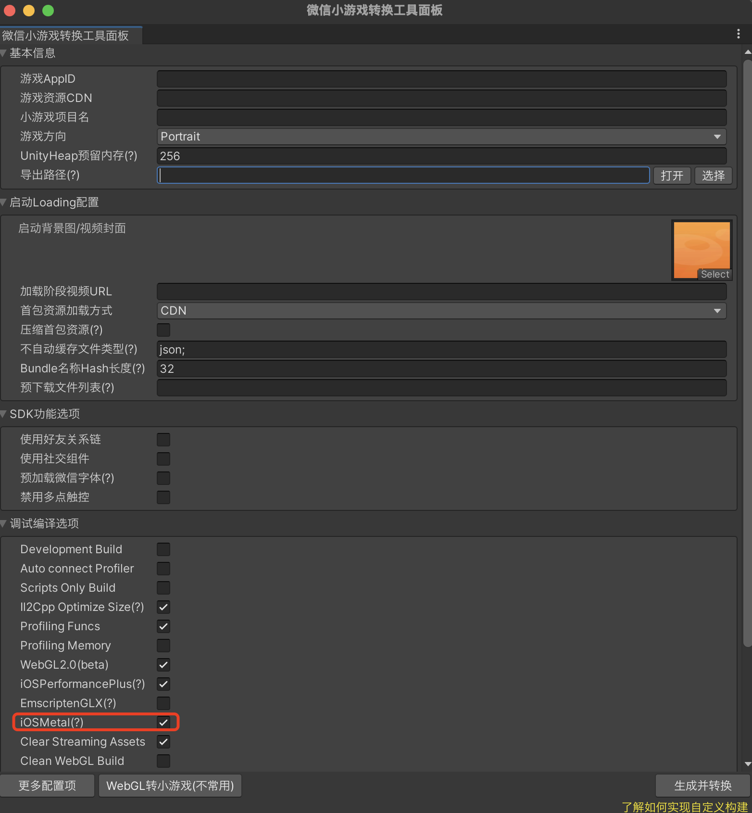
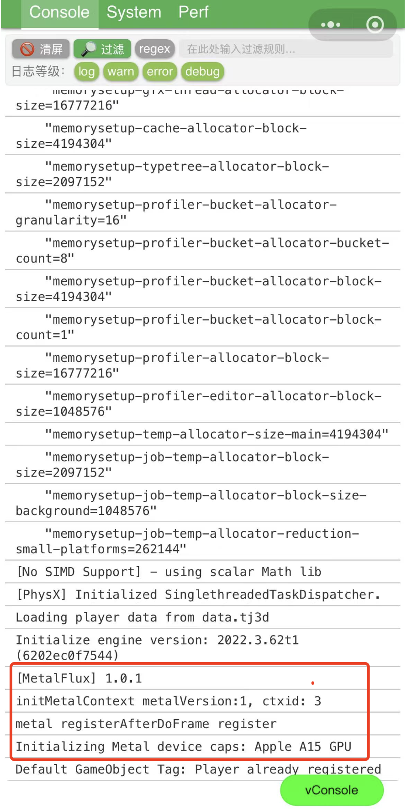

# iOS Metal 渲染模式

## 简介

iOS Metal 渲染模式是指在 iOS 平台下，小游戏底层渲染不再通过传统的 WebGL，而是直接调用 Apple 官方的 Metal 图形接口。Metal 是苹果推出的高性能图形渲染 API，能够更好地发挥 iOS 设备的硬件性能，提升渲染效率和画面表现。

通过 Metal 渲染，小游戏可以获得更低的渲染延迟、更高的帧率以及更丰富的图形特效，尤其适合对性能和画质有较高要求的 3D 游戏或大型项目。


## 特别说明

1. iOS Metal 渲染模式仅支持 **iOS 高性能+模式**，小游戏保留 WebGL 渲染方案作为回退渲染方案。
2. iOS 高性能模式、Android、PC 和微信开发者工具不支持 Metal 渲染模式，会自动降级为 WebGL 渲染模式。
3. 微信版本须 `>= 8.0.63`，低版本的微信版本会自动降级为 WebGL 渲染模式。  
4. Metal 渲染模式对 iOS 系统版本基本没要求，满足微信要求的 iOS 14.0+ 即可。
5. 基础库版本须 `>= 3.10.0`，低版本的基础库会自动降级为 WebGL 渲染模式。
6. 当前仅支持 `团结引擎 1.6.2 及以上` 接入。
7. Metal 渲染模式处于 Beta 测试阶段，建议**充分验证后**再进行发布。

## 接入指南

### 1. SDK 接入

请参照 [微信 SDK 安装](./SDKInstaller.md)，使用 `Package方式`进行安装。

`打开游戏工程` -> `Editor 菜单栏` -> `Package Manager` -> `右上方 "+"` -> `Add package from git URL` -> `输入下方的URL地址`，即可完成 SDK 导入。

```javascript
https://github.com/wechat-miniprogram/minigame-tuanjie-transform-sdk.git#feat-metal-adapt-new
```

### 2. 开启 Metal 渲染

通过「微信小游戏工具面板」-「调试编译选项」-「iOS Metal(?)」进行勾选，并开启转换。



## 常见问题

### Q1. 如何确认游戏已经启用了 Metal 渲染模式？

请按照下方的步骤进行验证：

1. 删除本地小游戏（包括开发版、体验版和正式版）。
2. 重新进入游戏并打开调试，查看 vConsole 中的相关日志。

-   vConsole 第一行，确认基础库版本 `>=3.10.0`。
-   在渲染初始化阶段，查看是否包含“Metal 渲染已启用”相关日志信息。
    

### Q2. 为什么开启 Metal 渲染后，部分机型表现异常？

A2. 部分设备或系统可能存在兼容性问题。建议优先在主流 iOS 设备上进行测试。如遇到问题，[联系我们](./IssueAndContact.md)协助排查。

### Q3. Metal 渲染模式下，遇到性能或画面异常如何处理？

A3. Metal 渲染与 WebGL 渲染在底层实现上有较大差异，部分自定义 Shader 或特殊渲染逻辑可能需要适配。建议优先在主流 iOS 设备上进行测试。如有问题，[联系我们](./IssueAndContact.md)协助定位。

### Q4. Metal 渲染模式，对包体和资源影响大吗？

A4. 由于同时存在 Metal 和 WebGL 两份 Shader，Shader 资源的大小大概会是之前的2倍，但由于同时只会加载一份 Shader 进内存，Shader 占用内存应该区别不大。Wasm 代码包会略微增加但可忽略不计。如有问题，[联系我们](./IssueAndContact.md)协助定位。

### Q5. 可以同时勾选 iOS Metal 和 EmscriptenGLX 进行小游戏打包吗？

A5. 可以。同时勾选的情况，如果 iOS 满足 Metal 渲染条件，会优先跑 Metal 渲染方案，否则回退到 EmscriptenGLX 渲染方案。

