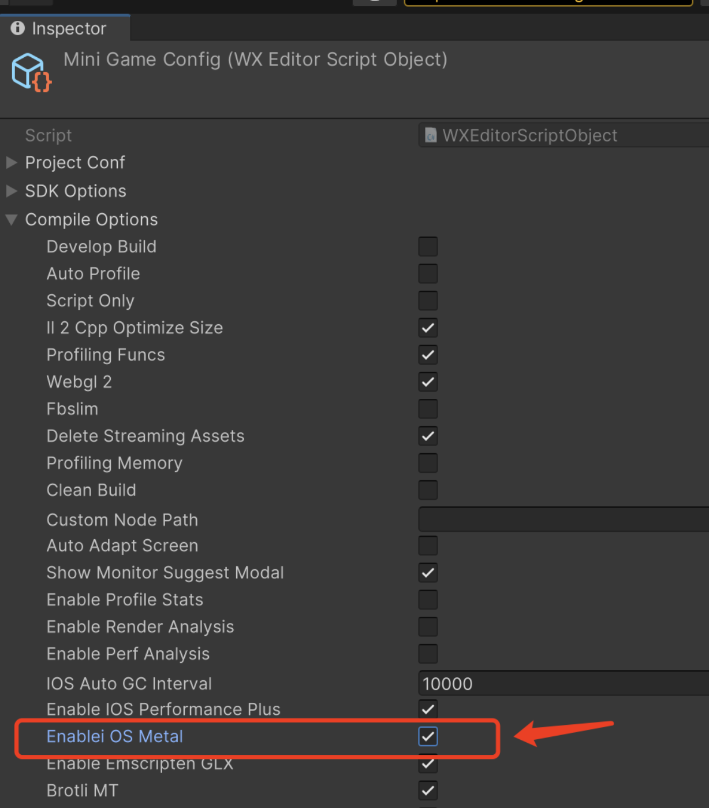

# iOS Metal 渲染模式

## 简介

iOS Metal 渲染模式是在 iOS 平台下，小游戏底层渲染不再使用传统 WebGL，而是直接调用 Apple 官方的 Metal 图形接口。Metal 是苹果推出的高性能图形渲染 API，能够更好地发挥 iOS 设备的硬件性能，提升渲染效率和画面质量。

采用 Metal 渲染后，小游戏可获得更低的渲染延迟、更高的帧率以及更丰富的图形特效，尤其适合对性能和画质要求较高的 3D 游戏或大型项目。

## 特别说明

1. iOS Metal 渲染模式仅支持 **iOS 高性能+模式**，小游戏会保留 WebGL 渲染作为回退方案。
2. iOS 高性能模式、Android、PC 及微信开发者工具暂不支持 Metal 渲染，将自动降级为 WebGL。
3. 微信版本需 `>= 8.0.63`，低版本微信会自动降级为 WebGL。
4. Metal 渲染模式对 iOS 系统无特殊要求，满足微信要求的 iOS 14.0+ 即可。
5. 基础库版本需 `>= 3.10.0`，低版本基础库会自动降级为 WebGL。
6. 当前仅支持 `团结引擎 1.6.2 及以上` 接入。
7. Metal 渲染模式目前处于 Beta 测试阶段，建议**充分验证后**再发布。

## 接入指南

### 1. SDK 接入

请参考 [微信 SDK 安装](./SDKInstaller.md)，采用 `Package方式`进行安装。

操作步骤：`打开游戏工程` -> `Editor 菜单栏` -> `Package Manager` -> `右上角 "+"` -> `Add package from git URL` -> 输入下方 URL 地址，完成 SDK 导入。

```javascript
https://github.com/wechat-miniprogram/minigame-tuanjie-transform-sdk.git
```

### 2. 开启 Metal 渲染

通过「微信小游戏工具面板」-「调试编译选项」-「iOS Metal」勾选并开启转换。


温馨提示：

如工具面板无「iOS Metal」选项，可能是插件版本未更新。可手动修改插件的 Mini Game Config 配置文件，在 Editor 工程中选中该文件， 在 Inspector 面板展开 Compile Options，并勾选 enableiOSMetal 选项，如下图：



按正常流程打包即可。

## 常见问题

### Q1. 如何确认游戏已启用 Metal 渲染模式？

请按以下步骤验证：

1. 删除本地小游戏（包括开发版、体验版和正式版）。
2. 重新进入游戏并打开调试，查看 vConsole 日志。

-   vConsole 第一行，确认基础库版本 `>=3.10.0`。
-   渲染初始化阶段，查看是否有“Metal 渲染已启用”等相关日志信息。
    

### Q2. 为什么开启 Metal 渲染后，部分机型表现异常？

A2. 部分设备或系统可能存在兼容性问题。建议优先在主流 iOS 设备上测试。如遇问题，[请联系我们](./IssueAndContact.md)协助排查。

### Q3. Metal 渲染模式下，遇到性能或画面异常如何处理？

A3. Metal 与 WebGL 在底层实现上差异较大，部分自定义 Shader 或特殊渲染逻辑可能需要适配。建议优先在主流 iOS 设备上测试。如有问题，[请联系我们](./IssueAndContact.md)协助定位。

### Q4. Metal 渲染模式对包体和资源有影响吗？

A4. 由于同时存在 Metal 和 WebGL 两套 Shader，Shader 资源体积约为原来的 2 倍。但实际运行时只加载一套 Shader，内存占用变化不大。Wasm 代码包体积略有增加，影响较小。如有疑问，[请联系我们](./IssueAndContact.md)协助分析。

### Q5. 可以同时勾选 iOS Metal 和 EmscriptenGLX 打包小游戏吗？

A5. 可以。如同时勾选，iOS 设备满足 Metal 渲染条件时优先采用 Metal，否则回退到 EmscriptenGLX 渲染方案。

### Q6. iOS Metal 是否支持开放数据域？

A6. 支持 screenCanvas 模式，目前不支持 offscreenCanvas。如遇问题，[请联系我们](./IssueAndContact.md)协助排查。  
[开放数据域介绍](https://developers.weixin.qq.com/minigame/dev/guide/open-ability/opendata/basic.html)

### Q7. 勾选 iOS Metal 后，是否还需设置 WebGL1 和 WebGL2？

A7. 需要。iOS Metal 仅支持 iOS 平台，其他平台仍采用 WebGL 渲染。当 iOS 小游戏不满足 Metal 渲染条件时也会回退到 WebGL。如遇问题，[请联系我们](./IssueAndContact.md)协助排查。

### Q8. 勾选 iOS Metal 后，导出 iOS 小游戏包运行异常怎么办？

A8. 请先确认已勾选 **iOS 高性能+模式**，如仍有问题可尝试重启 Unity Editor 重新打包。如问题依旧，[请联系我们](./IssueAndContact.md)协助排查。