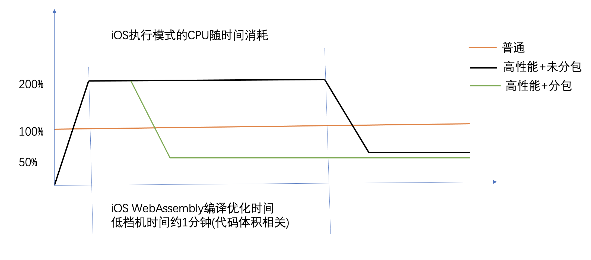
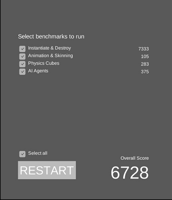
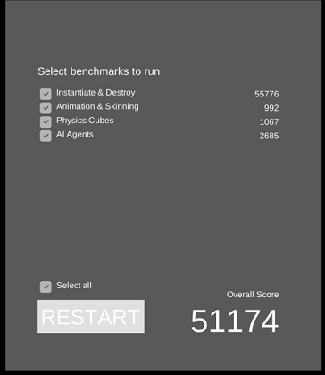
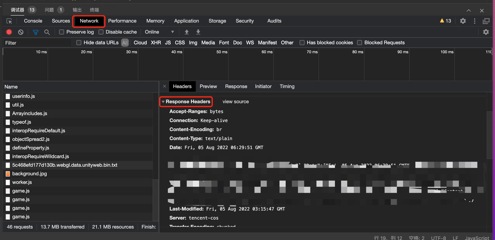
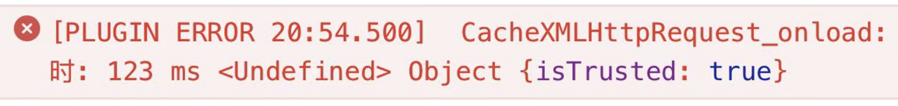

# iOS高性能模式

## 什么是高性能模式
在iOS环境下，标准的微信小游戏WASM运行模式是无JIT, 对于计算性能要求较高的游戏会受到比较大的限制。常见情况是：
1. 中低端机帧率较低，流畅度难以达到上线标准
2. 对CPU计算资源消耗过高，运行一段时间后设备温度持续上升

小游戏环境框架提供了高性能运行模式，该运行模式下CPU算力得到明显提升。但该模式也存在更严格的内存与代码包体限制，需要开发者采取合适的手段以达到最优。

## 性能提升
### CPU消耗
通过多款游戏项目，我们得到实际游戏项目的CPU占用如下图所示：

我们得到以下结论：
- 高性能模式在长期执行过程中CPU明显低于普通模式，后者长期处于高CPU占用因此长期运行容易越来越烫
- 游戏启动初始阶段，高性能模式存在CPU高峰用于WebAssembly编译优化
- 采用[代码分包](WasmSplit.md)后，高性能模式能较快回落CPU占用并处理较优水平

### 压力测试
使用Unity所提供的Benchmark Demo的部分案例进行评测：
- Instntiate & Destroy
- Animation & Skinning
- Physics Cubes
- AI Agents 

测试过程为不断增加运算复杂度，直到帧率下降到特定数值。

分数越高，代表的运行能力越强。

上图分别是iOS端普通模式与高性能模式的得分，可以看到在几个压测示例中高性能模式均明显优于普通模式。

经实际游戏测试，游戏帧率都会得到明显改善，虽无法达到Benchmark几乎一个数量级的差异。

## 如何开通

iOS端小游戏高性能模式适用于遇到iOS环境运行性能不足，运行发烫的小游戏。
- 需要该能力的开发者登录[微信公众平台](https://mp.weixin.qq.com) -> 首页能力地图模块 -> 点击进入"生产提效包" -> 点击开通高性能模式。 

- 开通成功后，过配置 game.json 的 iOSHighPerformance 为 true 则可进入高性能模式，通过去掉此开关可以正常回退到普通模式，以便两种模式对比。

## 高性能模式限制
### 内存限制
高性能模式下，iOS低端机(6s/7/8等)2G RAM机型的内存限制为1G，中高端机(7P/8P/iPhoneX/XSAMX/11/12等)3G以上内存机型的内存限制为1.4G，因此开发者务必保证内存峰值不超过该数值。

建议开发者根据指引[优化Unity WebGL的内存](OptimizationMemory.md)，如[压缩纹理优化](CompressedTexture.md)等方式。

### 代码体积限制
高性能模式下，WASM代码将被编译并优化，需要占用更多的编译消耗与内存。如果未进行优化前，可以明显感受到启动开始阶段（如启动前1分钟内）设备发烫。

建议开发者使用[代码分包工具](WasmSplit.md)减少代码包体积。

## QA
1. 如何判别游戏否已经开启了高性能模式？
   - 删除本地小游戏(包括开发版、体验版和正式版)，
   - 重新进入小游戏并打开调试，查看vconsole日志, 关注"game start"日志中的"render"字段为"h5"则为高性能模式
   - 系统和基础库要求是: iOS>=14.0, 基础库>=2.23.1, 用户占比约为75%。 对于不满足此要求时回退为普通执行方式。

2. 使用高性能模式下，游戏本身是否需要做修改？  
   - 业务代码无需做任何调整，普通模式与高性能模式可以无缝切换。
   - 高性能模式下，请不要服务端设置Cookie，游戏端内因为跨域问题会读取不到Cookie
   - Android下载资源无问题，高性能模式提示资源下载失败等网络问题，请参考文档[网络通信适配](UsingNetworking.md#注意事项)关于跨域的问题 

3. iOS报错提示未开启gzip/br压缩

可通过微信开发者工具查看Content-Encoding是否为gzip或br

如果有正确压缩，可忽略这个错误。

问题原因：由于跨域获取不到Content-Encoding头

解决办法：增加跨域头部`"Access-Control-Expose-Headers": "Content-Length, Content-Encoding",`

4. 资源下载提示`isTrusted`

多半由于跨域问题导致，可通过开发者工具查看对应资源的Response Header是否有跨域头，
请参考文档[网络通信适配](UsingNetworking.md#注意事项)关于跨域的问题 

5. 卡在启动封面无法启动
   - 右上角打开调试，重启小游戏，点三次下方的Unity logo打开vconsole
   - 如果出现资源访问失败，但Android和开发者工具却可以下载则参考QA3关于跨域问题
   - 15.4以上系统出现"Not implemented"与内存问题，此为Unity & iOS 15.4的BUG，微信提供的wasm代码分包(推荐)或Unity WebGL官方论坛的[临时修复方案](https://forum.unity.com/threads/ios-15-webgl-2-issue.1176116/page-2)

6. 个别游戏UI会出现闪烁问题
   - 已知iOS 15.4偶现，如果开发者遇到请提供可复现Unity工程联系minigamedevop08

7. 为什么开启了高性能模式，游戏启动很烫？
   - 请参考本文前面部分，如果未使用代码分包的情况下JIT编译优化将耗费大量性能

6. 使用高性能模式下，必须如果不优化内存和代码包体积可以吗？
   - 不建议。如果不做任何优化的情况下，很有可能会遇到超出内存限制而崩溃，启动时发烫现象严重等问题。

7. iOS高性能模式与安卓性能对比如何？
   - 两种系统环境下，WASM执行都是JIT代码。但由于底层虚拟机差异过大以及自身不断迭代，难以横向对比。
