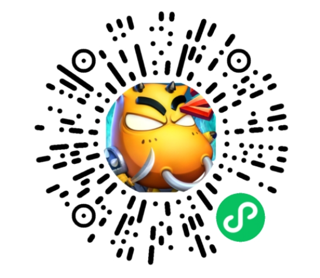
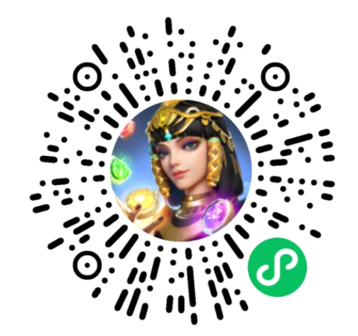

# Unity WebGL 微信小游戏适配方案(公测)

欢迎使用 Unity WebGL 小游戏适配(转换)方案，本方案设计目的是**降低 Unity 游戏转换到微信小游戏的开发成本**。基于WebAssembly技术，无需更换Unity引擎与重写核心代码的情况下将原有游戏项目适配到微信小游戏。

- 若图片无法显示，请访问[gitee项目地址](https://gitee.com/wechat-minigame/minigame-unity-webgl-transform)

## 方案特点
* 保持原引擎工具链与技术栈
* 无需重写游戏核心逻辑，支持大部分第三方插件
* 由转换工具与微信小游戏运行环境保证适配兼容，保持较高还原度
* 微信小游戏平台能力以C# SDK方式提供给开发者，快速对接平台开放能力

## 转换案例
| 我叫MT2(回合战斗) | 旅行串串(休闲) | 谜题大陆(SLG) | 热血神剑(MMO) | 
| --- | --- | --- | --- |
|  |  |  |  |

- [更多转换案例](Design/ShowCase.md)

## 安装与使用

下载 [Unity插件](https://game.weixin.qq.com/cgi-bin/gamewxagwasmsplitwap/getunityplugininfo?download=1)，并导入至游戏项目中，版本更新请查看[更新日志](CHANGELOG.md)

- 请查阅[推荐引擎版本](Design/UnityVersion.md)，安装时选择WebGL组件
- 前往[Node官网](https://nodejs.org/zh-cn/download/)安装长期稳定版
- 前往[微信开发者工具下载](https://developers.weixin.qq.com/miniprogram/dev/devtools/stable.html)安装Stable版开发者工具【注意：为保证稳定性，请勿使用小游戏版 Minigame Build】
- 查阅[小游戏开发者文档-快速上手](https://developers.weixin.qq.com/minigame/dev/guide/)创建小游戏类目应用
- 登录[MP微信公众平台](https://mp.weixin.qq.com)，能力地图-生产提效包-快适配，开通使用
- 查阅[快速开始：转换工具导出微信小游戏](Design/Transform.md)进行小游戏导出转换

## 文档总览
- [Unity WebGL微信小游戏转换指南](Design/Guide.md)

方案概述与兼容性
- [技术原理](Design/Summary.md)
- [兼容性评估](Design/Evaluation.md)
- [推荐引擎版本](Design/UnityVersion.md)
- [更多转换案例](Design/ShowCase.md)
- [技术常见问题QA](Design/DevelopmentQAList.md)

性能优化
- [性能优化总览](Design/PerfOptimization.md)
- [性能评估标准](Design/PerfMeasure.md)
- 启动性能

  - [提升 Unity WebGL 游戏启动速度](Design/StartupOptimization.md)
  - [启动流程与时序](Design/Startup.md)
  - [使用 Loader 进行游游戏加载](Design/UsingLoader.md)
  - [资源按需加载概述](Design/ResourcesLoading.md)
  - [使用 AssetBundle 进行资源按需加载](Design/UsingAssetBundle.md)
  - [使用 Addressable 进行资源按需加载](Design/UsingAddressable.md)
  - [使用 AutoStreaming 进行资源按需加载](Design/InstantGameGuide.md)
  - [定制启动封面](Design/CustomLoading.md)
  - [使用预下载功能](Design/UsingPreload.md)
  - [首场景启动优化](Design/FirstSceneOptimization.md)
  - [使用代码分包工具](Design/WasmSplit.md)
  - [启动留存数据上报统计](Design/ReportStartupStat.md)

- 运行性能
  - [优化Unity WebGL的运行性能](Design/OptimizationPerformence.md)
  - [使用 Android CPU Profiler 性能调优](Design/AndroidProfile.md)
  - [使用 Unity Profiler 性能调优](Design/UnityProfiler.md)
  - [优化Unity WebGL的内存](Design/OptimizationMemory.md)
  - [使用ProfilingMemory分析内存](Design/UsingMemoryProfiler.md)
  - [压缩纹理优化](Design/CompressedTexture.md)
  - [资源优化工具与建议](Design/AssetOptimization.md)
  - [iOS高性能模式](Design/iOSOptimization.md)
  - [WebGL2.0渲染支持说明](Design/WebGL2.md)

版本更新与资源部署
- [小游戏资源部署](Design/DataCDN.md)
- [小游戏资源缓存](Design/FileCache.md)
- [小游戏版本更新](Design/Update.md)

能力适配

- [WX SDK 平台能力适配](Design/WX_SDK.md)
- [屏幕适配](Design/fixScreen.md)
- [输入法适配](Design/InputAdaptation.md)
- [排行榜与微信关系数据](Design/OpenData.md)
- [后端服务指引](Design/BackendServiceStartup.md)
- [网络通信适配](Design/UsingNetworking.md)
- [使用水印保护代码包安全](Design/wasmWaterMark.md)
  
调试与异常
- [开发错误调试与排查](Design/DebugAndException.md)
- [现网错误日志上报与排查](Design/IssueForProduction.md)

问题反馈

- [问题反馈与联系我们](Design/IssueAndContact.md)

