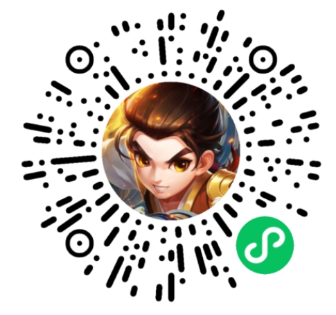

# 微信小游戏团结/Unity适配方案

欢迎使用 Unity WebGL 小游戏适配方案(又称团结Unity快适配)，本方案设计目的是**降低 Unity 游戏转换到微信小游戏的开发成本**。基于WebAssembly技术，无需更换Unity引擎与重写核心代码的情况下将原有游戏项目适配到微信小游戏。

**官方文档：[https://wechat-miniprogram.github.io/minigame-unity-webgl-transform/](https://wechat-miniprogram.github.io/minigame-unity-webgl-transform/)**

### 方案特点
* 保持原引擎工具链与技术栈
* 无需重写游戏核心逻辑，支持大部分第三方插件
* 由转换工具与微信小游戏运行环境保证适配兼容，保持较高还原度
* 微信小游戏平台能力以C# SDK方式提供给开发者，快速对接平台开放能力

### 转换案例
| 我叫MT2(回合战斗) | 旅行串串(休闲) | 谜题大陆(SLG) | 热血神剑(MMO) | 
| --- | --- | --- | --- |
|  |  |  |  |

[查阅更多转换案例](Design/ShowCase.md)
